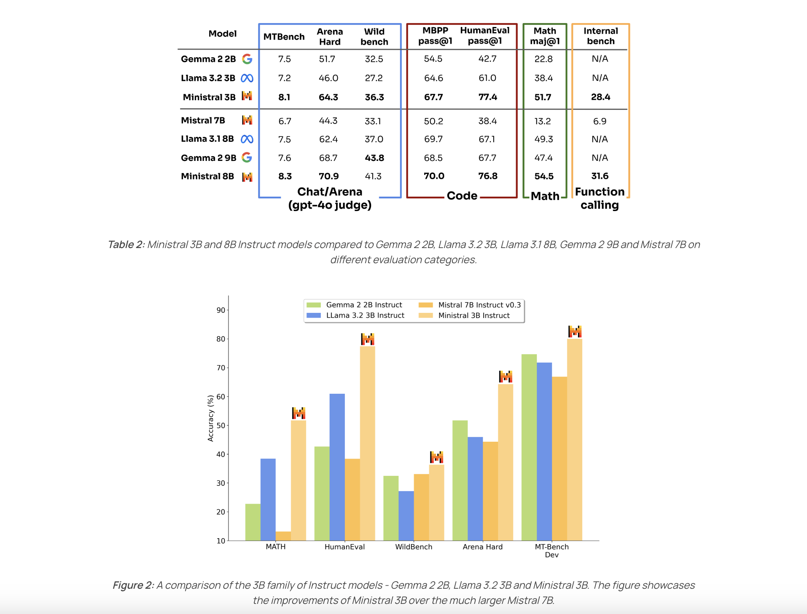

# Mistral AI Introduces Les Ministraux: Ministral 3B and Ministral 8B- Revolutionizing On-Device AI

> High-performance AI models that can run at the edge and on personal devices are needed to overcome the limitations of existing large-scale models. These models require significant computational resources, making them dependent on cloud environments, which poses privacy risks, increases latency, and adds costs. Additionally, cloud reliance is not suitable for offline scenarios. Introducing Ministral […]

High-performance AI models that can run at the edge and on personal devices are needed to overcome the limitations of existing large-scale models. These models require significant computational resources, making them dependent on cloud environments, which poses privacy risks, increases latency, and adds costs. Additionally, cloud reliance is not suitable for offline scenarios.

### Introducing Ministral 3B and Ministral 8B

Mistral AI recently unveiled two groundbreaking models aimed at transforming on-device and edge AI capabilities—Ministral 3B and Ministral 8B. These models, collectively known as les Ministraux, are engineered to bring powerful language modeling capabilities directly to devices, eliminating the need for cloud computing resources. With on-device AI becoming more integral in domains like healthcare, industrial automation, and consumer electronics, Mistral AI’s new offerings represent a major leap towards empowering applications that can perform advanced computations locally, securely, and more cost-effectively. These models are set to redefine how AI interacts with the physical world, offering a new level of autonomy and adaptability.

### Technical Details and Benefits

The technical design of les Ministraux is built around striking a balance between power efficiency and performance. Ministral 3B and 8B are transformer-based language models optimized for lower power consumption without compromising on accuracy and inference capabilities. The models are named based on their respective parameter counts—3 billion and 8 billion parameters—which are notably efficient for edge environments while still being robust enough for a wide range of natural language processing tasks. Mistral AI leveraged various pruning and quantization techniques to reduce the computational load, allowing these models to be deployed on devices with limited hardware capacity, such as smartphones or embedded systems. Ministral 3B is particularly optimized for ultra-efficient on-device deployment, while Ministral 8B offers greater computational power for use cases that require more nuanced understanding and language generation.

### Importance and Performance Results

The significance of Ministral 3B and 8B extends beyond their technical specifications. These models address key limitations in existing edge AI technology, such as the need for reduced latency and improved data privacy. By keeping data processing local, les Ministraux ensures that sensitive user data remains on the device, which is crucial for applications in fields like healthcare and finance. Preliminary benchmarks have shown impressive results—Ministral 8B, for instance, demonstrated a notable increase in task completion rates compared to existing on-device models, while maintaining efficiency. The models also allow developers to create AI applications that are less reliant on internet connectivity, ensuring that services remain available even in remote or bandwidth-constrained areas. This makes them ideal for applications where reliability is critical, such as in field operations or emergency response.

### Conclusion

The introduction of les Ministraux: Ministral 3B and Ministral 8B marks an important step forward in the AI industry’s quest to bring more powerful computing capabilities directly to edge devices. Mistral AI’s focus on optimizing these models for on-device use addresses fundamental challenges related to privacy, latency, and cost-efficiency, making AI more accessible and versatile across various domains. By delivering state-of-the-art performance without the traditional cloud dependency, Ministral 3B and 8B pave the way for a future where AI can operate seamlessly, securely, and efficiently right at the edge. This not only enhances the user experience but also opens new avenues for innovation in how AI can be integrated into everyday devices and workflows.

---

Check out the [**Details** ](https://mistral.ai/news/ministraux/)and [**8B Model**.](https://mistral.ai/news/ministraux/) All credit for this research goes to the researchers of this project. Also, don’t forget to follow us on **[Twitter](https://twitter.com/Marktechpost)** and join our **[Telegram Channel](https://pxl.to/at72b5j)** and [**LinkedIn Gr**](https://www.linkedin.com/groups/13668564/)[**oup**](https://www.linkedin.com/groups/13668564/). **If you like our work, you will love our**[** newsletter..**](https://marktechpost-newsletter.beehiiv.com/subscribe) Don’t Forget to join our **[50k+ ML SubReddit](https://www.reddit.com/r/machinelearningnews/)**.

**[[Upcoming Live Webinar- Oct 29, 2024] ](https://go.predibase.com/predibase-inference-engine-102924-lp?utm_medium=3rdparty&utm_source=marktechpost)****[The Best Platform for Serving Fine-Tuned Models: Predibase Inference Engine (Promoted)](https://go.predibase.com/predibase-inference-engine-102924-lp?utm_medium=3rdparty&utm_source=marktechpost)**
