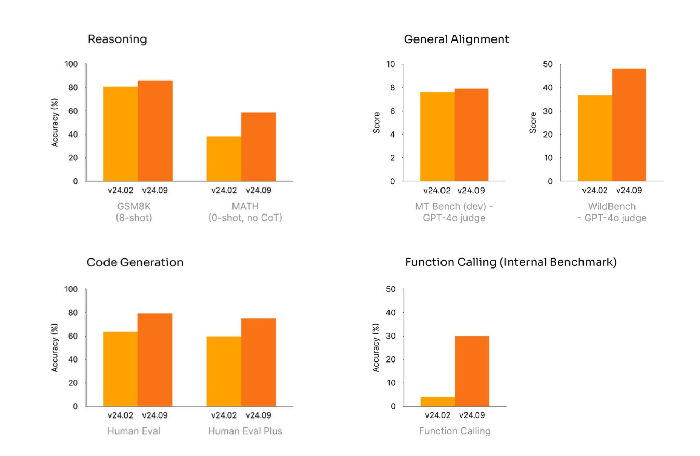

# Mistral AI Released Mistral-Small-Instruct-2409: A Game-Changing Open-Source Language Model Empowering Versatile AI Applications with Unmatched Efficiency and Accessibility

> Mistral AI recently announced the release of Mistral-Small-Instruct-2409, a new open-source large language model (LLM) designed to address critical challenges in artificial intelligence research and application. This development has generated significant excitement in the AI community, as it promises to enhance the performance of AI systems, improve accessibility to cutting-edge models, and offer new possibilities […]

Mistral AI recently announced the release of [**Mistral-Small-Instruct-2409**](https://huggingface.co/mistralai/Mistral-Small-Instruct-2409), a new open-source large language model (LLM) designed to address critical challenges in artificial intelligence research and application. This development has generated significant excitement in the AI community, as it promises to enhance the performance of AI systems, improve accessibility to cutting-edge models, and offer new possibilities for natural language processing tasks. The release of this model continues Mistral AI’s mission to push the boundaries of open-source AI while promoting transparency and collaboration.

**The Evolution of Mistral AI**

Mistral AI has been making waves in the AI landscape for its dedication to developing powerful, accessible, and transparent models. Mistral AI aims to democratize access to advanced AI tools by focusing on open-source releases, fostering an environment where researchers, developers, and institutions worldwide can contribute to and benefit from cutting-edge technologies. The release of Mistral-Small-Instruct-2409 is the latest in a series of innovations the company has developed to fulfill this goal.

Advancements in machine learning techniques, such as transformer architectures and pretraining methods, have driven the development of large language models like Mistral-Small-Instruct-2409. These models can perform various natural language processing tasks, including text generation, summarization, and question-answering. The increasing availability of high-quality datasets and computational resources has accelerated the development of these models, enabling Mistral AI to deliver high-performance AI systems that can be deployed across various industries and domains.

**Mistral’s Latest: Mistral-Small-Instruct-2409**

Mistral-Small-Instruct-2409 is a powerful multilingual model that supports tool use and function calling. With 22 billion parameters and a vocabulary expanded to 32,768 tokens, this model offers a robust framework for handling various complex natural language tasks. One of its standout features is its 128K sequence length, allowing the model to manage significantly longer input sequences than its predecessors.

Positioned comfortably between the Mistral NeMo 12B and Mistral Large 123B models, the Mistral-Small-Instruct-2409 balances performance and scalability. This makes it ideal for users who need powerful language processing capabilities without the extensive computational resources required for larger models. Moreover, the model weights for non-commercial use are freely available on the Hugging Face Hub, ensuring broad accessibility. The Mistral-Small-Instruct-2409 also works seamlessly with popular AI frameworks like Transformers, making it a flexible and efficient choice for developers looking to integrate advanced AI into their applications.

**Features and Capabilities of Mistral-Small-Instruct-2409**

One of Mistral-Small-Instruct-2409’s standout features is its versatility and efficiency in handling a diverse set of natural language tasks. As an instruct-tuned model, it has been fine-tuned to follow instructions and generate accurate, context-aware responses. This makes it well-suited for conversational AI, content creation, code generation, and other tasks.

*[**Image Source**](https://x.com/reach_vb/status/1836090816173154585)*

Another critical advantage is the model’s compact size. While many large language models require substantial computational resources, Mistral-Small-Instruct-2409 balances performance and efficiency, making it accessible to various users, including those with limited computational capabilities. This makes the model an attractive option for developers working on projects where resources are constrained but high-quality AI performance is still required.

Mistral AI has ensured the model’s architecture is designed for easy and smooth integration into various applications. This flexibility enables developers to implement Mistral-Small-Instruct-2409 in various use cases, from enhancing customer support chatbots to automating complex business processes.

**Open-Source Commitment and Ethical Considerations**

Mistral AI’s commitment to open-source development is one of the core aspects that sets it apart from many other AI companies. By making Mistral-Small-Instruct-2409 freely available to the public, the company is promoting a more inclusive and collaborative AI research environment. Researchers and developers can experiment with the model, fine-tune it for specific tasks, and even contribute improvements to the underlying architecture.

This approach also aligns with growing concerns about the ethical implications of AI technology. As AI models become more powerful and pervasive, issues such as bias, transparency, and accountability have come to the forefront. Mistral AI addresses these concerns by ensuring that the development of its models, including Mistral-Small-Instruct-2409, is transparent and open to scrutiny. This openness allows researchers to understand the model’s behavior better, identify potential biases, and work towards developing more equitable and responsible AI systems.

**Applications and Impact**

The potential applications of Mistral-Small-Instruct-2409 are vast, spanning multiple industries and use cases. For example, the models can be used in the healthcare sector to analyze medical records, assist in diagnostics, and provide personalized healthcare recommendations. In the legal field, they can help automate document review processes and assist lawyers in legal research. The education sector can benefit from the model’s ability to provide personalized tutoring and generate educational content. At the same time, the financial industry can leverage its capabilities for market analysis, fraud detection, and customer service automation.

These models’ instruction-following abilities make them ideal candidates for improving AI-driven tools such as virtual assistants and smart devices. By understanding and responding to user instructions more accurately, the models can provide more relevant and personalized assistance, enhancing the user experience.

**Conclusion**

The release of Mistral-Small-Instruct-2409 marks an important milestone in developing large language models and the ongoing evolution of AI technology. Mistral AI’s commitment to open-source development and ethical AI practices has positioned the company as a leader in the field, and introducing these models reinforces that reputation. These models can transform industries and applications worldwide by providing powerful yet accessible tools for natural language processing. Their versatility, efficiency, and instruction-following capabilities make them valuable assets for developers and researchers. 

---

Check out the **[Model Card](https://huggingface.co/mistralai/Mistral-Small-Instruct-2409)**. All credit for this research goes to the researchers of this project. Also, don’t forget to follow us on **[Twitter](https://twitter.com/Marktechpost)** and join our **[Telegram Channel](https://pxl.to/at72b5j)** and [**LinkedIn Gr**](https://www.linkedin.com/groups/13668564/)[**oup**](https://www.linkedin.com/groups/13668564/). **If you like our work, you will love our**[** newsletter..**](https://marktechpost-newsletter.beehiiv.com/subscribe)

Don’t Forget to join our **[50k+ ML SubReddit](https://www.reddit.com/r/machinelearningnews/)**

**[⏩ ⏩ FREE AI WEBINAR: ‘SAM 2 for Video: How to Fine-tune On Your Data’ (Wed, Sep 25, 4:00 AM – 4:45 AM EST)](https://encord.com/webinar/sam2-for-video/?utm_medium=affiliate&utm_source=newsletter&utm_campaign=marktechpost&utm_content=sam2video)**
