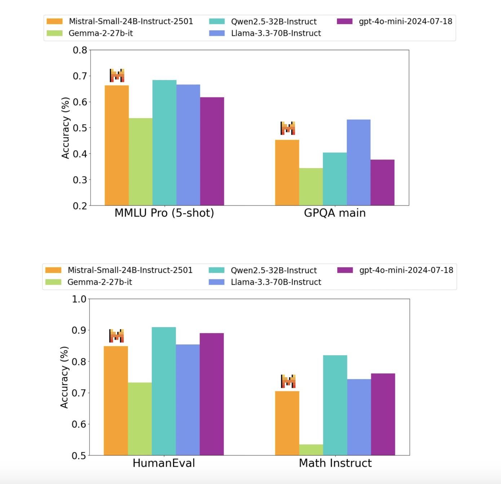

# Mistral AI Releases the Mistral-Small-24B-Instruct-2501: A Latency-Optimized 24B-Parameter Model Released Under the Apache 2.0 License

> Developing compact yet high-performing language models remains a significant challenge in artificial intelligence. Large-scale models often require extensive computational resources, making them inaccessible for many users and organizations with limited hardware capabilities. Additionally, there is a growing demand for methods that can handle diverse tasks, support multilingual communication, and provide accurate responses efficiently without sacrificing […]

Developing compact yet high-performing language models remains a significant challenge in artificial intelligence. Large-scale models often require extensive computational resources, making them inaccessible for many users and organizations with limited hardware capabilities. Additionally, there is a growing demand for methods that can handle diverse tasks, support multilingual communication, and provide accurate responses efficiently without sacrificing quality. Balancing performance, scalability, and accessibility is crucial, particularly for enabling local deployments and ensuring data privacy. This highlights the need for innovative approaches to create smaller, resource-efficient models that deliver capabilities comparable to their larger counterparts while remaining versatile and cost-effective.

Recent advancements in natural language processing have focused on developing large-scale models, such as GPT-4, Llama 3, and Qwen 2.5, which demonstrate exceptional performance across diverse tasks but demand substantial computational resources. Efforts to create smaller, more efficient models include instruction-fine-tuned systems and quantization techniques, enabling local deployment while maintaining competitive performance. Multilingual models like Gemma-2 have advanced language understanding in various domains, while innovations in function calling and extended context windows have improved task-specific adaptability. Despite these strides, achieving a balance between performance, efficiency, and accessibility remains critical in developing smaller, high-quality language models.

Mistral AI Releases the Small 3 (Mistral-Small-24B-Instruct-2501) model. It is a compact yet powerful language model designed to provide state-of-the-art performance with only 24 billion parameters. Fine-tuned on diverse instruction-based tasks, it achieves advanced reasoning, multilingual capabilities, and seamless application integration. Unlike larger models, Mistral-Small is optimized for efficient local deployment, supporting devices like RTX 4090 GPUs or laptops with 32GB RAM through quantization. With a 32k context window, it excels in handling extensive input while maintaining high responsiveness. The model also incorporates features such as JSON-based output and native function calling, making it highly versatile for conversational and task-specific implementations.

To support both commercial and non-commercial applications, the method is open-sourced under the Apache 2.0 license, ensuring flexibility for developers. Its advanced architecture enables low latency and fast inference, catering to enterprises and hobbyists alike. The Mistral-Small model also emphasizes accessibility without compromising quality, bridging the gap between large-scale performance and resource-efficient deployment. By addressing key challenges in scalability and efficiency, it sets a benchmark for compact models, rivaling the performance of larger systems like Llama 3.3-70B and GPT-4o-mini while being significantly easier to integrate into cost-effective setups.

The Mistral-Small-24B-Instruct-2501 model demonstrates impressive performance across multiple benchmarks, rivaling or exceeding larger models like Llama 3.3-70B and GPT-4o-mini in specific tasks. It achieves high accuracy in reasoning, multilingual processing, and coding benchmarks, such as 84.8% on HumanEval and 70.6% on math tasks. With a 32k context window, the model effectively handles extensive input, ensuring robust instruction-following capabilities. Evaluations highlight its exceptional performance in instruction adherence, conversational reasoning, and multilingual understanding, achieving competitive scores on public and proprietary datasets. These results underline its efficiency, making it a viable alternative to larger models for diverse applications.

*https://mistral.ai/news/mistral-small-3/*

In conclusion, The Mistral-Small-24B-Instruct-2501 sets a new standard for efficiency and performance in smaller-scale large language models. With 24 billion parameters, it delivers state-of-the-art results in reasoning, multilingual understanding, and coding tasks comparable to larger models while maintaining resource efficiency. Its 32k context window, fine-tuned instruction-following capabilities, and compatibility with local deployment make it ideal for diverse applications, from conversational agents to domain-specific tasks. The model’s open-source nature under the Apache 2.0 license further enhances its accessibility and adaptability. Mistral-Small-24B-Instruct-2501 exemplifies a significant step toward creating powerful, compact, and versatile AI solutions for community and enterprise use.

---

Check out **_the [Technical Details](https://mistral.ai/news/mistral-small-3/), [mistralai/Mistral-Small-24B-Instruct-2501](https://mistral.ai/news/mistral-small-3/)_** and **[mistralai/Mistral-Small-24B-Base-2501](https://huggingface.co/mistralai/Mistral-Small-24B-Base-2501)_._** All credit for this research goes to the researchers of this project. Also, don’t forget to follow us on **[Twitter](https://x.com/intent/follow?screen_name=marktechpost)** and join our **[Telegram Channel](https://arxiv.org/abs/2406.09406)** and [**LinkedIn Gr**](https://www.linkedin.com/groups/13668564/)[**oup**](https://www.linkedin.com/groups/13668564/). Don’t Forget to join our **[70k+ ML SubReddit](https://www.reddit.com/r/machinelearningnews/)**.

**🚨 [Meet IntellAgent](https://pxl.to/82homag): [An Open-Source Multi-Agent Framework to Evaluate Complex Conversational AI System](https://pxl.to/82homag)** _(Promoted)_
