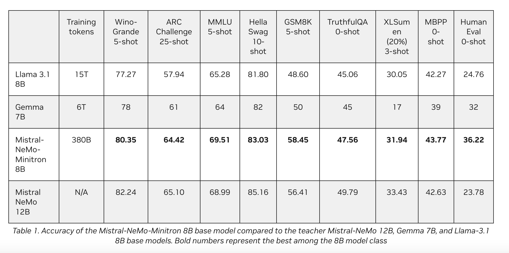

# Mistral-NeMo-Minitron 8B Released: NVIDIA’s Latest AI Model Redefines Efficiency and Performance Through Advanced Pruning and Knowledge Distillation Techniques

> NVIDIA has introduced Mistral-NeMo-Minitron 8B, a highly sophisticated large language model (LLM). This model continues their work in developing state-of-the-art AI technologies. It stands out due to its impressive performance across multiple benchmarks, making it one of the most advanced open-access models in its size class. The Mistral-NeMo-Minitron 8B was created using width-pruning derived from […]

NVIDIA has introduced [**Mistral-NeMo-Minitron 8B**](https://huggingface.co/nvidia/Mistral-NeMo-Minitron-8B-Base), a highly sophisticated large language model (LLM). This model continues their work in developing state-of-the-art AI technologies. It stands out due to its impressive performance across multiple benchmarks, making it one of the most advanced open-access models in its size class.

The Mistral-NeMo-Minitron 8B was created using width-pruning derived from the larger Mistral NeMo 12B model. This process reduces the model’s size by selectively pruning less important network parts, such as neurons and attention heads. It is followed by a retraining phase using a technique known as knowledge distillation. The result is a smaller, more efficient model that retains much of the performance of the original, larger model.

**The Process of Model Pruning and Distillation**

Model pruning is a technique for making AI models smaller and more efficient by removing less critical components. There are two primary types of pruning: depth pruning, which reduces the number of layers in the model, and width pruning, which reduces the number of neurons, attention heads, and embedding channels within each layer. In the case of Mistral-NeMo-Minitron 8B, width pruning was chosen to achieve the optimal balance between size and performance.

Following pruning, the model undergoes a light retraining process using knowledge distillation. This technique transfers the knowledge from the original, larger teacher model to the pruned, smaller student model. The objective is to create a faster and less resource-intensive model while maintaining high accuracy. For Mistral-NeMo-Minitron 8B, this process involved retraining with a dataset of 380 billion tokens, which is significantly smaller than the dataset used for training the original Mistral NeMo 12B model from scratch.

**Performance and Benchmarking**

Mistral-NeMo-Minitron 8B’s performance is a testament to the success of this pruning and distillation approach. The model consistently outperforms other models in its size class across various popular benchmarks. For instance, a 5-shot WinoGrande test scored 80.35, outperforming Llama 3.1 8B and Gemma 7B. Similarly, it scored 69.51 in the MMLU 5-shot test and 83.03 in the HellaSwag 10-shot test, marking it as one of the most accurate models in its category.

The Mistral-NeMo-Minitron 8B’s comparison to other models, such as the Mistral NeMo 12B, Llama 3.1 8B, and Gemma 7B, highlights its superior performance in several key areas. This success is attributed to the Mistral NeMo 12B model’s strategic pruning and the subsequent light retraining phase. The Mistral-NeMo-Minitron 8B model demonstrates the effectiveness of structured weight pruning and knowledge distillation in producing high-performance, compact models.

**Technical Details and Architecture**

The Mistral-NeMo-Minitron 8B model architecture is built on a transformer decoder for auto-regressive language modeling. It features a model embedding size 4096, 32 attention heads, and an MLP intermediate dimension of 11,520, distributed across 40 layers. This design also incorporates advanced techniques such as Grouped-Query Attention (GQA) and Rotary Position Embeddings (RoPE), contributing to robust performance across various tasks.

The model was trained on a diverse dataset of English and multilingual text and code covering legal, math, science, and finance domains. This extensive and varied dataset ensures the model is well-suited to various applications. The training process included the introduction of question-answering and alignment-style data to enhance the model’s performance further.

**Future Directions and Ethical Considerations**

The release of Mistral-NeMo-Minitron 8B is just the beginning of NVIDIA’s efforts in developing smaller, more efficient models through pruning and distillation. The company plans to continue refining this technique to create even smaller models with high accuracy and efficiency. These models will be integrated into the NVIDIA NeMo framework for generative AI, providing developers with powerful tools for various NLP tasks.

However, it is important to note the limitations and ethical considerations of the Mistral-NeMo-Minitron 8B model. Like many large language models, it was trained on data that may contain toxic language and societal biases. As a result, there is a risk that the model could amplify these biases or produce inappropriate responses. NVIDIA emphasizes the importance of responsible AI development and encourages users to consider these factors when deploying the model in real-world applications.

**Conclusion**

NVIDIA introduced the Mistral-NeMo-Minitron 8B by using width-pruning and knowledge distillation. This model rivals and often surpasses other models in its size class. As NVIDIA continues to refine and expand its AI capabilities, the Mistral-NeMo-Minitron 8B sets a new standard for efficiency and performance in natural language processing.

---

Check out the [**Model Card** ](https://huggingface.co/nvidia/Mistral-NeMo-Minitron-8B-Base)and **[Details](https://developer.nvidia.com/blog/mistral-nemo-minitron-8b-foundation-model-delivers-unparalleled-accuracy).** All credit for this research goes to the researchers of this project. Also, don’t forget to follow us on **[Twitter](https://twitter.com/Marktechpost)** and join our **[Telegram Channel](https://arxiv.org/abs/2408.08231)** and [**LinkedIn Gr**](https://www.linkedin.com/groups/13668564/)[**oup**](https://www.linkedin.com/groups/13668564/). **If you like our work, you will love our**[** newsletter..**](https://marktechpost-newsletter.beehiiv.com/subscribe)

Don’t Forget to join our **[49k+ ML SubReddit](https://www.reddit.com/r/machinelearningnews/)**

**Find Upcoming [AI Webinars here](https://www.marktechpost.com/ai-webinars-list-llms-rag-generative-ai-ml-vector-database/)**
