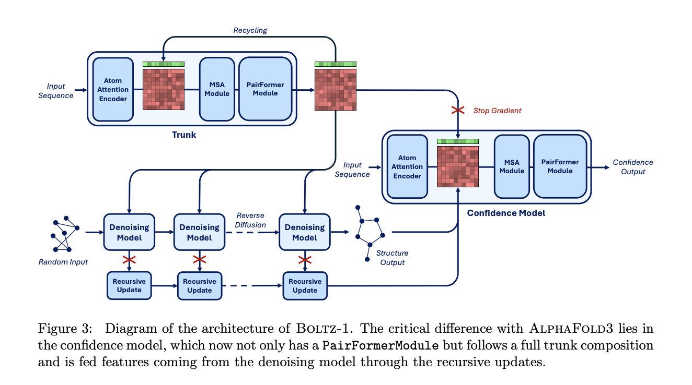

# MIT Researchers Propose Boltz-1: The First Open-Source AI Model Achieving AlphaFold3-Level Accuracy in Biomolecular Structure Prediction

> Understanding biomolecular interactions is crucial for fields like drug discovery and protein design. Traditionally, determining the three-dimensional structure of proteins and other biomolecules required costly and time-consuming laboratory experiments. AlphaFold3, launched in 2024, revolutionized the field by demonstrating that deep learning could achieve experimental-level accuracy in predicting biomolecular structures, including complex interactions. Despite these advances, […]

Understanding biomolecular interactions is crucial for fields like drug discovery and protein design. Traditionally, determining the three-dimensional structure of proteins and other biomolecules required costly and time-consuming laboratory experiments. AlphaFold3, launched in 2024, revolutionized the field by demonstrating that deep learning could achieve experimental-level accuracy in predicting biomolecular structures, including complex interactions. Despite these advances, the challenge of accurately modeling interactions between different biomolecules in 3D space persisted. Complex interactions, such as those between proteins, nucleic acids, and ligands, continued to pose difficulties, leaving a significant gap in structural biology.

### Boltz-1: A Breakthrough in Biomolecular Modeling

A team of MIT researchers has introduced Boltz-1, the first open-source and commercially accessible model that matches AlphaFold3-level accuracy in predicting biomolecular complexes. Unlike its predecessors, Boltz-1 is fully accessible to the public, with the model weights, training, and inference code released under the MIT license. This openness aims to foster global collaboration and advance biomolecular modeling.

Boltz-1 follows the general framework used in AlphaFold3 but introduces several architectural and procedural innovations, including new multiple sequence alignment (MSA) pairing algorithms, a unified cropping approach for efficient training, and an enhanced confidence model. These innovations allow Boltz-1 to deliver high accuracy while remaining accessible and significantly lowering the computational burden.

### Technical Details

The technical advancement of Boltz-1 lies in its careful architectural modifications and efficient data-handling methods. For instance, it uses a novel algorithm to pair MSAs, leveraging taxonomy information to improve the density and quality of sequence alignment. This method allows Boltz-1 to capture co-evolutionary signals critical for accurately predicting biomolecular interactions.

Additionally, a unified cropping algorithm optimizes the training process, balancing spatial and contiguous cropping strategies to enhance the diversity of training data. Boltz-1’s robust pocket-conditioning mechanism also enhances its ability to predict interactions by allowing partial information about binding pockets, making it highly adaptable to real-world scenarios. The combination of these innovations results in a model that maintains high accuracy with significantly less computational overhead compared to AlphaFold3.

### Impact and Benchmark Performance

This advancement is significant for several reasons. By democratizing access to a model capable of predicting complex biomolecular structures at AlphaFold3’s level, Boltz-1 has the potential to accelerate discoveries in areas like drug design, structural biology, and synthetic biology.

The researchers demonstrated Boltz-1’s capabilities through various benchmarks. On CASP15, a competition for protein structure prediction, Boltz-1 showcased strong performance in protein-ligand and protein-protein prediction tasks, achieving an LDDT-PLI of 65%, compared to Chai-1’s 40%. Moreover, Boltz-1 had a DockQ success rate of 83%, surpassing Chai-1’s 76%. These results highlight Boltz-1’s reliability and robustness in predicting biomolecular interactions, especially in protein-ligand complex prediction, where it excelled in aligning small molecules with their respective binding pockets.

### Conclusion

In conclusion, Boltz-1 represents a pivotal step in making high-accuracy biomolecular modeling widely accessible. By releasing it under an open-source license, MIT aims to empower researchers and organizations worldwide, facilitating innovation in biomolecular research. Boltz-1’s performance, on par with commercial state-of-the-art models while being open-source underscores its potential to advance our understanding of biomolecular interactions.

This breakthrough is likely to be a game-changer, not only in academic research but also in industries like pharmaceuticals, where accelerating drug discovery could have a profound impact. The hope is that Boltz-1 will serve as a foundation for ongoing and future research, inspiring collaboration and enhancing our collective capability to address complex biological questions.

---

Check out the Technical **[Paper](https://gcorso.github.io/assets/boltz1.pdf)**, **[Details](https://jclinic.mit.edu/boltz-1/)**, and **[GitHub Code/Model](https://github.com/jwohlwend/boltz)**. All credit for this research goes to the researchers of this project. Also, don’t forget to follow us on **[Twitter](https://twitter.com/Marktechpost)** and join our **[Telegram Channel](https://pxl.to/at72b5j)** and [**LinkedIn Gr**](https://www.linkedin.com/groups/13668564/)[**oup**](https://www.linkedin.com/groups/13668564/). **If you like our work, you will love our**[** newsletter..**](https://marktechpost-newsletter.beehiiv.com/subscribe) Don’t Forget to join our **[55k+ ML SubReddit](https://www.reddit.com/r/machinelearningnews/)**.

**[[FREE AI WEBINAR](https://landing.deepset.ai/webinar-implementing-idp-with-genai-in-financial-services?utm_campaign=2411%20-%20webinar%20-%20credX%20-%20IDP%20with%20GenAI%20in%20Financial%20Services&utm_source=marktechpost&utm_medium=newsletter)] ****[Implementing Intelligent Document Processing with GenAI in Financial Services and Real Estate Transactions](https://landing.deepset.ai/webinar-implementing-idp-with-genai-in-financial-services?utm_campaign=2411%20-%20webinar%20-%20credX%20-%20IDP%20with%20GenAI%20in%20Financial%20Services&utm_source=marktechpost&utm_medium=newsletter)**– **_[From Framework to Production](https://landing.deepset.ai/webinar-implementing-idp-with-genai-in-financial-services?utm_campaign=2411%20-%20webinar%20-%20credX%20-%20IDP%20with%20GenAI%20in%20Financial%20Services&utm_source=marktechpost&utm_medium=banner-ad-desktop)_**
