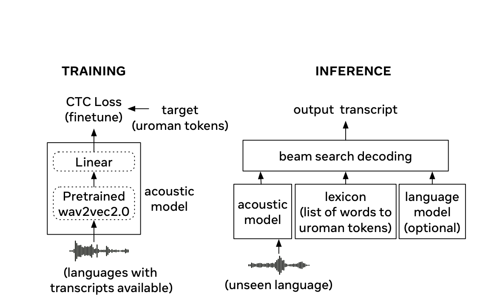

# MMS Zero-shot Released: A New AI Model to Transcribe the Speech of Almost Any Language Using Only a Small Amount of Unlabeled Text in the New Language

> Speech recognition is a rapidly evolving field that enables machines to understand and transcribe human speech across various languages. This technology is vital for virtual assistants, automated transcription services, and language translation applications. Despite significant advancements, the challenge of covering all languages, particularly low-resource ones, remains substantial. A major issue in speech recognition is the […]

Speech recognition is a rapidly evolving field that enables machines to understand and transcribe human speech across various languages. This technology is vital for virtual assistants, automated transcription services, and language translation applications. Despite significant advancements, the challenge of covering all languages, particularly low-resource ones, remains substantial.

A major issue in speech recognition is the need for labeled data for many languages, making it difficult to build accurate models. Traditional approaches rely heavily on large datasets of transcribed speech, which are only available for some of the world’s languages. This limitation significantly hinders the development of universal speech recognition systems. Moreover, existing methods often require complex linguistic rules or large amounts of audio and text data, impractical for many low-resource languages.

Existing methods for speech recognition involve either supervised learning with extensive labeled data or unsupervised learning requiring both audio and text data. However, these methods are insufficient for many low-resource languages due to the need for more data. Zero-shot approaches have emerged, aiming to recognize new languages without direct training on labeled data from those languages. These approaches face challenges with phoneme mapping accuracy, especially when the phonemizer performs poorly for unseen languages, resulting in high error rates.

Researchers from Monash University and Meta FAIR introduced MMS Zero-shot, a simpler and more effective approach to zero-shot speech recognition. This method leverages romanization and an acoustic model trained on 1,078 languages, significantly more than previous models. The research demonstrates substantial improvements in character error rate (CER) for unseen languages. This novel approach sidesteps the complexity of language-specific phonemizers by standardizing text to a common Latin script through romanization.

The proposed method involves training an acoustic model on a romanized version of the text from 1,078 languages. This model outputs romanized text during inference, which is then mapped to words using a simple lexicon. The romanization process standardizes diverse writing systems into a common Latin script, simplifying the model’s task and improving accuracy. The acoustic model is fine-tuned on labeled data from languages with available transcripts, ensuring it can generalize to unseen languages. The method also incorporates a lexicon and, optionally, a language model to enhance decoding accuracy during inference.

The MMS Zero-shot method reduces the average CER by 46% relative to previous models on 100 unseen languages. Specifically, the CER is reduced to just 2.5 times higher than in-domain supervised baselines. This improvement is substantial considering the method requires no labeled data for the evaluation languages. The research shows that a romanization-based approach can achieve high accuracy compared to traditional phoneme-based methods, which often need help with unseen languages. For instance, the model achieves an average CER of 32.3% on the MMS test set, 29.8% on the FLEURS test set, and 36.4% on the CommonVoice test set, showcasing its robust performance across different datasets.

In conclusion, the research addresses the critical problem of speech recognition for low-resource languages by introducing a novel zero-shot approach. With its extensive language training and romanization technique, the MMS Zero-shot method offers a promising solution to the data scarcity challenge, advancing the field towards more inclusive and universal speech recognition systems. This approach by Monash University and Meta FAIR researchers paves the way for more accurate and accessible speech recognition technologies, potentially transforming applications across various domains where language diversity is a significant barrier. Integrating a simple lexicon and using a universal romanizer like uroman further enhance the method’s applicability and accuracy, making it an important step forward in the field.

---

Check out the **[Paper,](https://arxiv.org/abs/2407.17852) [Code,](https://github.com/facebookresearch/fairseq/tree/main/examples/mms/zero_shot) and [Demo](https://huggingface.co/spaces/mms-meta/mms-zeroshot).** All credit for this research goes to the researchers of this project. Also, don’t forget to follow us on **[Twitter](https://twitter.com/Marktechpost)** and join our **[Telegram Channel](https://pxl.to/at72b5j)** and [**LinkedIn Gr**](https://www.linkedin.com/groups/13668564/)[**oup**](https://www.linkedin.com/groups/13668564/). **If you like our work, you will love our**[** newsletter..**](https://marktechpost-newsletter.beehiiv.com/subscribe)

Don’t Forget to join our **[47k+ ML SubReddit](https://www.reddit.com/r/machinelearningnews/)**

**Find Upcoming [AI Webinars here](https://www.marktechpost.com/ai-webinars-list-llms-rag-generative-ai-ml-vector-database/)**

---

> [Arcee AI Released DistillKit: An Open Source, Easy-to-Use Tool Transforming Model Distillation for Creating Efficient, High-Performance Small Language Models](https://www.marktechpost.com/2024/08/01/arcee-ai-released-distillkit-an-open-source-easy-to-use-tool-transforming-model-distillation-for-creating-efficient-high-performance-small-language-models/)
