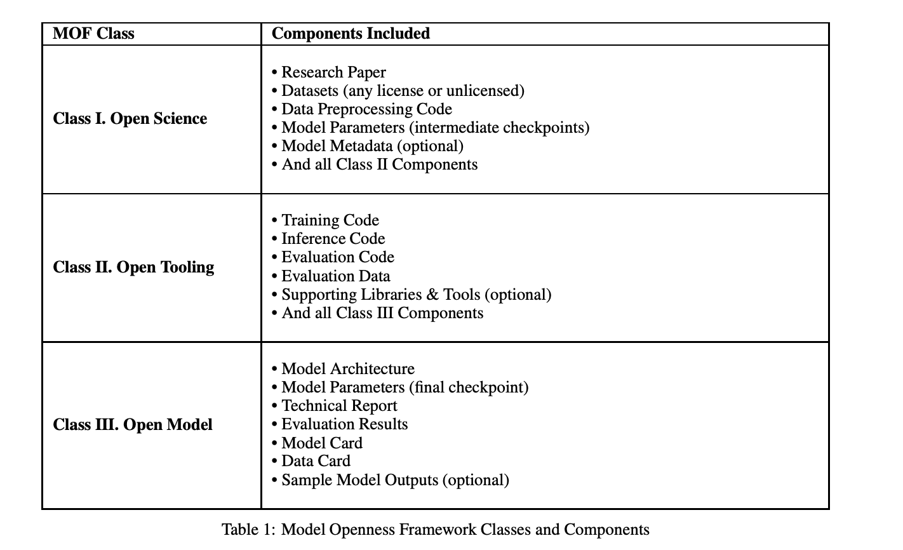

# Model Openness Framework (MOF): Enhancing AI Transparency with 17 Essential Components for Full Lifecycle Openness and Reproducibility

> Artificial Intelligence (AI) has rapidly advanced, revolutionizing various sectors by performing tasks that require human intelligence, such as learning, reasoning, and problem-solving. Improvements in machine learning algorithms, computational capabilities, and the availability of large datasets drive these advancements. Despite the progress, the field faces significant challenges regarding transparency and reproducibility, which are critical for scientific […]

Artificial Intelligence (AI) has rapidly advanced, revolutionizing various sectors by performing tasks that require human intelligence, such as learning, reasoning, and problem-solving. Improvements in machine learning algorithms, computational capabilities, and the availability of large datasets drive these advancements. Despite the progress, the field faces significant challenges regarding transparency and reproducibility, which are critical for scientific validation and public trust in AI systems.

The core issue lies in the need for AI models to be more open. Although labeled as open-source, many AI models only provide some necessary components for thorough understanding and independent verification. This lack of transparency erodes the credibility of AI research and limits the potential for collaborative development. Full access to data, code, and documentation makes reproducing results or building upon existing models easier, stifling innovation and raising ethical concerns about using these systems.

Existing methods for sharing AI models often involve releasing only selected elements, such as the final trained model and weights, without comprehensive documentation or clear licensing. Platforms like Hugging Face and GitHub facilitate the distribution of models but frequently need to include detailed information about data preprocessing, training processes, and evaluation metrics. This piecemeal approach leaves users and researchers with an incomplete picture, making verifying claims or adapting models for different applications difficult. As a result, the AI community faces significant barriers to transparency, reproducibility, and trust.

Researchers from the Linux Foundation, the University of Oxford, Columbia University, and Generative AI Commons have developed the **Model Openness Framework (MOF)**, a comprehensive system designed to promote transparency and reproducibility in AI model development. The MOF provides a classification system that ranks AI models based on completeness and openness. This framework requires including all components in the model development lifecycle and mandates that they be released under appropriate open licenses, thus ensuring full transparency.

The MOF defines 17 essential components for model openness, including datasets, data preprocessing code, model architecture, trained model parameters, metadata, training, inference code, evaluation code, data, supporting libraries, and tools. Each component must be released under open licenses suitable for its type, such as OSI-approved licenses for code and CDLA-Permissive for data. By specifying these requirements, the MOF ensures that the community can fully inspect, replicate, and extend models, thus aligning with the principles of open science. This comprehensive approach addresses the shortcomings of current methods and sets a new standard for openness in AI research.

*[**Image Source**](https://arxiv.org/pdf/2403.13784)*

Implementing the MOF has shown significant improvements in the transparency and reproducibility of AI research. Models classified under this framework have demonstrated enhanced accessibility for review, modification, and extension, fostering a more collaborative and innovative environment. For instance, the framework has effectively combat “open washing,” where models are misleadingly marketed as open-source despite significant restrictions. By distinguishing genuinely open models from those that are not, the MOF helps ensure that users and researchers can trust and verify the models they work with, promoting responsible AI development.

*[**Image Source**](https://arxiv.org/pdf/2403.13784)*

The MOF also introduces a classification system with three levels: Class I, Class II, and Class III. Class III, the entry level, includes core components such as the model architecture and final parameters, along with basic documentation and evaluation results. Class II builds on this by adding full training and inference code, benchmark tests, and supporting libraries. Class I, the highest level, aligns with the ideals of open science by requiring a detailed research paper, raw training datasets, and comprehensive log files. This tiered approach guides model producers in progressively enhancing the completeness and openness of their releases.

In conclusion, the Model Openness Framework mandates the comprehensive disclosure of all model components and their appropriate licensing, and the MOF addresses critical issues of reproducibility and trust. This framework not only aids researchers and developers in sharing their work more openly but also helps users adopt and implement AI models confidently and responsibly. 

---

Check out the [**Paper**.](https://arxiv.org/abs/2403.13784) All credit for this research goes to the researchers of this project. Also, don’t forget to follow us on **[Twitter](https://twitter.com/Marktechpost)** and join our **[Telegram Channel](https://pxl.to/at72b5j)** and [**LinkedIn Gr**](https://www.linkedin.com/groups/13668564/)[**oup**](https://www.linkedin.com/groups/13668564/). **If you like our work, you will love our**[** newsletter..**](https://marktechpost-newsletter.beehiiv.com/subscribe)

Don’t Forget to join our **[48k+ ML SubReddit](https://www.reddit.com/r/machinelearningnews/)**

**Find Upcoming [AI Webinars here](https://www.marktechpost.com/ai-webinars-list-llms-rag-generative-ai-ml-vector-database/)**

---

> [Arcee AI Released DistillKit: An Open Source, Easy-to-Use Tool Transforming Model Distillation for Creating Efficient, High-Performance Small Language Models](https://www.marktechpost.com/2024/08/01/arcee-ai-released-distillkit-an-open-source-easy-to-use-tool-transforming-model-distillation-for-creating-efficient-high-performance-small-language-models/)
