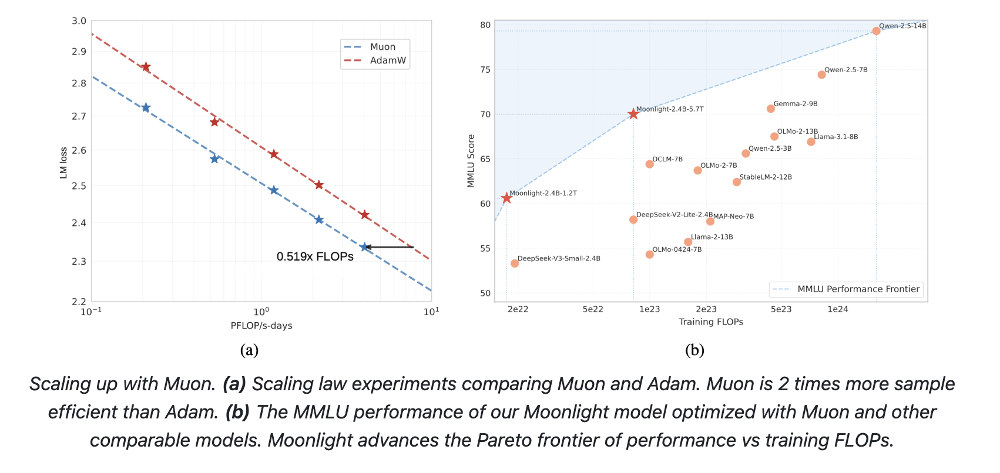

# Moonshot AI and UCLA Researchers Release Moonlight: A 3B/16B-Parameter Mixture-of-Expert (MoE) Model Trained with 5.7T Tokens Using Muon Optimizer

> Training large language models (LLMs) has become central to advancing artificial intelligence, yet it is not without its challenges. As model sizes and datasets continue to grow, traditional optimization methods—most notably AdamW—begin to show their limitations. One of the main difficulties is managing the computational cost and ensuring stability throughout extended training runs. Issues such […]

Training large language models (LLMs) has become central to advancing artificial intelligence, yet it is not without its challenges. As model sizes and datasets continue to grow, traditional optimization methods—most notably AdamW—begin to show their limitations. One of the main difficulties is managing the computational cost and ensuring stability throughout extended training runs. Issues such as vanishing or exploding gradients, inconsistent update magnitudes across diverse parameter matrices, and the heavy resource demands of distributed environments complicate the process. In essence, as researchers push toward models with billions of parameters and trillions of tokens, there is a pressing need for more refined optimization techniques that can handle these complexities with greater efficiency and stability.

In an effort to address these challenges, Moonshot AI in collaboration with UCLA has developed Moonlight—a Mixture-of-Expert (MoE) model optimized using the Muon optimizer. Moonlight is offered in two configurations: a version with 3 billion activated parameters and a total of 16 billion parameters, trained on 5.7 trillion tokens. This work builds upon the Muon optimizer, originally designed for smaller models, by scaling its principles to meet the demands of larger training regimes. Muon’s core innovation lies in its use of matrix orthogonalization through Newton-Schulz iterations. This method helps to ensure that gradient updates are applied more uniformly across the model’s parameter space. By addressing the common pitfalls associated with AdamW, Muon provides a promising alternative that enhances both training efficiency and stability.

### Technical Details 

A closer look at the technical innovations behind Moonlight reveals the thoughtful adjustments made to the Muon optimizer. Two primary modifications were key to making Muon suitable for large-scale training. First, the integration of weight decay—a technique commonly used with AdamW—helps to control the growth of weight magnitudes, particularly when training with large models and extensive token counts. Without weight decay, weights and layer outputs might grow excessively, potentially degrading model performance over time.

The second adjustment involves calibrating the per-parameter update scale. In practice, the update magnitude in Muon can vary based on the shape of the weight matrices. To harmonize these updates, the method scales them by a factor proportional to the square root of the largest dimension of each matrix. This change aligns Muon’s behavior more closely with the well-understood performance of AdamW and ensures that all parameters are updated consistently.

Furthermore, the distributed implementation of Muon builds on techniques from ZeRO-1, partitioning optimizer states across data-parallel groups. This approach reduces memory overhead and limits the communication costs typically associated with distributed training. Although additional steps—such as gathering gradients and performing Newton-Schulz iterations—are required, these have been optimized so that their impact on overall training time remains minimal. The result is an optimizer that maintains competitive performance while requiring fewer computational resources.

### Insights from Empirical Results and Data Analysis

Empirical evaluations of Moonlight underscore the practical benefits of these technical improvements. At an intermediate checkpoint of 1.2 trillion tokens, Moonlight demonstrated modest improvements over its counterpart trained with AdamW (referred to as Moonlight-A) and other similar MoE models. For example, in tasks assessing language understanding, Moonlight achieved slightly higher scores on benchmarks like MMLU. In code generation tasks, its performance gains were even more evident, suggesting that the refined update mechanics of Muon contribute to better overall task performance.

Scaling law experiments further illustrate the advantages of Muon. These experiments reveal that Muon can match the performance of AdamW-trained models while using only about half the training computational cost. This efficiency is an important consideration for researchers balancing resource constraints with the desire to push model capabilities. Additionally, spectral analysis of the weight matrices indicates that Moonlight’s training with Muon leads to a more diverse range of singular values. Such diversity in update directions may help the model generalize better across various tasks.

Additional studies during the supervised fine-tuning phase indicate that when both pretraining and fine-tuning are carried out with Muon, the benefits of this optimizer persist throughout the training pipeline. In cases where the optimizer is switched between pretraining and fine-tuning, the differences are less pronounced, suggesting that consistency in the optimization method is beneficial.

### Conclusion

In summary, the development of Moonlight represents a thoughtful advancement in the training of large language models. By adopting the Muon optimizer, the team at Moonshot AI and UCLA has provided a viable alternative to traditional methods like AdamW, demonstrating improvements in training efficiency and model stability. Key enhancements include the integration of weight decay and adjustments to the per-parameter update scale, both of which help to harmonize updates across different types of weight matrices. The distributed implementation further underscores the practical benefits of this approach, particularly in reducing memory and communication overhead in large-scale training environments.

The insights gained from the Moonlight project are clearly articulated in the technical report, “Muon is Scalable for LLM Training.” This work shows that, under compute-optimal conditions, Muon can achieve comparable or even superior performance to AdamW while significantly reducing the computational cost. The report also highlights that transitioning from AdamW to Muon does not require extensive hyper-parameter tuning, simplifying the integration process for researchers.

Looking ahead, the open-sourcing of the Muon implementation along with pretrained models and intermediate checkpoints is expected to foster further research into scalable optimization techniques. Future work may explore extending Muon to other norm constraints or integrating its benefits into a unified optimization framework that covers all model parameters. Such endeavors could lead to even more robust and efficient training strategies, gradually shaping a new standard for LLM development.

---

Check out **_the [Paper](https://github.com/MoonshotAI/Moonlight/blob/master/Moonlight.pdf), [Model on Hugging Face](https://huggingface.co/moonshotai/Moonlight-16B-A3B) and [GitHub Page](https://github.com/MoonshotAI/Moonlight?tab=readme-ov-file)._** All credit for this research goes to the researchers of this project. Also, feel free to follow us on **[Twitter](https://x.com/intent/follow?screen_name=marktechpost)** and don’t forget to join our **[75k+ ML SubReddit](https://www.reddit.com/r/machinelearningnews/)**.

**🚨 [Recommended Read- LG AI Research Releases NEXUS: An Advanced System Integrating Agent AI System and Data Compliance Standards to Address Legal Concerns in AI Datasets](https://www.marktechpost.com/2025/02/16/lg-ai-research-releases-nexus-an-advanced-system-integrating-agent-ai-system-and-data-compliance-standards-to-address-legal-concerns-in-ai-datasets/)**
