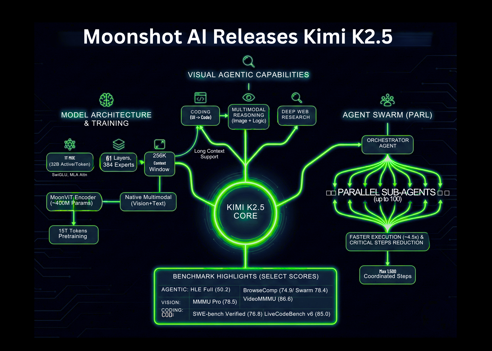

# Moonshot AI Releases Kimi K2.5: An Open Source Visual Agentic Intelligence Model with Native Swarm Execution

> Moonshot AI has released Kimi K2.5 as an open source visual agentic intelligence model. It combines a large Mixture of Experts language backbone, a native vision encoder, and a parallel multi agent system called Agent Swarm. The model targets coding, multimodal reasoning, and deep web research with strong benchmark results on agentic, vision, and coding […]

Moonshot AI has released Kimi K2.5 as an open source visual agentic intelligence model. It combines a large Mixture of Experts language backbone, a native vision encoder, and a parallel multi agent system called Agent Swarm. The model targets coding, multimodal reasoning, and deep web research with strong benchmark results on agentic, vision, and coding suites.

### Model Architecture and Training

Kimi K2.5 is a Mixture of Experts model with 1T total parameters and about 32B activated parameters per token. The network has 61 layers. It uses 384 experts, with 8 experts selected per token plus 1 shared expert. The attention hidden size is 7168 and there are 64 attention heads.

The model uses MLA attention and the SwiGLU activation function. The tokenizer vocabulary size is 160K. The maximum context length during training and inference is 256K tokens. This supports long tool traces, long documents, and multi step research workflows.

Vision is handled by a MoonViT encoder with about 400M parameters. Visual tokens are trained together with text tokens in a single multimodal backbone. Kimi K2.5 is obtained by continual pretraining on about 15T tokens of mixed vision and text data on top of Kimi K2 Base. This native multimodal training is important because the model learns joint structure over images, documents, and language from the start.

The released checkpoints support standard inference stacks such as vLLM, SGLang, and KTransformers with transformers version 4.57.1 or newer. Quantized INT4 variants are available, reusing the method from Kimi K2 Thinking. This allows deployment on commodity GPUs with lower memory budgets.

### Coding and Multimodal Capabilities

Kimi K2.5 is positioned as a strong open source coding model, especially when code generation depends on visual context. The model can read UI mockups, design screenshots, or even videos, then emit structured frontend code with layout, styling, and interaction logic.

Moonshot shows examples where the model reads a puzzle image, reasons about the shortest path, and then writes code that produces a visualized solution. This demonstrates cross modal reasoning, where the model combines image understanding, algorithmic planning, and code synthesis in a single flow.

Because K2.5 has a 256K context window, it can keep long specification histories in context. A practical workflow for developers is to mix design assets, product docs, and existing code in one prompt. The model can then refactor or extend the codebase while keeping visual constraints aligned with the original design.

*https://www.kimi.com/blog/kimi-k2-5.html?*

### Agent Swarm and Parallel Agent Reinforcement Learning

A key feature of Kimi K2.5 is Agent Swarm. This is a multi agent system trained with Parallel Agent Reinforcement Learning, PARL. In this setup an orchestrator agent decomposes a complex goal into many subtasks. It then spins up domain specific sub agents to work in parallel.

Kimi team reports that K2.5 can manage up to 100 sub agents within a task. It supports up to 1,500 coordinated steps or tool calls in one run. This parallelism gives about 4.5 times faster completion compared with a single agent pipeline on wide search tasks.

PARL introduces a metric called Critical Steps. The system rewards policies that reduce the number of serial steps needed to solve the task. This discourages naive sequential planning and pushes the agent to split work into parallel branches while still maintaining consistency.

One example by the Kimi team is a research workflow where the system needs to discover many niche creators. The orchestrator uses Agent Swarm to spawn a large number of researcher agents. Each agent explores different regions of the web, and the system merges results into a structured table.

*https://www.kimi.com/blog/kimi-k2-5.html?*

### Benchmark Performance

On agentic benchmarks, Kimi K2.5 reports strong numbers. On HLE Full with tools the score is 50.2. On BrowseComp with context management the score is 74.9. In Agent Swarm mode the BrowseComp score increases further to 78.4 and WideSearch metrics also improve. The Kimi team compares these values with GPT 5.2, Claude 4.5, Gemini 3 Pro, and DeepSeek V3, and K2.5 shows the highest scores among the listed models on these specific agentic suites.

On vision and video benchmarks K2.5 also reports high scores. MMMU Pro is 78.5 and VideoMMMU is 86.6. The model performs well on OmniDocBench, OCRBench, WorldVQA, and other document and scene understanding tasks. These results indicate that the MoonViT encoder and long context training are effective for real world multimodal problems, such as reading complex documents and reasoning over videos.

*https://www.kimi.com/blog/kimi-k2-5.html?*

For coding benchmarks it lists SWE Bench Verified at 76.8, SWE Bench Pro at 50.7, SWE Bench Multilingual at 73.0, Terminal Bench 2.0 at 50.8, and LiveCodeBench v6 at 85.0. These numbers place K2.5 among the strongest open source coding models currently reported on these tasks.

On long context language benchmarks, K2.5 reaches 61.0 on LongBench V2 and 70.0 on AA LCR under standard evaluation settings. For reasoning benchmarks it achieves high scores on AIME 2025, HMMT 2025 February, GPQA Diamond, and MMLU Pro when used in thinking mode.

### Key Takeaways

- **Mixture of Experts at trillion scale**: Kimi K2.5 uses a Mixture of Experts architecture with 1T total parameters and about 32B active parameters per token, 61 layers, 384 experts, and 256K context length, optimized for long multimodal and tool heavy workflows.

- **Native multimodal training with MoonViT**: The model integrates a MoonViT vision encoder of about 400M parameters and is trained on about 15T mixed vision and text tokens, so images, documents, and language are handled in a single unified backbone.

- **Parallel Agent Swarm with PARL**: Agent Swarm, trained with Parallel Agent Reinforcement Learning, can coordinate up to 100 sub agents and about 1,500 tool calls per task, giving around 4.5 times faster execution versus a single agent on wide research tasks.

- **Strong benchmark results in coding, vision, and agents**: K2.5 reports 76.8 on SWE Bench Verified, 78.5 on MMMU Pro, 86.6 on VideoMMMU, 50.2 on HLE Full with tools, and 74.9 on BrowseComp, matching or exceeding listed closed models on several agentic and multimodal suites.

---

Check out the **[Technical details](https://www.kimi.com/blog/kimi-k2-5.html?) **and** [Model Weight](https://huggingface.co/moonshotai/Kimi-K2.5)**. Also, feel free to follow us on **[Twitter](https://x.com/intent/follow?screen_name=marktechpost)** and don’t forget to join our **[100k+ ML SubReddit](https://www.reddit.com/r/machinelearningnews/)** and Subscribe to **[our Newsletter](https://www.aidevsignals.com/)**. Wait! are you on telegram? **[now you can join us on telegram as well.](https://t.me/machinelearningresearchnews)**
