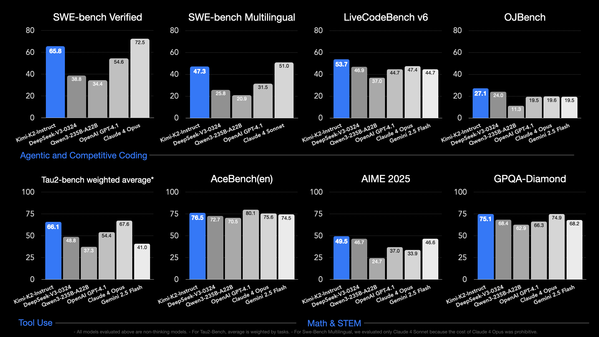

# Moonshot AI Releases Kimi K2: A Trillion-Parameter MoE Model Focused on Long Context, Code, Reasoning, and Agentic Behavior

> Kimi K2, launched by Moonshot AI in July 2025, is a purpose-built, open-source Mixture-of-Experts (MoE) model—1 trillion total parameters, with 32 billion active parameters per token. It’s trained using the custom MuonClip optimizer on 15.5 trillion tokens, achieving stable training at this unprecedented scale without the typical instabilities seen in ultra-large models. Unlike traditional chatbots, K2 is architected […]

**Kimi K2**, launched by Moonshot AI in July 2025, is a purpose-built, open-source **Mixture-of-Experts (MoE)** model—1 trillion total parameters, with _32 billion active parameters_ per token. It’s trained using the custom **MuonClip** optimizer on 15.5 trillion tokens, achieving stable training at this unprecedented scale without the typical instabilities seen in ultra-large models.

Unlike traditional chatbots, K2 is architected specifically for **agentic workflows**. It features native **Model Context Protocol (MCP)** support and was trained on simulated multi-step tool interactions, enabling it to autonomously decompose tasks, execute tool sequences, write and debug code, analyze data, and orchestrate workflows—all with minimal human oversight.

### Why Agentic over Conversational?

While advanced models like GPT-4 and Claude 4 Sonnet excel at language reasoning, **Kimi K2 moves from reasoning to action**. It doesn’t just respond—it executes. The core shift lies in enabling real-world workflows:

- **Autonomous code execution**

- **Data analysis with charts and interfaces**

- **End-to-end web application development**

- **Orchestration of 17+ tools per session without human input**

K2’s training incorporated millions of synthetic dialogues, each rated by an LLM-based evaluator. These dialogues simulate realistic tool-use scenarios, giving K2 a practical edge in tool selection and multi-step execution.

### Architecture and Training Innovations

K2’s technical design demonstrates several novel elements:

- **MoE Transformer Design**: 384 experts with routing to 8 active experts per token, plus 1 shared expert for global context. The model uses 64 attention heads and supports a 128K-token context window.

- **MuonClip Optimizer**: A modified version of Muon that stabilizes training at scale. It uses **qk-clipping** to constrain attention scores by rescaling Q/K matrices, effectively preventing instability in deep layers.

- **Training Dataset**: Over 15.5 trillion tokens from multilingual and multimodal sources, giving K2 robust generalization and tool-use reasoning across diverse domains.

The model comes in two variants: **Kimi-K2-Base**, the foundational model ideal for fine-tuning and building customized solutions; and **Kimi-K2-Instruct**, the post-trained version optimized for immediate use in general-purpose chat and tool-using agentic tasks. Instruct is reflex-grade—optimized for fast, low-latency interaction rather than long-form deliberation. On benchmarks, Kimi K2 outperforms Claude Sonnet 4 and GPT-4.1 in coding and agentic reasoning, with **71.6% on SWE-bench**, **65.8% on agentic tasks**, and **53.7% on LiveCodeBench**.

### Performance Benchmarks

Kimi K2 not only matches but often surpasses closed-source models on key benchmarks:

BenchmarkKimi K2GPT‑4.1Claude Sonnet 4SWE-bench Verified71.6 %54.6 %~72.7 %Agentic Coding (Tau2)65.8 %45.2 %~61 %LiveCodeBench v6 (Pass@1)53.7 %44.7 %47.4 %MATH-50097.4 %92.4 %–MMLU89.5 %~90.4 %~92.9 %

Its performance in **agentic benchmarks** like Tau2 and LiveCodeBench demonstrates its superior capacity to handle multi-step, real-world coding tasks—outperforming many proprietary models.

### Cost Efficiency

Perhaps the most disruptive element is pricing:

- **Claude 4 Sonnet**: $3 input / $15 output per million tokens

- **Gemini 2.5 Pro**: $2.5 input / $15 output

- **Kimi K2**: **$0.60 input / $2.50 output**

Kimi K2 is roughly **5x cheaper** than Claude or Gemini while offering equal or better performance on several metrics. The cost advantage, combined with open access and support for local deployment, positions K2 as an economically viable alternative for developers, enterprises, and research teams.

### Strategic Shift: From Thinking to Acting

Kimi K2 marks a pivotal moment in AI’s evolution—from **thinking agents** to **acting systems**. With native tool-use capabilities and built-in support for multi-agent protocols, it goes far beyond static chat interfaces. It is capable of triggering workflows, making decisions, executing API calls, and delivering tangible outputs autonomously.

Moreover, its release comes at a time when most such capabilities are either locked behind expensive APIs or limited to research labs. K2 is:

- **Open-source**, requiring no subscription

- **Globally accessible**, not limited to US-based deployment

- **Designed for developers**, not just end-users

### Broader Implications

- **Will agentic architecture become the norm?** K2’s strong performance on tool use tasks could push proprietary players to rethink their architectures.

- **Can open-source efforts from Asia compete at global scale?** With K2, Moonshot AI joins others like DeepSeek in showing that top-tier performance doesn’t have to originate from Silicon Valley.

- **What’s next in the agentic evolution?** Future models may combine video, robotics, and embodied reasoning to further expand the scope of what agentic AI can accomplish.

### Conclusion

**Kimi K2** isn’t just a bigger model—it’s a blueprint for what comes after the reasoning race: **execution-first AI**. By combining trillion-parameter scale, low inference costs, and deeply integrated agentic capabilities, Kimi K2 opens the door for AI systems that do more than generate—they build, act, and solve autonomously.

Check out the **[Models on Hugging Face](https://huggingface.co/collections/moonshotai/kimi-k2-6871243b990f2af5ba60617d) and [GitHub Page](https://github.com/MoonshotAI/Kimi-K2)**. All credit for this research goes to the researchers of this project. Also, feel free to follow us on **[Twitter](https://x.com/intent/follow?screen_name=marktechpost)**, and **[Youtube](https://www.youtube.com/@Marktechpost)** and don’t forget to join our **[100k+ ML SubReddit](https://www.reddit.com/r/machinelearningnews/)** and Subscribe to **[our Newsletter](https://www.airesearchinsights.com/subscribe)**.
