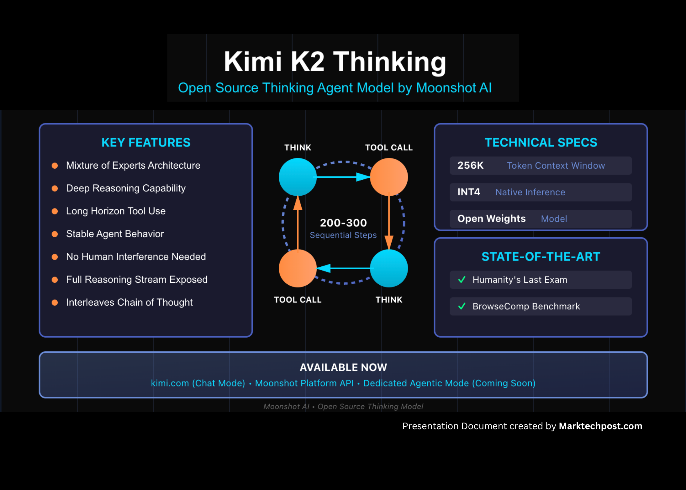

# Moonshot AI Releases Kimi K2 Thinking: An Impressive Thinking Model that can Execute up to 200–300 Sequential Tool Calls without Human Interference

> How do we design AI systems that can plan, reason, and act over long sequences of decisions without constant human guidance? Moonshot AI has released Kimi K2 Thinking, an open source thinking agent model that exposes the full reasoning stream of the Kimi K2 Mixture of Experts architecture. It targets workloads that need deep reasoning, […]

How do we design AI systems that can plan, reason, and act over long sequences of decisions without constant human guidance? Moonshot AI has released Kimi K2 Thinking, an open source thinking agent model that exposes the full reasoning stream of the Kimi K2 Mixture of Experts architecture. It targets workloads that need deep reasoning, long horizon tool use, and stable agent behavior across many steps.

*https://moonshotai.github.io/Kimi-K2/thinking.html*

### What is Kimi K2 Thinking?

Kimi K2 Thinking is described as the latest, most capable version of Moonshot’s open source thinking model. It is built as a thinking agent that reasons step by step and dynamically invokes tools during inference. The model is designed to interleave chain of thought with function calls so it can read, think, call a tool, think again, and repeat for hundreds of steps.

The model sets a new state of the art on Humanity’s Last Exam and BrowseComp, while maintaining coherent behavior across about 200 to 300 sequential tool calls without human interference.

At the same time, K2 Thinking is released as an open weights model with a 256K token context window and native INT4 inference, which reduces latency and GPU memory usage while preserving benchmark performance.

K2 Thinking is already live on kimi.com in chat mode and is accessible through the Moonshot platform API, with a dedicated agentic mode planned to expose the full tool using behavior.

### Architecture, MoE design, and context length

Kimi K2 Thinking inherits the Kimi K2 Mixture of Experts design. The model uses a MoE architecture with 1T total parameters and 32B activated parameters per token. It has 61 layers including 1 dense layer, 384 experts with 8 experts selected per token, 1 shared expert, 64 attention heads, and an attention hidden dimension of 7168. The MoE hidden dimension is 2048 per expert.

The vocabulary size is 160K tokens and the context length is 256K. The attention mechanism is Multi head Latent Attention, and the activation function is SwiGLU.

### Test time scaling and long horizon thinking

Kimi K2 Thinking is explicitly optimized for test time scaling. The model is trained to expand its reasoning length and tool call depth when facing harder tasks, rather than relying on a fixed short chain of thought.

*https://moonshotai.github.io/Kimi-K2/thinking.html*

On Humanity’s Last Exam in the no tools setting, K2 Thinking scores 23.9. With tools, the score rises to 44.9, and in the heavy setting it reaches 51.0. On AIME25 with Python, it reports 99.1, and on HMMT25 with Python it reports 95.1. On IMO AnswerBench it scores 78.6, and on GPQA it scores 84.5.

The testing protocol caps thinking token budgets at 96K for HLE, AIME25, HMMT25, and GPQA. It uses 128K thinking tokens for IMO AnswerBench, LiveCodeBench, and OJ Bench, and 32K completion tokens for Longform Writing. On HLE, the maximum step limit is 120 with a 48K reasoning budget per step. On agentic search tasks, the limit is 300 steps with a 24K reasoning budget per step.

### Benchmarks in agentic search and coding

On agentic search tasks with tools, K2 Thinking reports 60.2 on BrowseComp, 62.3 on BrowseComp ZH, 56.3 on Seal 0, 47.4 on FinSearchComp T3, and 87.0 on Frames.

On general knowledge benchmarks, it reports 84.6 on MMLU Pro, 94.4 on MMLU Redux, 73.8 on Longform Writing, and 58.0 on HealthBench.

For coding, K2 Thinking achieves 71.3 on SWE bench Verified with tools, 61.1 on SWE bench Multilingual with tools, 41.9 on Multi SWE bench with tools, 44.8 on SciCode, 83.1 on LiveCodeBenchV6, 48.7 on OJ Bench in the C plus plus setting, and 47.1 on Terminal Bench with simulated tools.

Moonshot team also defines a Heavy Mode that runs eight trajectories in parallel, then aggregates them to produce a final answer. This is used in some reasoning benchmarks to squeeze out extra accuracy from the same base model.

### Native INT4 quantization and deployment

K2 Thinking is trained as a native INT4 model. The research team applies Quantization Aware Training during the post training stage and uses INT4 weight only quantization on the MoE components. This supports INT4 inference with roughly a 2x generation speed improvement in low latency mode while maintaining state of the art performance. All reported benchmark scores are obtained under INT4 precision.

The checkpoints are saved in compressed tensors format and can be unpacked to higher precision formats such as FP8 or BF16 using the official compressed tensors tools. Recommended inference engines include vLLM, SGLang, and KTransformers.

### Key Takeaways

- Kimi K2 Thinking is an open weights thinking agent that extends the Kimi K2 Mixture of Experts architecture with explicit long horizon reasoning and tool use, not just short chat style responses.

- The model uses a trillion parameter MoE design with about tens of billions of active parameters per token, a 256K context window, and is trained as a native INT4 model with Quantization Aware Training, which gives about 2x faster inference while keeping benchmark performance stable.

- K2 Thinking is optimized for test time scaling, it can carry out hundreds of sequential tool calls in a single task and is evaluated under large thinking token budgets and strict step caps, which is important when you try to reproduce its reasoning and agentic results.

- On public benchmarks, it leads or is competitive on reasoning, agentic search, and coding tasks such as HLE with tools, BrowseComp, and SWE bench Verified with tools, showing that the thinking oriented variant delivers clear gains over the base non thinking K2 model.

### Editorial Comments

Kimi K2 Thinking is a strong signal that test time scaling is now a first class design target for open source reasoning models. Moonshot AI is not only exposing a 1T parameter Mixture of Experts system with 32B active parameters and 256K context window, it is doing so with native INT4 quantization, Quantization Aware Training, and tool orchestration that runs for hundreds of steps in production like settings. Overall, Kimi K2 Thinking shows that open weights reasoning agents with long horizon planning and tool use are becoming practical infrastructure, not just research demos.

---

Check out the **[Model Weights](https://huggingface.co/collections/moonshotai/kimi-k2) **and [**Technical Details**.](https://moonshotai.github.io/Kimi-K2/thinking.html) Feel free to check out our **[GitHub Page for Tutorials, Codes and Notebooks](https://github.com/Marktechpost/AI-Tutorial-Codes-Included)**. Also, feel free to follow us on **[Twitter](https://x.com/intent/follow?screen_name=marktechpost)** and don’t forget to join our **[100k+ ML SubReddit](https://www.reddit.com/r/machinelearningnews/)** and Subscribe to **[our Newsletter](https://www.aidevsignals.com/)**. Wait! are you on telegram? **[now you can join us on telegram as well.](https://t.me/machinelearningresearchnews)**
