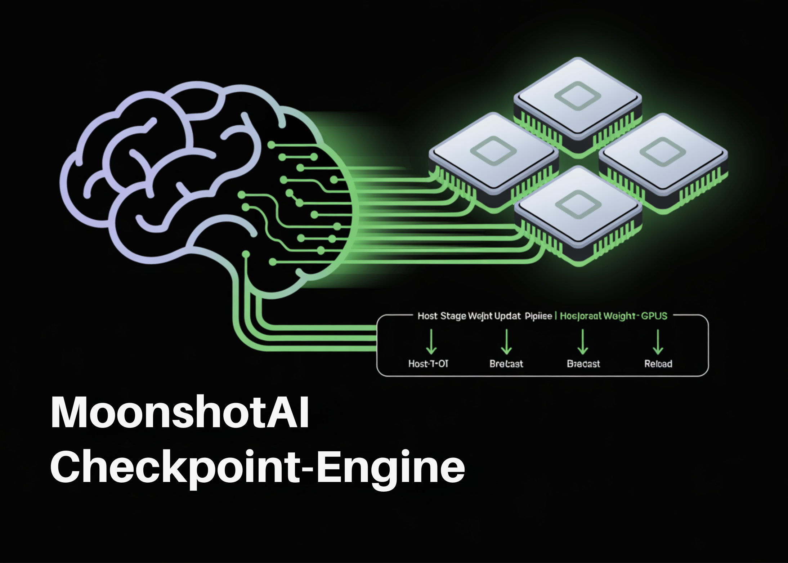

# MoonshotAI Released Checkpoint-Engine: A Simple Middleware to Update Model Weights in LLM Inference Engines, Effective for Reinforcement Learning

> MoonshotAI has open-sourced checkpoint-engine, a lightweight middleware aimed at solving one of the key bottlenecks in large language model (LLM) deployment: rapidly updating model weights across thousands of GPUs without disrupting inference. The library is particularly designed for reinforcement learning (RL) and reinforcement learning with human feedback (RLHF), where models are updated frequently and downtime […]

MoonshotAI has open-sourced **checkpoint-engine**, a lightweight middleware aimed at solving one of the key bottlenecks in large language model (LLM) deployment: rapidly updating model weights across thousands of GPUs without disrupting inference.

The library is particularly designed for reinforcement learning (RL) and reinforcement learning with human feedback (RLHF), where models are updated frequently and downtime directly impacts system throughput.

*https://github.com/MoonshotAI/checkpoint-engine*

### How Fast can LLMs be updated?

Checkpoint-engine delivers a significant breakthrough by updating a **1-trillion parameter model across thousands of GPUs in roughly 20 seconds**.

Traditional distributed inference pipelines can take several minutes to reload models of this size. By reducing the update time by an order of magnitude, checkpoint-engine directly addresses one of the largest inefficiencies in large-scale serving.

**The system achieves this through:**

- **Broadcast updates** for static clusters.

- **Peer-to-peer (P2P) updates** for dynamic clusters.

- **Overlapped communication and memory copy** for reduced latency.

### What does the Architecture look like?

Checkpoint-engine sits between training engines and inference clusters. **Its design includes:**

- A **Parameter [Server](https://www.marktechpost.com/2025/08/08/proxy-servers-explained-types-use-cases-trends-in-2025-technical-deep-dive/)** that coordinates updates.

- **Worker Extensions** that integrate with inference frameworks such as vLLM.

**The weight update pipeline runs in three stages:**

- **Host-to-Device (H2D):** Parameters are copied into GPU memory.

- **Broadcast:** Weights are distributed across workers using CUDA IPC buffers.

- **Reload:** Each inference shard reloads only the subset of weights it needs.

This staged pipeline is optimized for overlap, ensuring GPUs remain active throughout the update process.

### How does it perform in practice?

**Benchmarking results confirm checkpoint-engine’s scalability:**

- **GLM-4.5-Air (BF16, 8×H800):** 3.94s (broadcast), 8.83s (P2P).

- **Qwen3-235B-Instruct (BF16, 8×H800):** 6.75s (broadcast), 16.47s (P2P).

- **DeepSeek-V3.1 (FP8, 16×H20):** 12.22s (broadcast), 25.77s (P2P).

- **Kimi-K2-Instruct (FP8, 256×H20):** ~21.5s (broadcast), 34.49s (P2P).

Even at trillion-parameter scale with 256 GPUs, broadcast updates complete in about 20 seconds, validating its design goal.

### What are some trade-offs?

Checkpoint-engine introduces notable advantages, but also comes with limitations:

- **Memory Overhead:** Overlapped pipelines require additional GPU memory; insufficient memory triggers slower fallback paths.

- **P2P Latency:** Peer-to-peer updates support elastic clusters but at a performance cost.

- **Compatibility:** Officially tested with vLLM only; broader engine support requires engineering work.

- **Quantization:** FP8 support exists but remains experimental.

### Where does it fit in deployment scenarios?

**Checkpoint-engine is most valuable for:**

- **Reinforcement learning pipelines** where frequent weight updates are required.

- **Large inference clusters** serving 100B–1T+ parameter models.

- **Elastic environments** with dynamic scaling, where P2P flexibility offsets latency trade-offs.

### Summary

Checkpoint-engine represents a focused solution to one of the hardest problems in large-scale LLM deployment: rapid weight synchronization without halting inference. With demonstrated updates at trillion-parameter scale in around 20 seconds, flexible support for both broadcast and P2P modes, and an optimized communication pipeline, it provides a practical path forward for reinforcement learning pipelines and high-performance inference clusters. While still limited to vLLM and requiring refinements in quantization and dynamic scaling, it establishes an important foundation for efficient, continuous model updates in production AI systems.

---

Check out the **[PROJECT PAGE here](https://github.com/MoonshotAI/checkpoint-engine)_._** Feel free to check out our **[GitHub Page for Tutorials, Codes and Notebooks](https://github.com/Marktechpost/AI-Tutorial-Codes-Included)**. Also, feel free to follow us on **[Twitter](https://x.com/intent/follow?screen_name=marktechpost)** and don’t forget to join our **[100k+ ML SubReddit](https://www.reddit.com/r/machinelearningnews/)** and Subscribe to **[our Newsletter](https://www.aidevsignals.com/)**.
