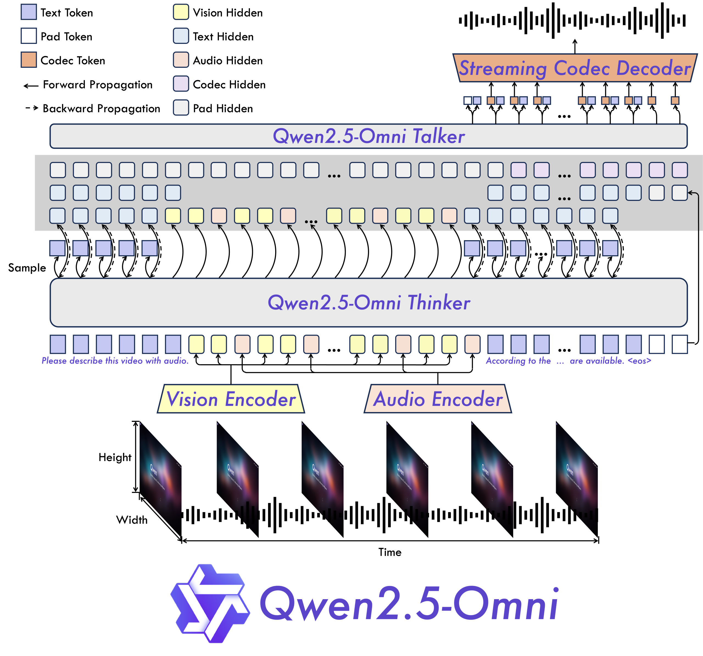

# Multimodal AI on Developer GPUs: Alibaba Releases Qwen2.5-Omni-3B with 50% Lower VRAM Usage and Nearly-7B Model Performance

> Multimodal foundation models have shown substantial promise in enabling systems that can reason across text, images, audio, and video. However, the practical deployment of such models is frequently hindered by hardware constraints. High memory consumption, large parameter counts, and reliance on high-end GPUs have limited the accessibility of multimodal AI to a narrow segment of […]

Multimodal foundation models have shown substantial promise in enabling systems that can reason across text, images, audio, and video. However, the practical deployment of such models is frequently hindered by hardware constraints. High memory consumption, large parameter counts, and reliance on high-end GPUs have limited the accessibility of multimodal AI to a narrow segment of institutions and enterprises. As research interest grows in deploying language and vision models at the edge or on modest computing infrastructure, there is a clear need for architectures that offer a balance between multimodal capability and efficiency.

### Alibaba Qwen Releases Qwen2.5-Omni-3B: Expanding Access with Efficient Model Design

In response to these constraints, Alibaba has released **Qwen2.5-Omni-3B**, a 3-billion parameter variant of its Qwen2.5-Omni model family. Designed for use on consumer-grade GPUs—particularly those with 24GB of memory—this model introduces a practical alternative for developers building multimodal systems without large-scale computational infrastructure.

Available through [GitHub](https://github.com/QwenLM/Qwen2.5-Omni), [Hugging Face](https://huggingface.co/Qwen/Qwen2.5-Omni-3B), and [ModelScope](https://modelscope.cn/models/Qwen/Qwen2.5-Omni-3B), the 3B model inherits the architectural versatility of the Qwen2.5-Omni family. It supports a unified interface for language, vision, and audio input, and is optimized to operate efficiently in scenarios involving long-context processing and real-time multimodal interaction.

### Model Architecture and Key Technical Features

Qwen2.5-Omni-3B is a transformer-based model that supports multimodal comprehension across text, images, and audio-video input. It shares the same design philosophy as its 7B counterpart, utilizing a modular approach where modality-specific input encoders are unified through a shared transformer backbone. Notably, the 3B model reduces memory overhead substantially, achieving over **50% reduction in VRAM consumption** when handling long sequences (~25,000 tokens).

**Key design characteristics include:**

- **Reduced Memory Footprint**: The model has been specifically optimized to run on 24GB GPUs, making it compatible with widely available consumer-grade hardware (e.g., NVIDIA RTX 4090).

- **Extended Context Processing**: Capable of processing long sequences efficiently, which is particularly beneficial in tasks such as document-level reasoning and video transcript analysis.

- **Multimodal Streaming**: Supports real-time audio and video-based dialogue up to 30 seconds in length, with stable latency and minimal output drift.

- **Multilingual Support and Speech Generation**: Retains capabilities for natural speech output with clarity and tone fidelity comparable to the 7B model.

### Performance Observations and Evaluation Insights

According to the information available on [ModelScope](https://modelscope.cn/models/Qwen/Qwen2.5-Omni-3B) and [Hugging Face](https://huggingface.co/Qwen/Qwen2.5-Omni-3B), Qwen2.5-Omni-3B demonstrates performance that is close to the 7B variant across several multimodal benchmarks. Internal assessments indicate that it retains **over 90% of the comprehension capability** of the larger model in tasks involving visual question answering, audio captioning, and video understanding.

In long-context tasks, the model remains stable across sequences up to ~25k tokens, making it suitable for applications that demand document-level synthesis or timeline-aware reasoning. In speech-based interactions, the model generates consistent and natural output over 30-second clips, maintaining alignment with input content and minimizing latency—a requirement in interactive systems and human-computer interfaces.

While the smaller parameter count naturally leads to a slight degradation in generative richness or precision under certain conditions, the overall trade-off appears favorable for developers seeking a high-utility model with reduced computational demands.

### Conclusion

Qwen2.5-Omni-3B represents a practical step forward in the development of efficient multimodal AI systems. By optimizing performance per memory unit, it opens opportunities for experimentation, prototyping, and deployment of language and vision models beyond traditional enterprise environments.

This release addresses a critical bottleneck in multimodal AI adoption—GPU accessibility—and provides a viable platform for researchers, students, and engineers working with constrained resources. As interest grows in edge deployment and long-context dialogue systems, compact multimodal models such as Qwen2.5-Omni-3B will likely form an important part of the applied AI landscape.

---

**Check out the model on [GitHub](https://github.com/QwenLM/Qwen2.5-Omni), [Hugging Face](https://huggingface.co/Qwen/Qwen2.5-Omni-3B), and [ModelScope](https://modelscope.cn/models/Qwen/Qwen2.5-Omni-3B)**. Also, don’t forget to follow us on **[Twitter](https://x.com/intent/follow?screen_name=marktechpost)** and join our **[Telegram Channel](https://arxiv.org/abs/2406.09406)** and [**LinkedIn Gr**](https://www.linkedin.com/groups/13668564/)[**oup**](https://www.linkedin.com/groups/13668564/). Don’t Forget to join our **[90k+ ML SubReddit](https://www.reddit.com/r/machinelearningnews/)**.

[**🔥 [Register Now] miniCON Virtual Conference on AGENTIC AI: FREE REGISTRATION + Certificate of Attendance + 4 Hour Short Event (May 21, 9 am- 1 pm PST) + Hands on Workshop**](https://minicon.marktechpost.com/)
