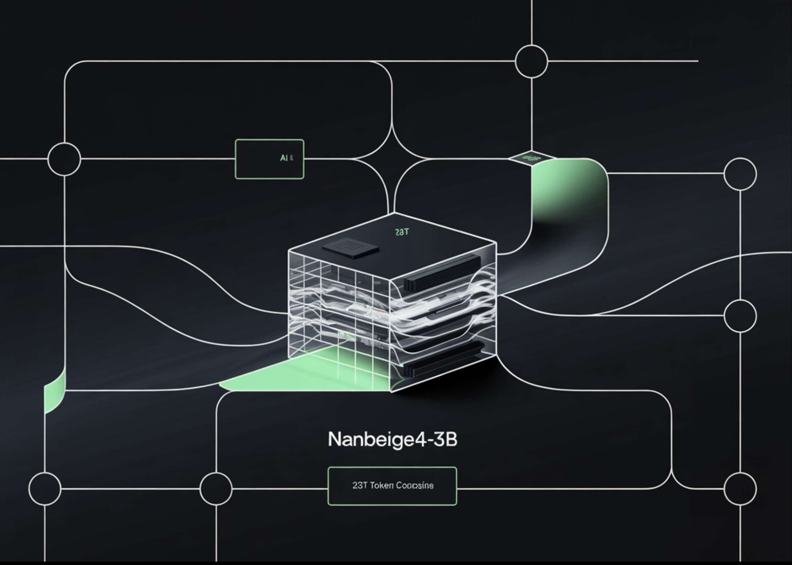

# Nanbeige4-3B-Thinking: How a 23T Token Pipeline Pushes 3B Models Past 30B Class Reasoning

> Can a 3B model deliver 30B class reasoning by fixing the training recipe instead of scaling parameters? Nanbeige LLM Lab at Boss Zhipin has released Nanbeige4-3B, a 3B parameter small language model family trained with an unusually heavy emphasis on data quality, curriculum scheduling, distillation, and reinforcement learning. The research team ships 2 primary checkpoints, […]

Can a 3B model deliver 30B class reasoning by fixing the training recipe instead of scaling parameters? Nanbeige LLM Lab at Boss Zhipin has released Nanbeige4-3B, a 3B parameter small language model family trained with an unusually heavy emphasis on data quality, curriculum scheduling, distillation, and reinforcement learning.

The research team ships 2 primary checkpoints, Nanbeige4-3B-Base and Nanbeige4-3B-Thinking, and evaluates the reasoning tuned model against Qwen3 checkpoints from 4B up to 32B parameters.

*https://arxiv.org/pdf/2512.06266*

## Benchmark results

On AIME 2024, Nanbeige4-3B-2511 reports 90.4, while Qwen3-32B-2504 reports 81.4. On GPQA-Diamond, Nanbeige4-3B-2511 reports 82.2, while Qwen3-14B-2504 reports 64.0 and Qwen3-32B-2504 reports 68.7. These are the 2 benchmarks where the research’s “3B beats 10× larger” framing is directly supported.

The research team also showcase strong tool use gains on BFCL-V4, Nanbeige4-3B reports 53.8 versus 47.9 for Qwen3-32B and 48.6 for Qwen3-30B-A3B. On Arena-Hard V2, Nanbeige4-3B reports 60.0, matching the highest score listed in that comparison table inside the research paper. At the same time, the model is not best across every category, on Fullstack-Bench it reports 48.0, below Qwen3-14B at 55.7 and Qwen3-32B at 58.2, and on SuperGPQA it reports 53.2, slightly below Qwen3-32B at 54.1.

*https://arxiv.org/pdf/2512.06266*

## The training recipe, the parts that move a 3B model

### Hybrid Data Filtering, then resampling at scale

For pretraining, the research team combine multi dimensional tagging with similarity based scoring. They reduce their labeling space to 20 dimensions and report 2 key findings, content related labels are more predictive than format labels, and a fine grained 0 to 9 scoring scheme outperforms binary labeling. For similarity based scoring, they build a retrieval database with hundreds of billions of entries supporting hybrid text and vector retrieval.

They filter to 12.5T tokens of high quality data, then select a 6.5T higher quality subset and upsample it for 2 or more epochs, producing a final 23T token training corpus. This is the first place where the report diverges from typical small model training, the pipeline is not just “clean data”, it is scored, retrieved, and resampled with explicit utility assumptions.

### FG-WSD, a data utility scheduler instead of uniform sampling

Most similar research projects treat warmup stable decay as a learning rate schedule only. Nanbeige4-3B adds a data curriculum inside the stable phase via FG-WSD, Fine-Grained Warmup-Stable-Decay. Instead of sampling a fixed mixture throughout stable training, they progressively concentrate higher quality data later in training.

*https://arxiv.org/pdf/2512.06266*

In a 1B ablation trained on 1T tokens, the above Table shows GSM8K improving from 27.1 under vanilla WSD to 34.3 under FG-WSD, with gains across CMATH, BBH, MMLU, CMMLU, and MMLU-Pro. In the full 3B run, the research team splits training into Warmup, Diversity-Enriched Stable, High-Quality Stable, and Decay, and uses ABF in the decay stage to extend context length to 64K.

*https://arxiv.org/pdf/2512.06266*

### Multi-stage SFT, then fix the supervision traces

Post training starts with cold start SFT, then overall SFT. The cold start stage uses about 30M QA samples focused on math, science, and code, with 32K context length, and a reported mix of about 50% math reasoning, 30% scientific reasoning, and 20% code tasks. The research team also claim that scaling cold start SFT instructions from 0.5M to 35M keeps improving AIME 2025 and GPQA-Diamond, with no early saturation in their experiments.

*https://arxiv.org/pdf/2512.06266*

Overall SFT shifts to a 64K context length mix including general conversation and writing, agent style tool use and planning, harder reasoning that targets weaknesses, and coding tasks. This stage introduces Solution refinement plus Chain-of-Thought reconstruction. The system runs iterative generate, critique, revise cycles guided by a dynamic checklist, then uses a chain completion model to reconstruct a coherent CoT that is consistent with the final refined solution. This is meant to avoid training on broken reasoning traces after heavy editing.

*https://arxiv.org/pdf/2512.06266*

### DPD distillation, then multi stage RL with verifiers

Distillation uses Dual-Level Preference Distillation, DPD. The student learns token level distributions from the teacher model, while a sequence level DPO objective maximizes the margin between positive and negative responses. Positives come from sampling the teacher Nanbeige3.5-Pro, negatives are sampled from the 3B student, and distillation is applied on both sample types to reduce confident errors and improve alternatives.

Reinforcement learning is staged by domain, and each stage uses on policy GRPO. The research team describes on policy data filtering using avg@16 pass rate and retaining samples strictly between 10% and 90% to avoid trivial or impossible items. STEM RL uses an agentic verifier that calls a Python interpreter to check equivalence beyond string matching. Coding RL uses synthetic test functions, validated via sandbox execution, and uses pass fail rewards from those tests. Human preference alignment RL uses a pairwise reward model designed to produce preferences in a few tokens and reduce reward hacking risk compared to general language model rewarders.

*https://arxiv.org/pdf/2512.06266*

## Comparison Table

Benchmark, metricQwen3-14B-2504Qwen3-32B-2504Nanbeige4-3B-2511AIME2024, avg@879.381.490.4AIME2025, avg@870.472.985.6GPQA-Diamond, avg@364.068.782.2SuperGPQA, avg@346.854.153.2BFCL-V4, avg@345.447.953.8Fullstack Bench, avg@355.758.248.0ArenaHard-V2, avg@339.948.460.0

## Key Takeaways

- **3B can lead much larger open models on reasoning, under the paper’s averaged sampling setup.** Nanbeige4-3B-Thinking reports AIME 2024 avg@8 90.4 vs Qwen3-32B 81.4, and GPQA-Diamond avg@3 82.2 vs Qwen3-14B 64.0.

- **The research team is careful about evaluation, these are avg@k results with specific decoding, not single shot accuracy.** AIME is avg@8, most others are avg@3, with temperature 0.6, top p 0.95, and long max generation.

- **Pretraining gains are tied to data curriculum, not just more tokens.** Fine-Grained WSD schedules higher quality mixtures later, and the 1B ablation shows GSM8K moving from 27.1 to 34.3 versus vanilla scheduling.

- **Post-training focuses on supervision quality, then preference aware distillation.** The pipeline uses deliberative solution refinement plus chain-of-thought reconstruction, then Dual Preference Distillation that combines token distribution matching with sequence level preference optimization.

---

Check out the **[Paper](https://arxiv.org/abs/2512.06266) and [Model Weights](https://huggingface.co/Nanbeige)**. Feel free to check out our **[GitHub Page for Tutorials, Codes and Notebooks](https://github.com/Marktechpost/AI-Tutorial-Codes-Included)**. Also, feel free to follow us on **[Twitter](https://x.com/intent/follow?screen_name=marktechpost)** and don’t forget to join our **[100k+ ML SubReddit](https://www.reddit.com/r/machinelearningnews/)** and Subscribe to **[our Newsletter](https://www.aidevsignals.com/)**. Wait! are you on telegram? **[now you can join us on telegram as well.](https://t.me/machinelearningresearchnews)**
