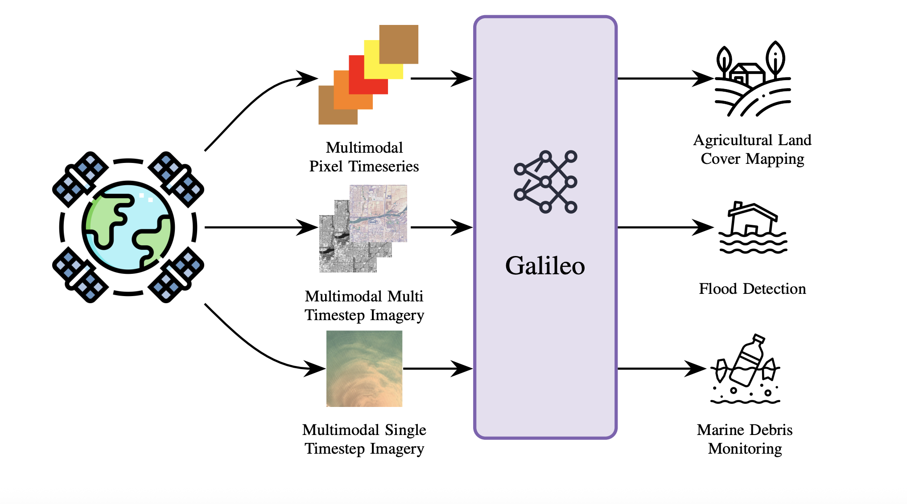

# NASA Releases Galileo: The Open-Source Multimodal Model Advancing Earth Observation and Remote Sensing

> Introduction Galileo is an open-source, highly multimodal foundation model developed to process, analyze, and understand diverse Earth observation (EO) data streams—including optical, radar, elevation, climate, and auxiliary maps—at scale. Galileo is developed with the support from researchers from McGill University, NASA Harvest Ai2, Carleton University, University of British Columbia, Vector Institute, and Arizona State University. […]

### Introduction

Galileo is an open-source, highly multimodal foundation model developed to process, analyze, and understand diverse Earth observation (EO) data streams—including optical, radar, elevation, climate, and auxiliary maps—at scale. Galileo is developed with the support from researchers from McGill University, NASA Harvest Ai2, Carleton University, University of British Columbia, Vector Institute, and Arizona State University. Galileo aims to provide a unified, generalist solution for critical applications like agricultural land mapping, disaster response, and environmental monitoring.

In contrast to prior remote sensing models limited to a single data type or scale, Galileo flexibly fuses multiple sensing modalities and is designed to recognize phenomena ranging from tiny objects (such as fishing boats, measuring just 1–2 pixels) to vast, slowly changing features like glaciers.

### Key Features and Architecture

#### Multimodal Transformer Design

Galileo is based on a Vision Transformer (ViT) architecture, meticulously adapted to process:

- **Multispectral optical imagery** (e.g., Sentinel-2)

- **Synthetic Aperture Radar (SAR)** (e.g., Sentinel-1)

- **Elevation and slope data** (e.g., NASA SRTM)

- **Weather/climate data** (e.g., precipitation and temperature from ERA5)

- **Land cover maps, population, night-lights, and more**

**Flexible Input Handling:**
Galileo’s tokenization pipeline splits remote sensing inputs into spatial patches, timesteps, and logical channel groups. This allows the model to process images, time series, and static tabular data in a single architecture configuration.

#### Unified Local and Global Feature Learning

**A core innovation is Galileo’s self-supervised pretraining algorithm, which combines:**

- **Global losses:** Encourage abstraction over wide spatial or temporal contexts—ideal for identifying “big” or slowly changing features (glaciers, forest loss).

- **Local losses:** Enhance sensitivity to minute details—crucial for detecting small, fast-changing objects (boats, debris).

**Local and global objectives differ in:**

- **Prediction depth:** Global tasks target deep latent representations; local tasks use shallow, linearly projected features.

- **Masking strategies:** Global tasks use structured, correlated space-time masks (forcing predictions over large intervals); local tasks use random unstructured masks.

This dual-objective pretraining enhances multi-scale feature representation, making Galileo generalizable across tasks and robust even with limited labels.

#### Pretraining Dataset and Strategy

To ensure both semantic and geographic diversity, Galileo’s pretraining dataset covers the entire globe, sampled via a clustering approach to maximize both land cover variety and geographic spread. The dataset comprises over 127,000 spatiotemporally aligned samples, each including four categories and nine remote sensing data types.

**Pretraining proceeds for 500 epochs on large compute resources. Key aspects:**

- **Batch size:** Effective batch size of 512.

- **Data augmentations:** Flipping, rotation, and variable patch sizes.

- **Optimization:** AdamW with scheduled learning rate and weight decay sweeps.

### Benchmark Results

#### Superior Generalization

Galileo is benchmarked on **11 diverse datasets and 15 downstream tasks**, spanning image and pixel time series classification, as well as segmentation. Specifically, it dominates on public datasets such as EuroSat, BigEarthNet, So2Sat, MADOS (marine debris), Sen1Floods11 (SAR flood mapping), CropHarvest (multimodal crop classification), and many others.

**Performance Highlights of Galileo-Base (ViT-Base):**

- **Classification (Finetune):**

EuroSat: 97.7% (top-1 accuracy, 100% training data)

- Outperforms specialist models like CROMA (96.6%) and SatMAE (96.6%)

- **Pixel Timeseries:**

CropHarvest (Kenya): 84.2% (tops Presto and AnySat)

- Breizhcrops: 73.0%

- **Segmentation (mIoU):**

MADOS: 67.6%

- PASTIS: 79.4%

**Model Flexibility:**
Across all benchmarks, Galileo is the top performer overall—outclassing both image-specialized and time-series specialized competitors. Notably, small model variants (ViT-Nano, ViT-Tiny) also achieve top or near-top results, critical for resource-constrained settings.

#### Ablation and Input Importance

Removing any individual modality (e.g., VIIRS night lights, ERA5, Dynamic World maps) from pretraining leads to a measurable decline in performance—even on benchmarks not directly using that input type. For example, absence of VIIRS data reduces MADOS mIoU from 67.8% to 63.5%, demonstrating the value of full multimodality for feature generalization.

### Open-Source and Real-World Impact

- **Open Weights & Code:**All code, model weights, and pretraining data are available on [GitHub](https://github.com/nasaharvest/galileo), fostering transparency and adoption by the global EO community.

- **Societal Benefits:**Galileo supports mission-critical NASA Harvest activities, such as global crop type mapping, rapid disaster mapping (floods, wildfires), and marine pollution detection. The model’s ability to work with limited labeled data makes it especially valuable in regions where ground truth is scarce, supporting food security and climate adaptation efforts.

### Technical Summary Table

ModelParamsTasks SupportedRank (Lower=Better)Input ModalitiesGalileo-Base85MImages, Time Series1 (overall)Optical, SAR, Weather, etc.Specialist SOTAvariesUsually 1 or 2 types3–10Limited

_Galileo-Base: consistently superior performance and flexibility across all major EO benchmarks._

### Conclusion

Galileo’s methodological and engineering advances—multimodal inputs, multi-scale local-global feature learning, and large-scale globally diverse pretraining—set a new standard for generalist remote sensing AI. Its flexibility underpins practical deployments from environmental monitoring to climate resilience, offering reliable, high-quality maps and predictions regardless of the task or geography.

With open-source access and active development, Galileo is positioned to catalyze a new wave of innovation in earth system science, empowering practitioners everywhere.

---

Check out the **[Paper](https://arxiv.org/abs/2502.09356)**, **[Model](https://github.com/nasaharvest/galileo)** and **[Technical Blog](https://www.nasaharvest.org/news/galileo-is-advancing-nasa-harvests-mission-to-safeguard-our-planet)_._** Feel free to check out our **[GitHub Page for Tutorials, Codes and Notebooks](https://github.com/Marktechpost/AI-Tutorial-Codes-Included)**. Also, feel free to follow us on **[Twitter](https://x.com/intent/follow?screen_name=marktechpost)** and don’t forget to join our **[100k+ ML SubReddit](https://www.reddit.com/r/machinelearningnews/)** and Subscribe to **[our Newsletter](https://www.aidevsignals.com/)**.
