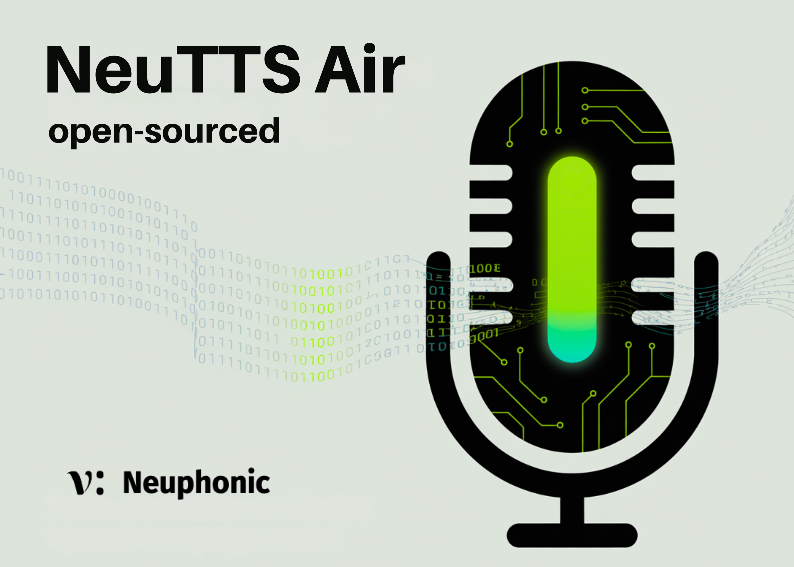

# Neuphonic Open-Sources NeuTTS Air: A 748M-Parameter On-Device Speech Language Model with Instant Voice Cloning

> Neuphonic has released NeuTTS Air, an open-source text-to-speech (TTS) speech language model designed to run locally in real time on CPUs. The Hugging Face model card lists 748M parameters (Qwen2 architecture) and ships in GGUF quantizations (Q4/Q8), enabling inference through llama.cpp/llama-cpp-python without cloud dependencies. It is licensed under Apache-2.0 and includes a runnable demo and […]

Neuphonic has released **NeuTTS Air**, an open-source text-to-speech (TTS) **speech language model** designed to run locally in real time on CPUs. The **[Hugging Face model card](https://huggingface.co/neuphonic/neutts-air)** lists **748M parameters** (Qwen2 architecture) and ships in GGUF quantizations (Q4/Q8), enabling inference through `llama.cpp`/`llama-cpp-python` without cloud dependencies. It is licensed under **Apache-2.0** and includes a runnable **[demo](https://huggingface.co/spaces/neuphonic/neutts-air)** and examples.

### So, what is new?

NeuTTS Air couples a **0.5B-class Qwen backbone** with Neuphonic’s **NeuCodec** audio codec. Neuphonic positions the system as a “super-realistic, on-device” TTS LM that clones a voice from **~3 seconds of reference audio** and synthesizes speech in that style, targeting voice agents and privacy-sensitive applications. The model card and repository explicitly emphasize **real-time CPU** generation and small-footprint deployment.

### Key Features

- **Realism at sub-1B scale:** Human-like prosody and timbre preservation for a ~0.7B (Qwen2-class) text-to-speech LM.

- **On-device deployment:** Distributed in **GGUF** (Q4/Q8) with CPU-first paths; suitable for laptops, phones, and Raspberry Pi-class boards.

- **Instant speaker cloning:** Style transfer from ~**3 seconds** of reference audio (reference WAV + transcript).

- **Compact LM+codec stack:** **Qwen 0.5B** backbone paired with **NeuCodec (0.8 kbps / 24 kHz)** to balance latency, footprint, and output quality.

### Explain the model architecture and runtime path?

- **Backbone:** _Qwen 0.5B_ used as a lightweight LM to condition speech generation; the hosted artifact is reported as **748M params** under the **qwen2** architecture on Hugging Face.

- **Codec:** _NeuCodec_ provides low-bitrate acoustic tokenization/decoding; it targets **0.8 kbps** with **24 kHz** output, enabling compact representations for efficient on-device use.

- **Quantization & format:** Prebuilt **GGUF** backbones (Q4/Q8) are available; the repo includes instructions for **`llama-cpp-python`** and an optional **ONNX** decoder path.

- **Dependencies:** Uses `espeak` for phonemization; examples and a Jupyter notebook are provided for end-to-end synthesis.

### On-device performance focus

**NeuTTS Air** showcases **‘real-time generation on mid-range devices**‘ and offers **CPU-first** defaults; GGUF quantization is intended for laptops and single-board computers. While no fps/RTF numbers are published on the card, the distribution targets **local inference without a GPU** and demonstrates a working flow through the provided examples and Space.

### Voice cloning workflow

NeuTTS Air requires (1) a **reference WAV** and (2) the **transcript text** for that reference. It encodes the reference to style tokens and then synthesizes arbitrary text **in the reference speaker’s timbre**. The Neuphonic team recommends **3–15 s** clean, mono audio and provides pre-encoded samples.

### Privacy, responsibility, and watermarking

Neuphonic frames the model for **on-device privacy** (no audio/text leaves the machine without user’s approval) and notes that all generated audio includes a **Perth (Perceptual Threshold) watermarker** to support responsible use and provenance.

### How it compares?

Open, local TTS systems exist (e.g., GGUF-based pipelines), but NeuTTS Air is notable for packaging a **small LM + neural codec** with **instant cloning**, **CPU-first quantizations**, and **watermarking** under a permissive license. The “world’s first super-realistic, on-device speech LM” phrasing is the vendor’s claim; the verifiable facts are the **size, formats, cloning procedure, license, and provided runtimes**.

### Our Comments

The focus is on system trade-offs: a ~0.7B Qwen-class backbone with GGUF quantization paired with NeuCodec at 0.8 kbps/24 kHz is a pragmatic recipe for real-time, CPU-only TTS that preserves timbre using ~3–15 s style references while keeping latency and memory predictable. The Apache-2.0 licensing and built-in watermarking are deployment-friendly, but publishing RTF/latency on commodity CPUs and cloning-quality vs. reference-length curves would enable rigorous benchmarking against existing local pipelines. Operationally, an offline path with minimal dependencies (eSpeak, llama.cpp/ONNX) lowers privacy/compliance risk for edge agents without sacrificing intelligibility.

---

Check out the **[Model Card on Hugging Face](https://huggingface.co/neuphonic/neutts-air) and [GitHub Page](https://github.com/neuphonic/neutts-air)**. Feel free to check out our **[GitHub Page for Tutorials, Codes and Notebooks](https://github.com/Marktechpost/AI-Tutorial-Codes-Included)**. Also, feel free to follow us on **[Twitter](https://x.com/intent/follow?screen_name=marktechpost)** and don’t forget to join our **[100k+ ML SubReddit](https://www.reddit.com/r/machinelearningnews/)** and Subscribe to **[our Newsletter](https://www.aidevsignals.com/)**. Wait! are you on telegram? **[now you can join us on telegram as well.](https://t.me/machinelearningresearchnews)**
