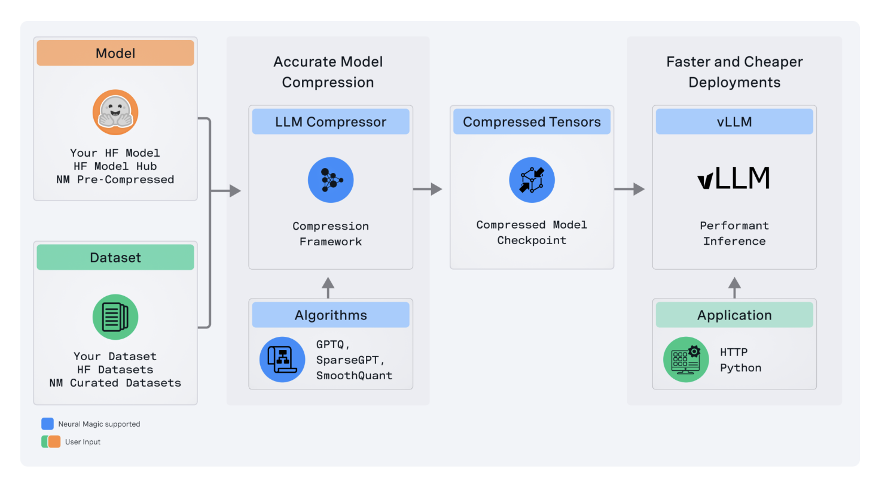

# Neural Magic Releases LLM Compressor: A Novel Library to Compress LLMs for Faster Inference with vLLM

> Neural Magic has released the LLM Compressor, a state-of-the-art tool for large language model optimization that enables far quicker inference through much more advanced model compression. Hence, the tool is an important building block in Neural Magic’s pursuit of making high-performance open-source solutions available to the deep learning community, especially inside the vLLM framework. LLM […]

Neural Magic has released the[ **LLM Compressor**](https://neuralmagic.com/blog/llm-compressor-is-here-faster-inference-with-vllm/), a state-of-the-art tool for large language model optimization that enables far quicker inference through much more advanced model compression. Hence, the tool is an important building block in Neural Magic’s pursuit of making high-performance open-source solutions available to the deep learning community, especially inside the vLLM framework.

*[**Image Source**](https://neuralmagic.com/blog/llm-compressor-is-here-faster-inference-with-vllm/)*

LLM Compressor reduces the difficulties that arise from the previously fragmented landscape of model compression tools, wherein users had to develop multiple bespoke libraries similar to AutoGPTQ, AutoAWQ, and AutoFP8 to apply certain quantization and compression algorithms. Such fragmented tools are folded into one library by LLM Compressor to easily apply state-of-the-art compression algorithms like GPTQ, SmoothQuant, and SparseGPT. These algorithms are implemented to create compressed models that offer reduced inference latency and maintain high levels of accuracy, which is critical for the model to be in production environments.

The second key technical advancement the LLM Compressor brings is activation and weight quantization support. In particular, activation quantization is important to ensure that INT8 and FP8 tensor cores are utilized. These are optimized for high-performance computing on the new GPU architectures from NVIDIA, such as the Ada Lovelace and Hopper architectures. This is an important capability in accelerating compute-bound workloads where the computational bottleneck is eased by using lower-precision arithmetic units. It means that, by quantizing activations and weights, the LLM Compressor allows for up to a twofold increase in performance for inference tasks, mainly under high server loads. This is attested by large models like Llama 3.1 70B, which proves that using the LLM Compressor, the model achieves latency performance very close to that of an unquantized version running on four GPUs with just two.

*[**Image Source**](https://neuralmagic.com/blog/llm-compressor-is-here-faster-inference-with-vllm/)*

Besides activation quantization, the LLM Compressor supports state-of-the-art structured sparsity, 2:4, weight pruning with SparseGPT. This weight pruning removes redundant parameters selectively to reduce the loss in accuracy by dropping 50% of the model’s size. In addition to accelerating inference, this quantization-pruning combination minimizes the memory footprint and enables deployment on resource-constrained hardware for LLMs.

The LLM Compressor was designed to integrate easily into any open-source ecosystem, particularly the Hugging Face model hub, via the painless loading and running of compressed models within vLLM. Further, the tool extends this by supporting a variety of quantization schemes, including fine-grained control over quantization, like per-tensor or per-channel on weights and per-tensor or per-token quantization on activation. This flexibility in the quantization strategy will allow very fine tuning concerning the demands on performance and accuracy from different models and deployment scenarios.

*[**Image Source**](https://neuralmagic.com/blog/llm-compressor-is-here-faster-inference-with-vllm/)*

Technically, the LLM Compressor is designed to work with various model architectures with extensibility. It has an aggressive roadmap for the tool, including extending support to MoE models, vision-language models, and non-NVIDIA hardware platforms. Other areas in the roadmap that are due for development include advanced quantization techniques such as AWQ and tools for creating non-uniform quantization schemes; those are expected to extend model efficiency further.

In conclusion, the LLM Compressor thus becomes an important tool for researchers and practitioners alike in optimizing LLMs for deployment to production. It is open-source and has state-of-the-art features, making it easier to compress models and obtain heavy performance improvements without affecting the integrity of the models. The LLM Compressor and similar tools will play a very important role shortly when AI continues scaling in efficiently deploying large models on diverse hardware environments, making them more accessible for application in many other areas.

---

Check out the **[GitHub Page](https://github.com/vllm-project/llm-compressor) and [Details](https://neuralmagic.com/blog/llm-compressor-is-here-faster-inference-with-vllm/).** All credit for this research goes to the researchers of this project. Also, don’t forget to follow us on **[Twitter](https://twitter.com/Marktechpost)** and join our **[Telegram Channel](https://pxl.to/at72b5j)** and [**LinkedIn Gr**](https://www.linkedin.com/groups/13668564/)[**oup**](https://www.linkedin.com/groups/13668564/). **If you like our work, you will love our**[** newsletter..**](https://marktechpost-newsletter.beehiiv.com/subscribe)

Don’t Forget to join our **[48k+ ML SubReddit](https://www.reddit.com/r/machinelearningnews/)**

**Find Upcoming [AI Webinars here](https://www.marktechpost.com/ai-webinars-list-llms-rag-generative-ai-ml-vector-database/)**

---

> [Arcee AI Introduces Arcee Swarm: A Groundbreaking Mixture of Agents MoA Architecture Inspired by the Cooperative Intelligence Found in Nature Itself](https://www.marktechpost.com/2024/08/15/arcee-ai-introduces-arcee-swarm-a-groundbreaking-mixture-of-agents-moa-architecture-inspired-by-the-cooperative-intelligence-found-in-nature-itself/)
