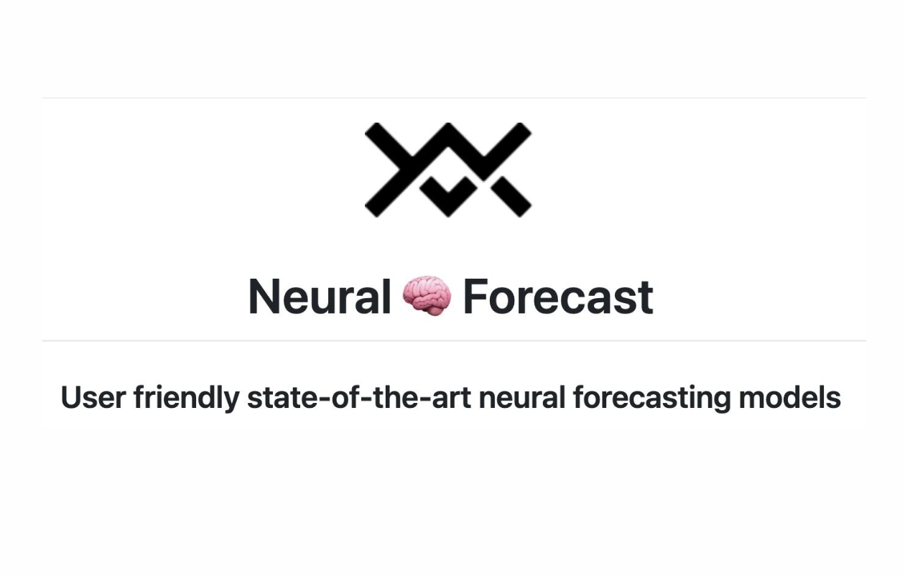

# NeuralForecast 1.7.4 Released: Nixtla’s Advanced Library Revolutionizes Neural Forecasting with Usability and Robustness

> In a significant development for the forecasting community, Nixtla has announced the release of NeuralForecast, an advanced library designed to offer a robust and user-friendly collection of neural forecasting models. This library aims to bridge the gap between complex neural networks and their practical application, addressing the persistent challenges faced by forecasters in terms of […]

In a significant development for the forecasting community, Nixtla has announced the release of [**NeuralForecast**](https://github.com/Nixtla/neuralforecast/releases/tag/v1.7.4), an advanced library designed to offer a robust and user-friendly collection of neural forecasting models. This library aims to bridge the gap between complex neural networks and their practical application, addressing the persistent challenges faced by forecasters in terms of usability, accuracy, and computational efficiency.

NeuralForecast is positioned as a comprehensive toolkit that includes a variety of neural network architectures such as Multi-Layer Perceptrons (MLP), Recurrent Neural Networks (RNNs), Temporal Convolutional Networks (TCNs), and more sophisticated models like NBEATS, NHITS, Temporal Fusion Transformer (TFT), and Informer. This wide range of models ensures users can access state-of-the-art techniques for diverse forecasting needs.

**Key Features of NeuralForecast**

- **Usability and Robustness:** NeuralForecast prioritizes user-friendliness, offering a unified interface compatible with other popular forecasting libraries like StatsForecast and MLForecast. This integration simplifies the workflow for users familiar with these libraries, allowing seamless transitions and enhanced productivity.

- **Exogenous Variable Support:** The library supports static, historical, and future exogenous variables, providing flexibility in model inputs. This feature is crucial for incorporating external factors into forecasting models improving accuracy.

- **Forecast Interpretability:** NeuralForecast includes tools for interpreting forecasts by plotting trend, seasonality, and exogenous prediction components. This capability helps users understand the underlying patterns and influences in their data.

- **Probabilistic Forecasting:** NeuralForecast facilitates probabilistic forecasting with simple model adapters for quantile losses and parametric distributions. This approach enables users to generate forecasts with confidence intervals, offering a more comprehensive view of potential future outcomes.

- **Automatic Model Selection:** The library includes parallelized automatic hyperparameter tuning, efficiently searching for the best validation configuration. This feature significantly reduces the time and computational resources required for model optimization.

**Example Usage**

Below is a sample code demonstrating how to use NeuralForecast with the NBEATS and NHITS models to forecast monthly passenger data:

*[**Code Source**](https://nixtlaverse.nixtla.io/neuralforecast/docs/getting-started/introduction.html)*

In conclusion, Nixtla’s release of NeuralForecast addresses the core challenges that have previously limited the practical application of neural networks in forecasting by focusing on usability, robustness, and state-of-the-art models. This library is set to become an invaluable tool for data scientists and forecasters seeking to leverage neural networks to their full potential.

---

> [Arcee AI Released DistillKit: An Open Source, Easy-to-Use Tool Transforming Model Distillation for Creating Efficient, High-Performance Small Language Models](https://www.marktechpost.com/2024/08/01/arcee-ai-released-distillkit-an-open-source-easy-to-use-tool-transforming-model-distillation-for-creating-efficient-high-performance-small-language-models/)
