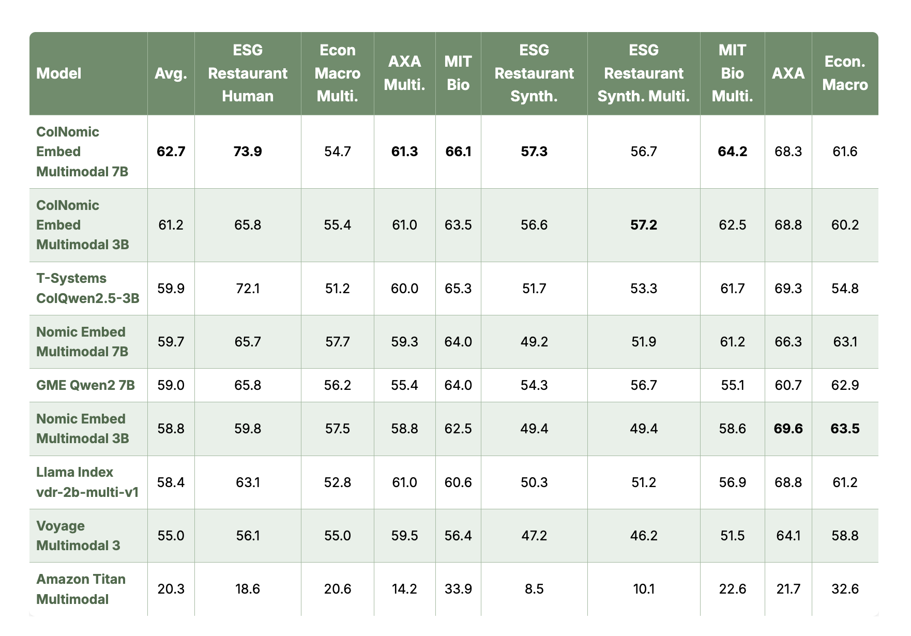

# Nomic Open Sources State-of-the-Art Multimodal Embedding Model

> Nomic has announced the release of “Nomic Embed Multimodal,” a groundbreaking embedding model that achieves state-of-the-art performance on visual document retrieval tasks. The new model seamlessly processes interleaved text, images, and screenshots, establishing a new high score on the Vidore-v2 benchmark for visual document retrieval. This advancement is particularly significant for retrieval augmented generation (RAG) […]

Nomic has announced the release of “[Nomic Embed Multimodal](https://www.nomic.ai/blog/posts/nomic-embed-multimodal),” a groundbreaking embedding model that achieves state-of-the-art performance on visual document retrieval tasks. The new model seamlessly processes interleaved text, images, and screenshots, establishing a new high score on the Vidore-v2 benchmark for visual document retrieval. This advancement is particularly significant for retrieval augmented generation (RAG) applications working with PDF documents, where capturing both visual and textual context is crucial.

### Breaking New Ground in Visual Document Retrieval

The Nomic Embed Multimodal 7B model has achieved an impressive 62.7 NDCG@5 score on the Vidore-v2 benchmark, representing a 2.8-point improvement over previous best-performing models. This advancement marks a significant milestone in the evolution of multimodal embeddings for document processing.

Unlike traditional retrieval systems that primarily rely on extracted text and often miss crucial visual elements, Nomic’s new model captures the full richness of documents by embedding both text and visual components directly. This approach eliminates the need for complex, error-prone processing pipelines commonly used in document analysis.

### Solving Real-World Document Challenges

Documents are inherently multimodal, conveying information through text, figures, page layouts, tables, and even fonts. Traditional text-only systems struggle with this complexity, often requiring separate encoders for visual and text inputs or complex preprocessing pipelines.

**Nomic Embed Multimodal provides an elegant solution by supporting interleaved text and image inputs in a single model, making it ideal for:**

- PDF documents and research papers

- Screenshots of applications and websites

- Visually rich content where layout matters

- Multilingual documents where visual context is important

### A Complete Embedding Ecosystem

With the release of Nomic Embed Multimodal, Nomic has finalized a comprehensive suite of embedding models that achieve state-of-the-art performance across multiple domains:

- **Nomic Embed Multimodal**: The latest addition that achieves state-of-the-art performance on interleaved text, images, and screenshots. It is ideal for document retrieval workflows.

- **Nomic Embed Text v2**: A powerful multilingual text embedding model that achieves state-of-the-art performance on the MIRACL benchmark. It is ideal for text retrieval workflows in any language.

- **Nomic Embed Code**: An embedding model that is specialized for code search applications, achieving a state-of-the-art score on the CodeSearchNet benchmark. It is ideal for code agent applications.

This complete ecosystem provides developers with cutting-edge tools for handling diverse data types, from pure text to complex multimodal documents and specialized code repositories. Each model in the ecosystem is designed to work seamlessly with modern [RAG](https://www.marktechpost.com/2024/11/25/retrieval-augmented-generation-rag-deep-dive-into-25-different-types-of-rag/) workflows while delivering best-in-class performance in its domain.

### Availability

Nomic has made their multimodal embedding models available on [Hugging Face](https://huggingface.co/collections/nomic-ai/nomic-embed-multimodal-67e5ddc1a890a19ff0d58073), along with the corresponding dataset and [GitHub repository](https://github.com/nomic-ai/contrastors), making this cutting-edge technology accessible to researchers and developers worldwide.

This release represents a significant step forward in multimodal representation learning and document understanding, completing Nomic’s vision of providing state-of-the-art embedding solutions across the full spectrum of data modalities.

Availability is upcoming in the (**[Nomic Atlas Data and Embedding Platform](https://atlas.nomic.ai)**)

---

_Thanks to the Nomic team for the thought leadership/ Resources for this article. Nomic team has supported us financially and by content for this article._
