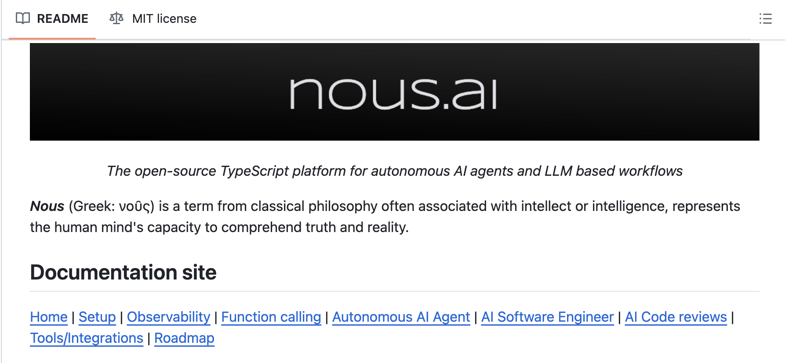

# Nous: An Open-Source TypesScript Platform for Building Autonomous AI Agents and LLM Workflows

> Building and managing such AI systems requires specialized knowledge due to the intricate interactions between various components. The AI landscape is fragmented, with disparate tools and libraries that lead to integration challenges and inconsistencies. This fragmentation hinders the ability to create standardized, interoperable, and reusable AI components, making the development process arduous and less accessible […]

Building and managing such AI systems requires specialized knowledge due to the intricate interactions between various components. The AI landscape is fragmented, with disparate tools and libraries that lead to integration challenges and inconsistencies. This fragmentation hinders the ability to create standardized, interoperable, and reusable AI components, making the development process arduous and less accessible to a broader audience. Researchers addressed the complexity and fragmentation of developing autonomous AI agents and Large Language Model (LLM) workflows by releasing a typescript open-source platform.

Current methods for developing autonomous AI agents and LLM workflows often involve specialized tools and libraries, each serving different purposes like data processing, model training, inference, and decision-making. However, these tools are often not standardized, making integration difficult and leading to inefficiencies in the development process. The proposed solution, **[Nous](https://github.com/TrafficGuard/nous)**, is an open-source TypeScript platform that aims to streamline the creation and management of these complex AI systems. Nous provides a unified framework to simplify development by offering standardized tools and promoting interoperability among AI components. It empowers developers to build sophisticated AI systems without needing extensive expertise in every aspect of AI development.

**[Nous](https://github.com/TrafficGuard/nous)** is built on a component-based architecture that allows developers to create and combine reusable modules for various AI tasks. This modularity promotes flexibility and scalability, enabling the platform to handle large-scale AI applications. The platform emphasizes declarative programming, where developers specify the desired outcomes rather than the exact steps to achieve them. This approach simplifies the development process and makes it easier to reason about the system’s behavior. Nous also integrates seamlessly with popular AI libraries and frameworks such as TensorFlow, PyTorch, and Hugging Face Transformers, making it an extensible and adaptable tool for diverse AI workflows. Although Nous is not yet quantified against existing methods, its efficient design optimizes resource utilization and minimizes latency. It also prioritizes reliability and robustness, ensuring that AI systems built on the platform are dependable and resilient.

In conclusion, Nous offers a promising solution to the challenges of AI development by providing a standardized and efficient platform that simplifies the creation and management of autonomous AI agents and LLM workflows. By addressing the complexity and fragmentation in the AI landscape, Nous has the potential to accelerate innovation, improve accessibility to AI technologies, and foster collaboration among developers and researchers. The platform’s modularity, declarative programming approach, and integration with existing tools make it a powerful and versatile tool for building sophisticated AI systems, ultimately contributing to the advancement of artificial intelligence.
