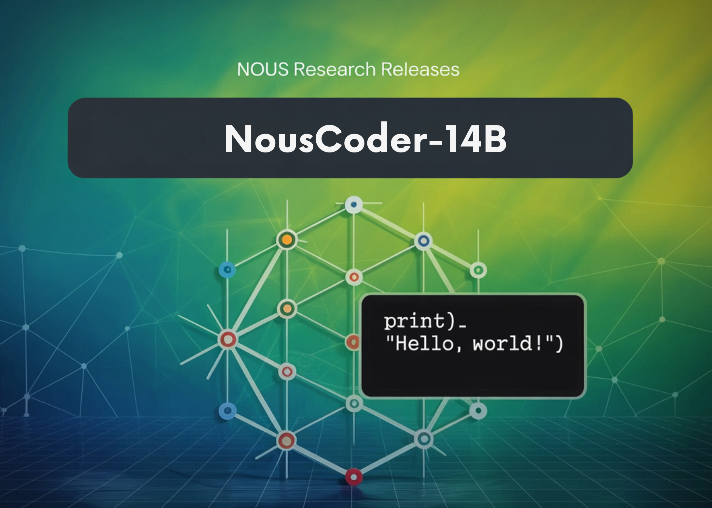

# Nous Research Releases NousCoder-14B: A Competitive Olympiad Programming Model Post-Trained on Qwen3-14B via Reinforcement Learning

> Nous Research has introduced NousCoder-14B, a competitive olympiad programming model that is post trained on Qwen3-14B using reinforcement learning (RL) with verifiable rewards. On the LiveCodeBench v6 benchmark, which covers problems from 08/01/2024 to 05/01/2025, the model reaches a Pass@1 accuracy of 67.87 percent. This is 7.08 percentage points higher than the Qwen3-14B baseline of […]

Nous Research has introduced NousCoder-14B, a competitive olympiad programming model that is post trained on Qwen3-14B using reinforcement learning (RL) with verifiable rewards. On the LiveCodeBench v6 benchmark, which covers problems from 08/01/2024 to 05/01/2025, the model reaches a Pass@1 accuracy of 67.87 percent. This is 7.08 percentage points higher than the Qwen3-14B baseline of 60.79 percent on the same benchmark. The research team trained the model on 24k verifiable coding problems using 48 B200 GPUs over 4 days, and released the weights under the Apache 2.0 license on Hugging Face.

*https://nousresearch.com/nouscoder-14b-a-competitive-olympiad-programming-model/*

### Benchmark focus and what Pass@1 means

LiveCodeBench v6 is designed for competitive programming evaluation. The test split used here contains 454 problems. The training set uses the same recipe as the DeepCoder-14B project from Agentica and Together AI. It combines problems from TACO Verified, PrimeIntellect SYNTHETIC 1, and LiveCodeBench problems created before 07/31/2024.

The benchmark only includes competitive programming style tasks. For each problem, a solution must respect strict time and memory limits and must pass a large set of hidden input output tests. Pass@1 is the fraction of problems where the first generated program passes all tests, including time and memory constraints.

*https://nousresearch.com/nouscoder-14b-a-competitive-olympiad-programming-model/*

### Dataset construction for execution based RL

All datasets used for training are composed of verifiable code generation problems. Each problem has a reference implementation and many test cases. **The training set contains 24k problems drawn from:**

- TACO Verified

- PrimeIntellect SYNTHETIC 1

- LiveCodeBench problems that come before 07/31/2024

The test set is LiveCodeBench v6, which has 454 problems between 08/01/2024 and 05/01/2025.

Every problem is a complete competitive programming task with a description, input format, output format, and test cases. This setup is important for RL because it gives a binary reward signal that is cheap to compute once the code has run.

### RL environment with Atropos and Modal

The RL environment is built using the Atropos framework. NousCoder-14B is prompted using the standard LiveCodeBench prompt format, and it generates Python code for each problem. **Each rollout receives a scalar reward that depends on test case results:**

- Reward 1 when the generated code passes all test cases for that problem

- Reward −1 when the code outputs a wrong answer, exceeds a 15 second time limit, or exceeds a 4 GB memory limit on any test case

To execute untrusted code safely and at scale, the team uses Modal as an autoscaled sandbox. The system launches one Modal container per rollout in the main design that the research team describes as the used setting. Each container runs all test cases for that rollout. This avoids mixing training compute with verification compute and keeps the RL loop stable.

The research team also pipelines inference and verification. When an inference worker finishes a generation, it sends the completion to a Modal verifier and immediately starts a new generation. With many inference workers and a fixed pool of Modal containers, this design keeps the training loop inference compute bound instead of verification bound.

The team discusses 3 verification parallelization strategies. They explore one container per problem, one per rollout, and one per test case. They finally avoid the per test case setting because of container launch overhead and use an approach where each container evaluates many test cases and focuses on a small set of the hardest test cases first. If any of these fail, the system can stop verification early.

### GRPO objectives, DAPO, GSPO, and GSPO+

NousCoder-14B uses Group Relative Policy Optimization (GRPO) which does not require a separate value model. On top of GRPO the research team test **3 objectives:** Dynamic sAmpling Policy Optimization (DAPO), Group Sequence Policy Optimization (GSPO), and a modified GSPO variant called GSPO+.

All 3 objectives share the same definition of advantage. The advantage for each rollout is the reward for that rollout normalized by the mean and standard deviation of rewards inside the group. DAPO applies importance weighting and clipping at the token level, and **introduces three main changes relative to GRPO:**

- A clip higher rule that increases exploration for low probability tokens

- A token level policy gradient loss that gives each token equal weight

- Dynamic sampling, where groups that are all correct or all incorrect are dropped because they carry zero advantage

GSPO moves the importance weighting to the sequence level. It defines a sequence importance ratio that aggregates token ratios over the whole program. GSPO+ keeps sequence level correction, but it rescales gradients so that tokens are weighted equally regardless of sequence length.

On LiveCodeBench v6, the differences between these objectives are modest. At a context length of 81,920 tokens, DAPO reaches a Pass@1 of 67.87 percent while GSPO and GSPO+ reach 66.26 percent and 66.52 percent. At 40,960 tokens, all 3 objectives cluster around 63 percent Pass@1.

### Iterative context extension and overlong filtering

Qwen3-14B supports long context and the training follows an iterative context extension schedule. The team first trains the model with a 32k context window and then continues training at the maximum Qwen3-14B context window of 40k. At each stage they select the checkpoint with the best LiveCodeBench score at 40k context and then use YaRN context extension at evaluation time to reach 80k tokens, that is 81,920 tokens.

A key trick is overlong filtering. When a generated program exceeds the maximum context window, they reset its advantage to zero. This removes that rollout from the gradient signal rather than penalizing it. The research team report that this approach avoids pushing the model toward shorter solutions for purely optimization reasons and helps maintain quality when they scale context length at test time.

### Key Takeaways

- NousCoder 14B is a Qwen3-14B based competitive programming model trained with execution based RL, it reaches 67.87 percent Pass@1 on LiveCodeBench v6, a 7.08 percentage point gain over the Qwen3-14B baseline of 60.79 percent on the same benchmark.

- The model is trained on 24k verifiable coding problems from TACO Verified, PrimeIntellect SYNTHETIC-1, and pre 07 31 2024 LiveCodeBench tasks, and evaluated on a disjoint LiveCodeBench v6 test set of 454 problems from 08/01/2024 to 05/01/2025.

- The RL setup uses Atropos, with Python solutions executed in sandboxed containers, a simple reward of 1 for solving all test cases and minus 1 for any failure or resource limit breach, and a pipelined design where inference and verification run asynchronously.

- Group Relative Policy Optimization objectives DAPO, GSPO, and GSPO+ are used for long context code RL, all operate on group normalized rewards, and show similar performance, with DAPO reaching the best Pass@1 at the longest 81,920 token context.

- The training uses iterative context extension, first at 32k then at 40k tokens, along with YaRN based extension at evaluation time to 81,920 tokens, includes overlong rollout filtering for stability, and ships as a fully reproducible open stack with Apache 2.0 weights and RL pipeline code.

---

Check out the **[Model Weights](https://huggingface.co/NousResearch/NousCoder-14B) **and** [Technical details](https://nousresearch.com/nouscoder-14b-a-competitive-olympiad-programming-model/)**. Also, feel free to follow us on **[Twitter](https://x.com/intent/follow?screen_name=marktechpost)** and don’t forget to join our **[100k+ ML SubReddit](https://www.reddit.com/r/machinelearningnews/)** and Subscribe to **[our Newsletter](https://www.aidevsignals.com/)**. Wait! are you on telegram? **[now you can join us on telegram as well.](https://t.me/machinelearningresearchnews)**
