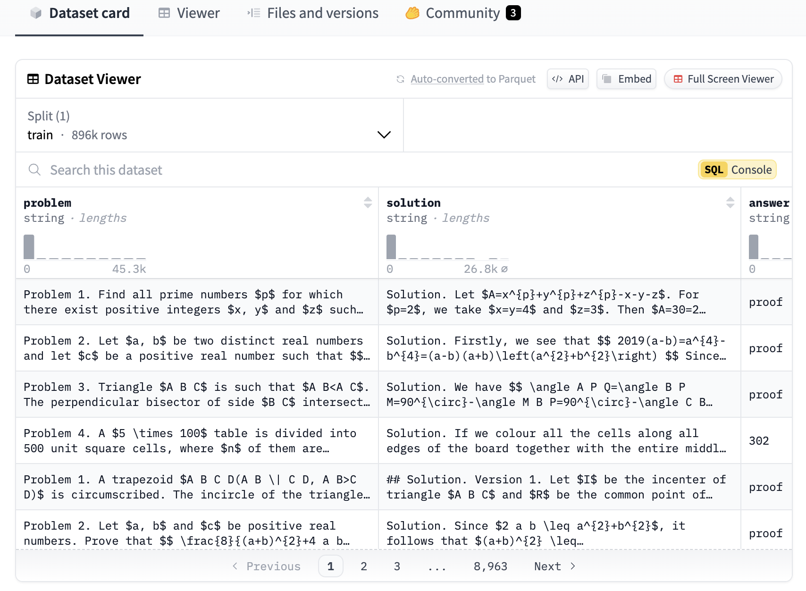

# NuminaMath 1.5: Second Iteration of NuminaMath Advancing AI-Powered Mathematical Problem Solving with Enhanced Competition-Level Datasets, Verified Metadata, and Improved Reasoning Capabilities

> Mathematical reasoning remains one of the most complex challenges in AI. While AI has advanced in NLP and pattern recognition, its ability to solve complex mathematical problems with human-like logic and reasoning still lags. Many AI models struggle with structured problem-solving, symbolic reasoning, and understanding the deep relationships between mathematical concepts. Addressing this gap requires […]

Mathematical reasoning remains one of the most complex challenges in AI. While AI has advanced in NLP and pattern recognition, its ability to solve complex mathematical problems with human-like logic and reasoning still lags. Many AI models struggle with structured problem-solving, symbolic reasoning, and understanding the deep relationships between mathematical concepts. Addressing this gap requires high-quality, structured datasets that allow AI to learn from expert mathematical reasoning and improve problem-solving accuracy. 

Recognizing the above needs, [Project-Numina has launched NuminaMath 1.5](https://huggingface.co/datasets/AI-MO/NuminaMath-1.5), the second version of its advanced AI training dataset, [NuminaMath](https://huggingface.co/datasets/AI-MO/NuminaMath-CoT), tailored specifically for mathematical reasoning. NuminaMath 1.5 builds upon its predecessors by offering a curated collection of approximately 900,000 competition-level mathematical problems. These problems are structured using a Chain of Thought (CoT) methodology, ensuring that AI models follow a logical step-by-step reasoning process to arrive at solutions. The dataset sources problems from Chinese high school mathematics, U.S. mathematics competitions, and international Olympiads, providing a broad spectrum of difficulty levels to train AI systems effectively.

**The major innovation in NuminaMath 1.5 is its enriched problem metadata, which includes:**

- Final answers for word problems.

- Mathematical domains include algebra, geometry, number theory, and calculus.

- Problem types are categorized into multiple-choice questions (MCQs), proof-based problems, and word problems.

These enhancements make NuminaMath 1.5 a more structured and verifiable resource for AI training. They allow for better generalization and reasoning when tackling unseen mathematical challenges.

Project-Numina has adopted a manual validation approach for problems sourced from Olympiad datasets to ensure the dataset’s accuracy and reliability. The previous version of NuminaMath encountered parsing issues due to automated extraction techniques, which sometimes misinterpreted problem structures. In response, NuminaMath 1.5 now utilizes official sources from national Olympiad websites, ensuring that each problem and solution is accurately transcribed and formatted.

**The latest dataset includes manually curated problems in critical mathematical fields such as:**

- Chinese mathematics contests (cn_contest)

- Inequalities and number theory, verified by expert mathematicians

This focus on curated and verified data ensures that AI models learn from authentic, high-quality sources.

*[**Image Source**](https://huggingface.co/datasets/AI-MO/NuminaMath-1.5)*

Another major improvement in NuminaMath 1.5 is the removal of synthetic datasets, such as synthetic_amc. While previous iterations included synthetic problems to expand dataset diversity, ablation studies found that synthetic data marginally hindered AI performance by introducing inconsistencies in problem structure. As a result, NuminaMath 1.5 eliminates synthetic problems, ensuring that AI models engage only with real-world, competition-level mathematics rather than artificially generated content.

**NuminaMath 1.5 provides problems from multiple sources, ensuring diverse mathematical challenges. The dataset includes:**

- Olympiad Problems: Verified problems from national and international mathematics Olympiads.

- AOPS Forum Data: Sourced from math discussion forums, featuring a mix of general and competition-style problems.

- AMC and AIME Problems: Questions from the American Mathematics Competitions (AMC) and the American Invitational Mathematics Examination (AIME).

- Chinese K-12 Mathematics: A large subset of problems from Chinese high school curricula, providing a strong foundation in algebra and geometry.

In conclusion, NuminaMath 1.5 delivers 896,215 verified competition-level math problems from Olympiads, national contests, and academic forums. Structured metadata, including problem type, question format, and verified solutions, ensures precise categorization and analysis. The dataset removes synthetic problems, focusing on manually curated, high-quality data. It is a vital resource for research and AI training, covering 268,000+ K-12 problems, 73,000 from forums, and elite competition sets.

---

Check out **_the [Dataset](https://huggingface.co/datasets/AI-MO/NuminaMath-1.5)._** All credit for this research goes to the researchers of this project. Also, don’t forget to follow us on **[Twitter](https://x.com/intent/follow?screen_name=marktechpost)** and join our **[Telegram Channel](https://arxiv.org/abs/2406.09406)** and [**LinkedIn Gr**](https://www.linkedin.com/groups/13668564/)[**oup**](https://www.linkedin.com/groups/13668564/). Don’t Forget to join our **[75k+ ML SubReddit](https://www.reddit.com/r/machinelearningnews/)**.

**[🚨 Recommended Open-Source AI Platform: ‘IntellAgent is a An Open-Source Multi-Agent Framework to Evaluate Complex Conversational AI System’ (Promoted)](https://pxl.to/82homag)**
