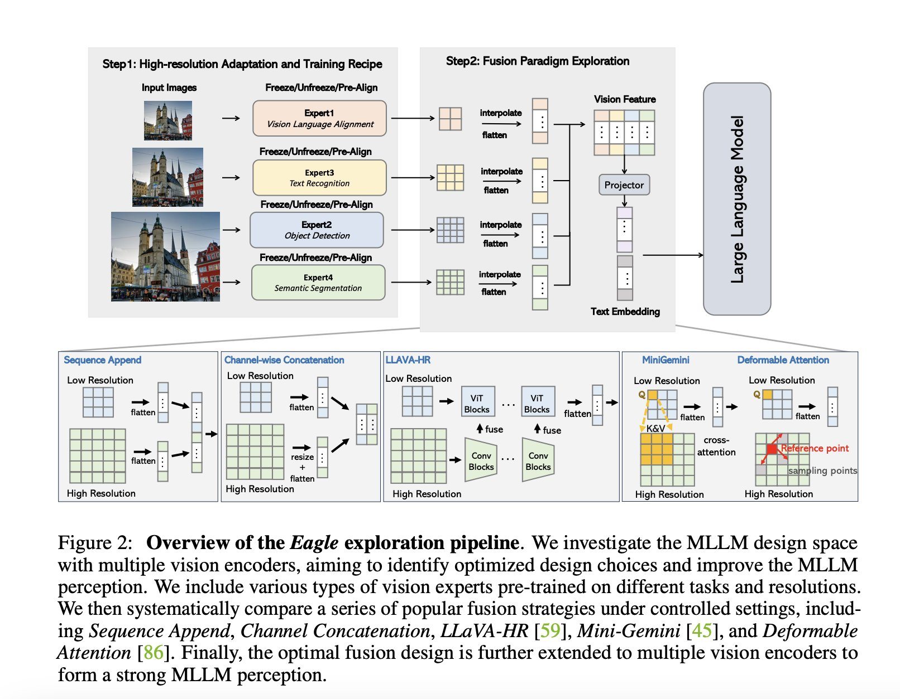

# NVEagle Released by NVIDIA: A Super Impressive Vision Language Model that Comes in 7B, 13B, and 13B Fine-Tuned on Chat

> Multimodal large language models (MLLMs) represent a significant leap in artificial intelligence by combining visual and linguistic information to understand better and interpret complex real-world scenarios. These models are designed to see, comprehend, and reason about visual inputs, making them invaluable in optical character recognition (OCR) and document analysis tasks. The core of these MLLMs […]

Multimodal large language models (MLLMs) represent a significant leap in artificial intelligence by combining visual and linguistic information to understand better and interpret complex real-world scenarios. These models are designed to see, comprehend, and reason about visual inputs, making them invaluable in optical character recognition (OCR) and document analysis tasks. The core of these MLLMs lies in their vision encoders, which convert images into visual tokens that are then integrated with text embeddings. This integration enables the model to interpret visual inputs and respond effectively. However, designing and optimizing these vision encoders remains a critical challenge, particularly when dealing with high-resolution images that require fine-grained visual perception.

The development of MLLMs faces several challenges, particularly in improving their visual perception capabilities. A key problem is the occurrence of hallucinations, where the model generates inaccurate or nonsensical outputs based on visual inputs. This issue is especially problematic in tasks requiring high-resolution image processing, such as OCR and document understanding. Existing models often need help with these tasks due to limitations in designing vision encoders and the methods used to integrate visual and textual data. Moreover, while many current MLLMs employ a single vision encoder, this approach often needs to capture the full range of visual information necessary for accurate interpretation, leading to errors and reduced performance.

Researchers have explored various methods for enhancing MLLM performance. One common approach is to use a single vision encoder pre-trained on large datasets, such as CLIP, which is often chosen for its ability to align visual and textual representations. However, this method has drawbacks, particularly when dealing with high-resolution image processing tasks. Another approach involves complex fusion strategies that combine visual features from multiple encoders. While these methods can improve performance, they often require significant computational resources and only sometimes deliver consistent results across different types of visual tasks. For instance, models like Flamingo and LLaVA-HR have been developed to handle specific challenges in MLLM design. However, they still leave room for improvement in efficiency and effectiveness.

Researchers from NVIDIA, Georgia Tech, UMD, and HKPU have developed the **Eagle family of MLLMs**. This new approach systematically explores the design space of MLLMs by benchmarking various vision encoders, experimenting with different fusion strategies, and progressively identifying optimal combinations of vision experts. The researchers introduced a method that involves simply concatenating visual tokens from complementary vision encoders, which was as effective as more complex mixing architectures. This approach simplifies the design process while maintaining high performance. They introduced a Pre-Alignment stage to align non-text-aligned vision experts with the language model before integrating them, which enhances model coherence and performance. 

The Eagle family of models, also known as **NVEagle**, includes several variants tailored to different tasks and requirements. The models come in three main versions: [**Eagle-X5-7B**](https://huggingface.co/NVEagle/Eagle-X5-7B), [**Eagle-X5-13B**](https://huggingface.co/NVEagle/Eagle-X5-13B), and [**Eagle-X5-13B-Chat**](https://huggingface.co/spaces/NVEagle/Eagle-X5-13B-Chat). The 7B and 13B models are designed for general-purpose vision-language tasks, with the 13B variant offering enhanced capabilities due to its larger parameter size. The 13B-Chat model is specifically fine-tuned for conversational AI, making it exceptionally well-suited for applications that require nuanced understanding and interaction based on visual inputs.

*[**Image Source**](https://arxiv.org/pdf/2408.15998)*

One of the standout features of NVEagle is its use of a mixture of experts (MoE) in the vision encoders, significantly improving visual perception. This approach allows the model to dynamically select the most appropriate vision encoder for a given task, enhancing its ability to process and understand complex visual information. The NVEagle models have been released on Hugging Face, making them accessible to researchers and developers. This release underscores the model’s versatility and robustness, as it performs exceptionally well across various benchmarks, from OCR and document analysis to visual question answering. 

*[**Image Source**](https://arxiv.org/pdf/2408.15998)*

The Eagle models demonstrated outstanding results across multiple benchmarks. For example, in OCR tasks, the Eagle models achieved an average score of 85.9 on the OCRBench, outperforming other leading models like InternVL and LLaVA-HR. On TextVQA, which evaluates the model’s ability to answer questions based on text within images, Eagle-X5 scored 88.8, marking a significant improvement over competitors. The model also excelled in visual question-answering tasks, such as GQA, where it scored 65.7, demonstrating its ability to handle complex visual inputs. The introduction of additional vision experts in the Eagle models, such as Pix2Struct and EVA-02, led to consistent gains in performance across various benchmarks, including a notable increase in the average score from 64.0 to 65.9 when using a combination of multiple vision encoders.

In conclusion, the Eagle family of models addresses many of the key challenges in visual perception. The researchers have created a model that addresses these challenges by systematically exploring the design space and optimizing the integration of multiple vision encoders. The Eagle models achieve state-of-the-art performance across various tasks with a streamlined and efficient design. Using a simple yet effective fusion strategy, combined with the introduction of a Pre-Alignment stage, has proven to be a powerful approach to enhancing MLLM performance.

---

Check out the **[Model Cards ](https://huggingface.co/collections/merve/nveagle-66d0705108582d73bb235c26)and [Demo](https://huggingface.co/spaces/NVEagle/Eagle-X5-13B-Chat).** All credit for this research goes to the researchers of this project. Also, don’t forget to follow us on **[Twitter](https://twitter.com/Marktechpost)** and join our **[Telegram Channel](https://www.zyphra.com/post/zamba2-mini)** and [**LinkedIn Gr**](https://www.linkedin.com/groups/13668564/)[**oup**](https://www.linkedin.com/groups/13668564/). **If you like our work, you will love our**[** newsletter..**](https://marktechpost-newsletter.beehiiv.com/subscribe)

Don’t Forget to join our **[50k+ ML SubReddit](https://www.reddit.com/r/machinelearningnews/)**

Here is a highly recommended webinar from our sponsor: **[‘Building Performant AI Applications with NVIDIA NIMs and Haystack’](https://landing.deepset.ai/webinar-nvidia-nims-and-haystack?utm_campaign=2409-campaign-nvidia-nims-and-haystack-&utm_source=marktechpost&utm_medium=banner-ad-desktop)**
