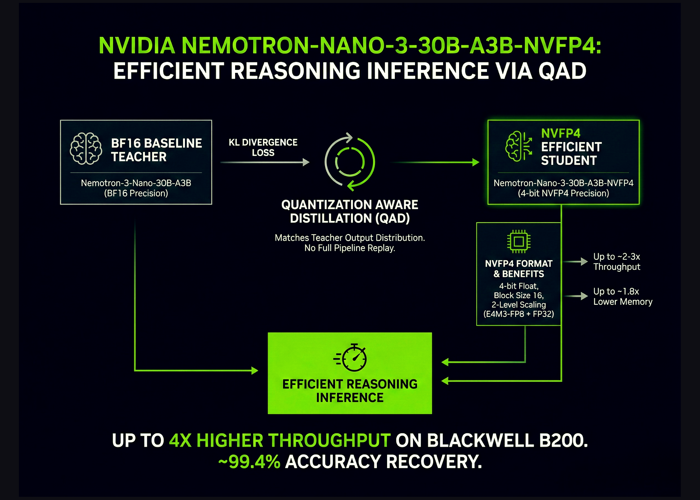

# NVIDIA AI Brings Nemotron-3-Nano-30B to NVFP4 with Quantization Aware Distillation (QAD) for Efficient Reasoning Inference

> NVIDIA has released Nemotron-Nano-3-30B-A3B-NVFP4, a production checkpoint that runs a 30B parameter reasoning model in 4 bit NVFP4 format while keeping accuracy close to its BF16 baseline. The model combines a hybrid Mamba2 Transformer Mixture of Experts architecture with a Quantization Aware Distillation (QAD) recipe designed specifically for NVFP4 deployment. Overall, it is an ultra-efficient […]

NVIDIA has released **Nemotron-Nano-3-30B-A3B-NVFP4**, a production checkpoint that runs a 30B parameter reasoning model in **4 bit NVFP4** format while keeping accuracy close to its BF16 baseline. The model combines a hybrid **Mamba2 Transformer Mixture of Experts** architecture with a **Quantization Aware Distillation (QAD)** recipe designed specifically for NVFP4 deployment. Overall, it is an ultra-efficient NVFP4 precision version of Nemotron-3-Nano that delivers up to 4x higher throughput on Blackwell B200.

*https://huggingface.co/nvidia/NVIDIA-Nemotron-3-Nano-30B-A3B-NVFP4*

### What is Nemotron-Nano-3-30B-A3B-NVFP4?

**Nemotron-Nano-3-30B-A3B-NVFP4** is a quantized version of **Nemotron-3-Nano-30B-A3B-BF16**, trained from scratch by NVIDIA team as a unified reasoning and chat model. It is built as a **hybrid Mamba2 Transformer MoE** network:

- 30B parameters in total

- 52 layers in depth

- 23 Mamba2 and MoE layers

- 6 grouped query attention layers with 2 groups

- Each MoE layer has 128 routed experts and 1 shared expert

- 6 experts are active per token, which gives about 3.5B active parameters per token

The model is pre-trained on **25T tokens** using a **Warmup Stable Decay** learning rate schedule with a batch size of 3072, a peak learning rate of 1e-3 and a minimum learning rate of 1e-5.

**Post training follows a 3 stage pipeline:**

- **Supervised fine tuning** on synthetic and curated data for code, math, science, tool calling, instruction following and structured outputs.

- **Reinforcement learning** with synchronous GRPO across multi step tool use, multi turn chat and structured environments, and RLHF with a generative reward model.

- **Post training quantization** to NVFP4 with FP8 KV cache and a selective high precision layout, followed by QAD.

The NVFP4 checkpoint keeps the attention layers and the Mamba layers that feed into them in BF16, quantizes remaining layers to NVFP4 and uses FP8 for the KV cache.

### NVFP4 format and why it matters?

**NVFP4** is a **4 bit floating point** format designed for both training and inference on recent NVIDIA GPUs. The main properties of NVFP4:

- Compared with FP8, NVFP4 delivers **2 to 3 times higher arithmetic throughput**.

- It reduces memory usage by about **1.8 times** for weights and activations.

- It extends MXFP4 by reducing the **block size from 32 to 16** and introduces **two level scaling**.

The two level scaling uses **E4M3-FP8 scales per block** and a **FP32 scale per tensor**. The smaller block size allows the quantizer to adapt to local statistics and the dual scaling increases dynamic range while keeping quantization error low.

For very large LLMs, simple **post training quantization (PTQ)** to NVFP4 already gives decent accuracy across benchmarks. For smaller models, especially those heavily postage pipelines, the research team notes that PTQ causes **non negligible accuracy drops**, which motivates a training based recovery method.

### From QAT to QAD

Standard **Quantization Aware Training (QAT)** inserts a pseudo quantization into the forward pass and reuses the **original task loss**, such as next token cross entropy. This works well for convolutional networks, **but the research team lists 2 main issues for modern LLMs:**

- Complex multi stage post training pipelines with SFT, RL and model merging are hard to reproduce.

- Original training data for open models is often unavailabublic form.

**Quantization Aware Distillation (QAD)** changes the objective instead of the full pipeline. A frozen **BF16 model acts as teacher** and the NVFP4 model is a student. Training minimizes **KL divergence** between their output token distributions, not the original supervised or RL objective.

**The research team highlights 3 properties of QAD:**

- It aligns the quantized model with the high precision teacher more accurately than QAT.

- It stays stable even when the teacher has already gone through several stages, such as supervised fine tuning, reinforcement learning and model merging, because QAD only tries to match the final teacher behavior.

- It works with partial, synthetic or filtered data, because it only needs input text to query the teacher and student, not the original labels or reward models.

### Benchmarks on Nemotron-3-Nano-30B

Nemotron-3-Nano-30B-A3B is one of the RL heavy models in the QAD research. The below Table shows accuracy on AA-LCR, AIME25, GPQA-D, LiveCodeBench-v5 and SciCode-TQ, NVFP4-QAT and NVFP4-QAD.

*https://research.nvidia.com/labs/nemotron/files/NVFP4-QAD-Report.pdf*

### Key Takeaways

- **Nemotron-3-Nano-30B-A3B-NVFP4 is a 30B parameter hybrid Mamba2 Transformer MoE model** that runs in 4 bit NVFP4 with FP8 KV cache and a small set of BF16 layers preserved for stability, while keeping about 3.5B active parameters per token and supporting context windows up to 1M tokens.

- **NVFP4 is a 4 bit floating point format with block size 16 and two level scaling**, using E4M3-FP8 per block scales and a FP32 per tensor scale, which gives about 2 to 3 times higher arithmetic throughput and about 1.8 times lower memory cost than FP8 for weights and activations.

- **Quantization Aware Distillation (QAD) replaces the original task loss with KL divergence to a frozen BF16 teacher**, so the NVFP4 student directly matches the teacher’s output distribution without replaying the full SFT, RL and model merge pipeline or needing the original reward models.

- Using the new Quantization Aware Distillation method, the NVFP4 version achieves up to **99.4% accuracy of BF16**

- **On AA-LCR, AIME25, GPQA-D, LiveCodeBench and SciCode, NVFP4-PTQ shows noticeable accuracy loss and NVFP4-QAT degrades further**, while NVFP4-QAD recovers performance to near BF16 levels, reducing the gap to only a few points across these reasoning and coding benchmarks.

---

Check out the **[Paper](https://research.nvidia.com/labs/nemotron/files/NVFP4-QAD-Report.pdf) and [Model Weights](https://huggingface.co/nvidia/NVIDIA-Nemotron-3-Nano-30B-A3B-NVFP4)**. Also, feel free to follow us on **[Twitter](https://x.com/intent/follow?screen_name=marktechpost)** and don’t forget to join our **[100k+ ML SubReddit](https://www.reddit.com/r/machinelearningnews/)** and Subscribe to **[our Newsletter](https://www.aidevsignals.com/)**. Wait! are you on telegram? **[now you can join us on telegram as well.](https://t.me/machinelearningresearchnews)**
