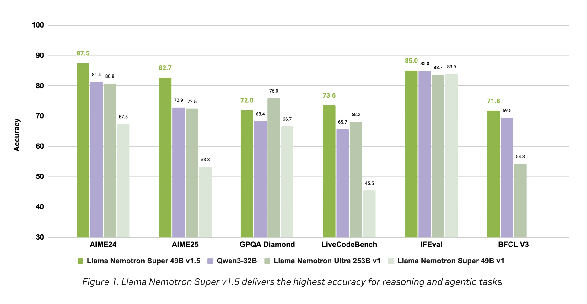

# NVIDIA AI Dev Team Releases Llama Nemotron Super v1.5: Setting New Standards in Reasoning and Agentic AI

> The landscape of artificial intelligence continues to evolve rapidly, with breakthroughs that push the boundaries of what models can achieve in reasoning, efficiency, and application versatility. The latest release from NVIDIA—the Llama Nemotron Super v1.5—represents a remarkable leap in both performance and usability, especially for agentic and reasoning-intensive tasks. This article provides an in-depth look at […]

The landscape of artificial intelligence continues to evolve rapidly, with breakthroughs that push the boundaries of what models can achieve in reasoning, efficiency, and application versatility. The latest release from NVIDIA—the **Llama Nemotron Super v1.5**—represents a remarkable leap in both performance and usability, especially for agentic and reasoning-intensive tasks. This article provides an in-depth look at the technical advancements and practical implications of Llama Nemotron Super v1.5, which is set to empower developers and enterprises alike with cutting-edge AI capabilities.

## Overview: Llama Nemotron Super v1.5 in Context

NVIDIA’s Nemotron family is known for building on the strongest open-source large language models and enhancing them with improved accuracy, efficiency, and transparency. **Llama Nemotron Super v1.5** stands as the latest and most advanced iteration, explicitly engineered for high-stakes reasoning scenarios such as math, science, code generation, and agentic functionalities.

## What Sets Nemotron Super v1.5 Apart?

The model is designed to:

- Deliver state-of-the-art accuracies for **science, math, coding, and agentic tasks**.

- Achieve up to **3x higher throughput** compared to previous models, making it both faster and more cost-effective for deployment.

- Operate efficiently on a **single GPU**, catering from individual developers to enterprise-scale applications.

## Technical Innovations Behind the Model

### 1. Post-Training Refinement on High-Signal Data

Nemotron Super v1.5 builds upon the efficient reasoning foundation established by Llama Nemotron Ultra. The advancement in Super v1.5 comes from **post-training refinement using a new proprietary dataset**, which is heavily focused on high-signal reasoning tasks. This targeted data amplifies the model’s capabilities in complex, multi-step problems.

### 2. Neural Architecture Search and Pruning for Efficiency

A significant innovation in v1.5 is the **use of neural architecture search and advanced pruning techniques**:

- By optimizing the network structure, NVIDIA has increased throughput (inference speed) without sacrificing accuracy.

- Models now execute faster, enabling more complex reasoning per unit of compute and maintaining lower inference costs.

- The ability to deploy on a single GPU minimizes hardware overhead, making powerful AI accessible for smaller teams as well as large organizations.

### 3. Benchmarks and Performance

Across a wide set of public and internal benchmarks, **Llama Nemotron Super v1.5 consistently leads its weight class**, especially in tasks that require:

- Multi-step reasoning.

- Structured tool use.

- Instruction following, code synthesis, and agentic workflows.

Performance charts (see Figures 1 & 2 in the release notes) visibly demonstrate:

- **Highest accuracy rates for core reasoning and agentic tasks** compared to leading open models of similar size.

- **Highest throughput**, translating to faster processing and inference at reduced operating costs.

## Key Features and Advantages

### Leading Edge Accuracy in Reasoning

The refinement on high-signal datasets ensures that Llama Nemotron Super v1.5 excels at answering sophisticated queries in science, complex mathematical problem solving, and generating reliable, maintainable code. This is crucial for real-world AI agents that must interact, reason, and act reliably within applications.

### Throughput and Operational Efficiency

- **3x Higher Throughput:** Optimizations allow the model to process more queries per second, making it suitable for real-time use cases and large-volume applications.

- **Lower Compute Costs:** Efficient architecture design and the capability to run on a single GPU remove scaling barriers for many organizations.

- **Reduced Deployment Complexity:** By minimizing hardware requirements while boosting performance, deployment pipelines can be streamlined across platforms.

### Built for Agentic Applications

Llama Nemotron Super v1.5 is not just about answering questions—it is tailored for **agentic tasks**, where AI models need to operate proactively, follow instructions, call functions, and integrate with tools and workflows. This adaptability makes the model an ideal foundation for:

- Conversational agents.

- Autonomous code assistants.

- Science and research AI tools.

- Intelligent automation agents deployed in enterprise workflows.

### Practical Deployment

The model is **available now** for hands-on experience and integration:

- **Interactive Access:** Directly at NVIDIA Build (build.nvidia.com), allowing users and developers to test its capabilities in live scenarios.

- **Open Model Download:** Available on Hugging Face, ready for deployment in custom infrastructure or inclusion in broader AI pipelines.

## How Nemotron Super v1.5 Pushes the Ecosystem Forward

### Open Weights and Community Impact

Continuing NVIDIA’s philosophy, Nemotron Super v1.5 is released as an open model. This transparency fosters:

- Rapid community-driven benchmarking and feedback.

- Easier customization for specialized domains.

- Greater collective scrutiny and iteration, ensuring trustworthy and robust AI models emerge across the board.

### Enterprise and Research Readiness

With its unique blend of performance, efficiency, and openness, Super v1.5 is tailored to become **the backbone for next-generation AI agents** in:

- Enterprise knowledge management.

- Customer support automation.

- Advanced research and scientific computing.

### Alignment with AI Best Practices

By combining **high-quality synthetic datasets** from NVIDIA and state-of-the-art model refinement techniques, the Nemotron Super v1.5 adheres to leading standards in:

- Transparency in training data and methods.

- Rigorous quality assurance for model outputs.

- Responsible and interpretable AI.

## Conclusion: A New Era for AI Reasoning Models

**Llama Nemotron Super v1.5** is a significant stride forward in the open-source AI landscape, offering top-tier reasoning aptitudes, transformative efficiency, and broad applicability. For developers aiming to build reliable AI agents—whether for individual projects or complex enterprise solutions—this release marks a milestone, setting new standards in accuracy and throughput.

With NVIDIA’s ongoing commitment to openness, efficiency, and community collaboration, Llama Nemotron Super v1.5 is poised to accelerate the development of smarter, more capable AI agents designed for the diverse challenges of tomorrow.

---

Check out the **[Open-Source Weights](https://huggingface.co/nvidia/Llama-3_3-Nemotron-Super-49B-v1_5)** and **[Technical details](https://developer.nvidia.com/blog/build-more-accurate-and-efficient-ai-agents-with-the-new-nvidia-llama-nemotron-super-v1-5/)_._** All credit for this research goes to the researchers of this project. Also, feel free to follow us on **[Twitter](https://x.com/intent/follow?screen_name=marktechpost)** and don’t forget to join our **[100k+ ML SubReddit](https://www.reddit.com/r/machinelearningnews/)** and Subscribe to **[our Newsletter](https://www.aidevsignals.com/)**.
