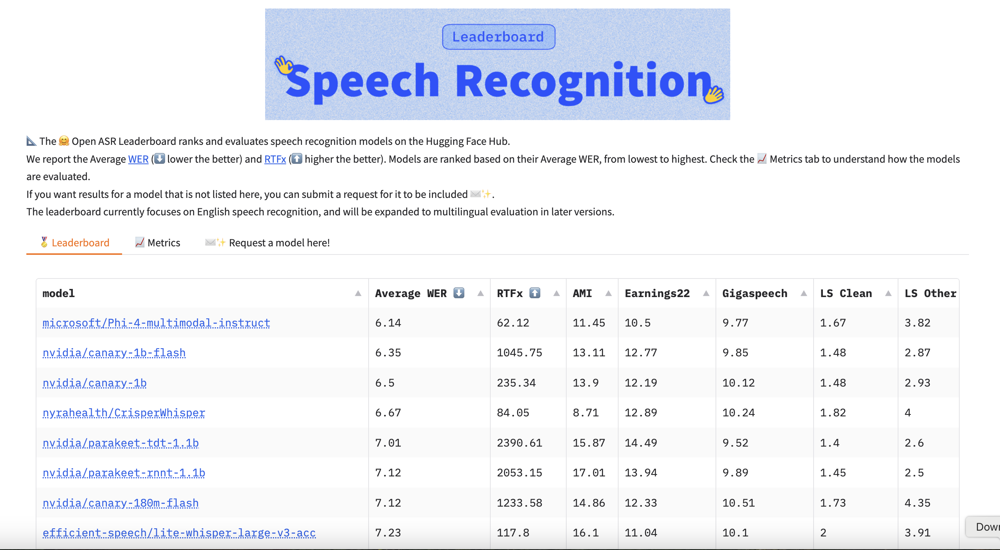

# NVIDIA AI Just Open Sourced Canary 1B and 180M Flash – Multilingual Speech Recognition and Translation Models

> In the realm of artificial intelligence, multilingual speech recognition and translation have become essential tools for facilitating global communication. However, developing models that can accurately transcribe and translate multiple languages in real-time presents significant challenges. These challenges include managing diverse linguistic nuances, maintaining high accuracy, ensuring low latency, and deploying models efficiently across various devices.​ […]

In the realm of artificial intelligence, multilingual speech recognition and translation have become essential tools for facilitating global communication. However, developing models that can accurately transcribe and translate multiple languages in real-time presents significant challenges. These challenges include managing diverse linguistic nuances, maintaining high accuracy, ensuring low latency, and deploying models efficiently across various devices.​

To address these challenges, NVIDIA AI has open-sourced two models: Canary 1B Flash and Canary 180M Flash. These models are designed for multilingual speech recognition and translation, supporting languages such as English, German, French, and Spanish. Released under the permissive CC-BY-4.0 license, these models are available for commercial use, encouraging innovation within the AI community.​

Technically, both models utilize an encoder-decoder architecture. The encoder is based on FastConformer, which efficiently processes audio features, while the Transformer Decoder handles text generation. Task-specific tokens, including <target language>, <task>, <toggle timestamps>, and <toggle PnC> (punctuation and capitalization), guide the model’s output. The Canary 1B Flash model comprises 32 encoder layers and 4 decoder layers, totaling 883 million parameters, whereas the Canary 180M Flash model consists of 17 encoder layers and 4 decoder layers, amounting to 182 million parameters. This design ensures scalability and adaptability to various languages and tasks. ​

Performance metrics indicate that the Canary 1B Flash model achieves an inference speed exceeding 1000 RTFx on open ASR leaderboard datasets, enabling real-time processing. In English automatic speech recognition (ASR) tasks, it attains a word error rate (WER) of 1.48% on the Librispeech Clean dataset and 2.87% on the Librispeech Other dataset. For multilingual ASR, the model achieves WERs of 4.36% for German, 2.69% for Spanish, and 4.47% for French on the MLS test set. In automatic speech translation (AST) tasks, the model demonstrates robust performance with BLEU scores of 32.27 for English to German, 22.6 for English to Spanish, and 41.22 for English to French on the FLEURS test set. ​

*Data as of March 20 2025*

The smaller Canary 180M Flash model also delivers impressive results, with an inference speed surpassing 1200 RTFx. It achieves a WER of 1.87% on the Librispeech Clean dataset and 3.83% on the Librispeech Other dataset for English ASR. For multilingual ASR, the model records WERs of 4.81% for German, 3.17% for Spanish, and 4.75% for French on the MLS test set. In AST tasks, it achieves BLEU scores of 28.18 for English to German, 20.47 for English to Spanish, and 36.66 for English to French on the FLEURS test set. ​

Both models support word-level and segment-level timestamping, enhancing their utility in applications requiring precise alignment between audio and text. Their compact sizes make them suitable for on-device deployment, enabling offline processing and reducing dependency on cloud services. Moreover, their robustness leads to fewer hallucinations during translation tasks, ensuring more reliable outputs. The open-source release under the CC-BY-4.0 license encourages commercial utilization and further development by the community.​

In conclusion, NVIDIA’s open-sourcing of the Canary 1B and 180M Flash models represents a significant advancement in multilingual speech recognition and translation. Their high accuracy, real-time processing capabilities, and adaptability for on-device deployment address many existing challenges in the field. By making these models publicly available, NVIDIA not only demonstrates its commitment to advancing AI research but also empowers developers and organizations to build more inclusive and efficient communication tools.

---

Check out **_the _**[**_Canary 1B_** **_Model_**](https://huggingface.co/nvidia/canary-1b-flash) and [**_Canary_** **_180M Flash_**](https://huggingface.co/nvidia/canary-180m-flash). All credit for this research goes to the researchers of this project. Also, feel free to follow us on **[Twitter](https://x.com/intent/follow?screen_name=marktechpost)** and don’t forget to join our **[80k+ ML SubReddit](https://www.reddit.com/r/machinelearningnews/)**.
