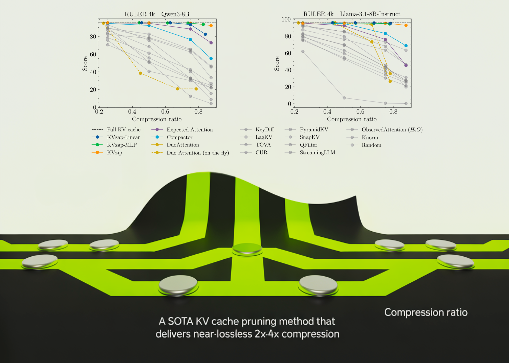

# NVIDIA AI Open-Sourced KVzap: A SOTA KV Cache Pruning Method that Delivers near-Lossless 2x-4x Compression

> As context lengths move into tens and hundreds of thousands of tokens, the key value cache in transformer decoders becomes a primary deployment bottleneck. The cache stores keys and values for every layer and head with shape (2, L, H, T, D). For a vanilla transformer such as Llama1-65B, the cache reaches about 335 GB […]

As context lengths move into tens and hundreds of thousands of tokens, the key value cache in transformer decoders becomes a primary deployment bottleneck. The cache stores keys and values for every layer and head with shape (2, L, H, T, D). For a vanilla transformer such as Llama1-65B, the cache reaches about 335 GB at 128k tokens in bfloat16, which directly limits batch size and increases time to first token.

*https://arxiv.org/pdf/2601.07891*

### Architectural compression leaves the sequence axis untouched

Production models already compress the cache along several axes. Grouped Query Attention shares keys and values across multiple queries and yields compression factors of 4 in Llama3, 12 in GLM 4.5 and up to 16 in Qwen3-235B-A22B, all along the head axis. DeepSeek V2 compresses the key and value dimension through Multi head Latent Attention. Hybrid models mix attention with sliding window attention or state space layers to reduce the number of layers that maintain a full cache.

These changes do not compress along the sequence axis. Sparse and retrieval style attention retrieve only a subset of the cache at each decoding step, but all tokens still occupy memory. Practical long context serving therefore needs techniques that delete cache entries which will have negligible effect on future tokens.

The [KVpress project](https://huggingface.co/spaces/nvidia/kvpress-leaderboard) from NVIDIA collects more than twenty such pruning methods in one codebase and exposes them through a public leaderboard on Hugging Face. Methods such as H2O, Expected Attention, DuoAttention, Compactor and KVzip are all evaluated in a consistent way.

### KVzip and KVzip plus as the scoring oracle

KVzip is currently the strongest cache pruning baseline on the [KVpress Leaderboard](https://huggingface.co/spaces/nvidia/kvpress-leaderboard). It defines an importance score for each cache entry using a copy and paste pretext task. The model runs on an extended prompt where it is asked to repeat the original context exactly. For each token position in the original prompt, the score is the maximum attention weight that any position in the repeated segment assigns back to that token, across heads in the same group when grouped query attention is used. Low scoring entries are evicted until a global budget is met.

KVzip+ refines this score. It multiplies the attention weight by the norm of the value contribution into the residual stream and normalizes by the norm of the receiving hidden state. This better matches the actual change that a token induces in the residual stream and improves correlation with downstream accuracy compared to the original score.

These oracle scores are effective but expensive. KVzip requires prefilling on the extended prompt, which doubles the context length and makes it too slow for production. It also cannot run during decoding because the scoring procedure assumes a fixed prompt.

*https://arxiv.org/pdf/2601.07891*

### KVzap, a surrogate model on hidden states

KVzap replaces the oracle scoring with a small surrogate model that operates directly on hidden states. For each transformer layer and each sequence position t, the module receives the hidden vector hₜ and outputs predicted log scores for every key value head. Two architectures are considered, a single linear layer (KVzap Linear) and a two layer MLP with GELU and hidden width equal to one eighth of the model hidden size (KVzap MLP).

Training uses prompts from the Nemotron Pretraining Dataset sample. The research team filter 27k prompts to lengths between 750 and 1,250 tokens, sample up to 500 prompts per subset, and then sample 500 token positions per prompt. For each key value head they obtain about 1.2 million training pairs and a validation set of 23k pairs. The surrogate learns to regress from the hidden state to the log KVzip+ score. Across models, the squared Pearson correlation between predictions and oracle scores reaches between about 0.63 and 0.77, with the MLP variant consistently outperforming the linear variant.

*https://arxiv.org/pdf/2601.07891*

### Thresholding, sliding window and negligible overhead

During inference, the KVzap model processes hidden states and produces scores for each cache entry. Entries with scores below a fixed threshold are pruned, while a sliding window of the most recent 128 tokens is always kept. The research team provides a concise PyTorch style function that applies the model, sets scores of the local window to infinity and returns compressed key and value tensors. In all experiments, pruning is applied after the attention operation.

KVzap uses score thresholding rather than fixed top k selection. A single threshold yields different effective compression ratios on different benchmarks and even across prompts within the same benchmark. The research team report up to 20 percent variation in compression ratio across prompts at a fixed threshold, which reflects differences in information density.

Compute overhead is small. An analysis at the layer level shows that the extra cost of KVzap MLP is at most about 1.1 percent of the linear projection FLOPs, while the linear variant adds about 0.02 percent. The relative memory overhead follows the same values. In long context regimes, the quadratic cost of attention dominates so the extra FLOPs are effectively negligible.

*https://arxiv.org/pdf/2601.07891*

### Results on RULER, LongBench and AIME25

KVzap is evaluated on long context and reasoning benchmarks using Qwen3-8B, Llama-3.1-8B Instruct and Qwen3-32B. Long context behavior is measured on RULER and LongBench. RULER uses synthetic tasks over sequence lengths from 4k to 128k tokens, while LongBench uses real world documents from multiple task categories. AIME25 provides a math reasoning workload with 30 Olympiad level problems evaluated under pass at 1 and pass at 4.

On RULER, KVzap matches the full cache baseline within a small accuracy margin while removing a large fraction of the cache. For Qwen3-8B, the best KVzap configuration achieves a removed fraction above 0.7 on RULER 4k and 16k while keeping the average score within a few tenths of a point of the full cache. Similar behavior holds for Llama-3.1-8B Instruct and Qwen3-32B.

On LongBench, the same thresholds lead to lower compression ratios because the documents are less repetitive. KVzap remains close to the full cache baseline up to about 2 to 3 times compression, while fixed budget methods such as Expected Attention degrade more on several subsets once compression increases.

On AIME25, KVzap MLP maintains or slightly improves pass at 4 accuracy at compression near 2 times and remains usable even when discarding more than half of the cache. Extremely aggressive settings, for example linear variants at high thresholds that remove more than 90 percent of entries, collapse performance as expected.

*https://arxiv.org/pdf/2601.07891*

Overall, the above Table shows that the best KVzap configuration per model delivers average cache compression between roughly 2.7 and 3.5 while keeping task scores very close to the full cache baseline across RULER, LongBench and AIME25.

### Key Takeaways

- KVzap is an input adaptive approximation of KVzip+ that learns to predict oracle KV importance scores from hidden states using small per layer surrogate models, either a linear layer or a shallow MLP, and then prunes low score KV pairs.

- Training uses Nemotron pretraining prompts where KVzip+ provides supervision, producing about 1.2 million examples per head and achieving squared correlation in the 0.6 to 0.8 range between predicted and oracle scores, which is sufficient for faithful cache importance ranking.

- KVzap applies a global score threshold with a fixed sliding window of recent tokens, so compression automatically adapts to prompt information density, and the research team report up to 20 percent variation in achieved compression across prompts at the same threshold.

- Across Qwen3-8B, Llama-3.1-8B Instruct and Qwen3-32B on RULER, LongBench and AIME25, KVzap reaches about 2 to 4 times KV cache compression while keeping accuracy very close to the full cache, and it achieves state of the art tradeoffs on the NVIDIA KVpress Leaderboard.

- The additional compute is small, at most about 1.1 percent extra FLOPs for the MLP variant, and KVzap is implemented in the open source kvpress framework with ready to use checkpoints on Hugging Face, which makes it practical to integrate into existing long context LLM serving stacks.

---

Check out the **[Paper](https://arxiv.org/pdf/2601.07891)** and **[GitHub Repo](https://github.com/NVIDIA/kvpress/tree/main/kvzap)**. Also, feel free to follow us on **[Twitter](https://x.com/intent/follow?screen_name=marktechpost)** and don’t forget to join our **[100k+ ML SubReddit](https://www.reddit.com/r/machinelearningnews/)** and Subscribe to **[our Newsletter](https://www.aidevsignals.com/)**. Wait! are you on telegram? **[now you can join us on telegram as well.](https://t.me/machinelearningresearchnews)**
