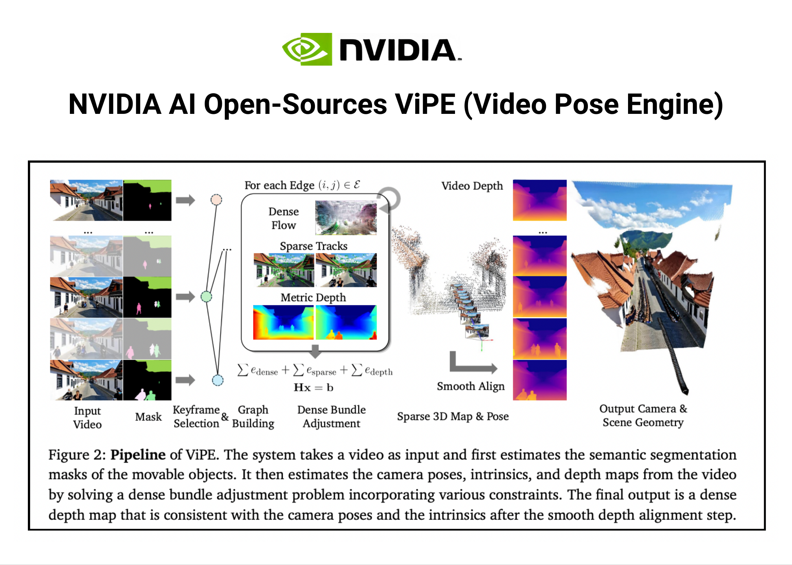

# NVIDIA AI Open-Sources ViPE (Video Pose Engine): A Powerful and Versatile 3D Video Annotation Tool for Spatial AI

> How do you create 3D datasets to train AI for Robotics without expensive traditional approaches? A team of researchers from NVIDIA released “ViPE: Video Pose Engine for 3D Geometric Perception” bringing a key improvement for Spatial AI. It addresses the central, agonizing bottleneck that has constrained the field of 3D computer vision for years.  ViPE […]

How do you create 3D datasets to train AI for Robotics without expensive traditional approaches? A team of researchers from NVIDIA released “[**ViPE: Video Pose Engine for 3D Geometric Perception**](https://pxl.to/26g9ky8)” bringing a key improvement for **Spatial AI. **It addresses the central, agonizing bottleneck that has constrained the field of 3D computer vision for years.

**[ViPE](https://pxl.to/hbsb4cb)** is a robust, versatile engine designed to process raw, unconstrained, “in-the-wild” video footage and automatically output the critical elements of 3D reality:

- **Camera Intrinsics** (sensor calibration parameters)

- **Precise Camera Motion** (pose)

- **Dense, Metric Depth Maps** (real-world distances for every pixel)

To truly know the magnitude of this breakthrough, we must first understand the profound difficulty of the problem it solves.

## The challenge: Unlocking 3D Reality from 2D Video 

The ultimate goal of Spatial AI is to enable machines, robots , autonomous vehicles, and AR glasses, to perceive and interact with the world in 3D. We live in a 3D world, but the vast majority of our recorded data, from smartphone clips to cinematic footage, is trapped in 2D.

**The Core Problem:** How do we reliably and scalably reverse-engineer the 3D reality hidden inside these flat video streams?

Achieving this accurately from everyday video, which features shaky movements, dynamic objects, and unknown camera types, is notoriously difficult, yet it is the **essential first step** for virtually any advanced spatial application.

## Problems with Existing Approaches

For decades, the field has been forced to choose between 2 powerful yet flawed paradigms.

### 1. The Precision Trap (Classical SLAM/SfM) 

Traditional methods like **Simultaneous Localization and Mapping (SLAM)** and **Structure-from-Motion (SfM)** rely on sophisticated geometric optimization. They are capable of pinpoint accuracy under ideal conditions.

**The Fatal Flaw: Brittleness.** These systems generally assume the world is static. Introduce a moving car, a textureless wall, or use an unknown camera, and the entire reconstruction can shatter. They are too delicate for the messy reality of everyday video.

### 2. The Scalability Wall (End-to-End Deep Learning) 

Recently, powerful [deep learning](https://www.marktechpost.com/2025/01/15/what-is-deep-learning-2/) models have emerged. By training on vast datasets, they learn robust “priors” about the world and are impressively resilient to noise and dynamism.

**The Fatal Flaw: Intractability.** These models are computationally hungry. Their memory requirements explode as video length increases, making the processing of long videos practically impossible. They simply do not scale.

This deadlock created a dilemma. The future of advanced AI demands massive datasets annotated with perfect 3D geometry, but the tools required to generate that data were either **too brittle or too slow** to deploy at scale.

## Meet ViPE: NVIDIA’s Hybrid Breakthrough Shatters the Mold 

This is where **[ViPE](https://pxl.to/hbsb4cb)** changes the game. It is not merely an incremental improvement; it is a well-designed and well-integrated hybrid pipeline that** **successfully fuses the best of both worlds. It takes the efficient, mathematically rigorous optimization framework of classical SLAM and injects it with the powerful, learned intuition of modern deep neural networks.

This synergy allows **[ViPE](https://pxl.to/hbsb4cb)** to be **[accurate, robust, efficient, and versatile](https://pxl.to/26g9ky8)** simultaneously. [ViPE](https://pxl.to/26g9ky8) delivers a solution that scales without compromising on precision.

## How it Works: Inside the ViPE Engine 

**[ViPE](https://pxl.to/hbsb4cb)**‘s architecture uses a keyframe-based [**Bundle Adjustment (BA)** framework](https://pxl.to/26g9ky8) for efficiency.

**Here are the Key Innovations:**

### Key Innovation 1: A Synergy of Powerful Constraints

[ViPE](https://pxl.to/26g9ky8) achieves unprecedented accuracy by masterfully balancing three critical inputs:

- **Dense Flow (Learned Robustness):** Uses a learned optical flow network for robust correspondences between frames, even in tough conditions.

- **Sparse Tracks (Classical Precision):** Incorporates high-resolution, traditional feature tracking to capture fine-grained details, drastically improving localization accuracy.

- **Metric Depth Regularization (Real-World Scale):** ViPE integrates priors from state-of-the-art monocular depth models to produce results in **true, real-world metric scale**.

### Key Innovation 2: Mastering Dynamic, Real-World Scenes 

To handle the chaos of real-world video,[ ViPE](https://pxl.to/26g9ky8) employs advanced foundational segmentation tools, **GroundingDINO** and **Segment Anything (SAM)**, to identify and mask out moving objects (e.g., people, cars). By intelligently ignoring these dynamic regions, ViPE ensures the camera motion is calculated based only on the static environment.

### Key Innovation 3: Fast Speed & General Versatility 

**[ViPE](https://pxl.to/hbsb4cb)** operates at a remarkable **3-5 FPS on a single GPU**, making it significantly faster than comparable methods. Furthermore, ViPE is universally applicable, supporting diverse camera models including standard, wide-angle/fisheye, and even 360° panoramic videos, automatically optimizing the intrinsics for each.

### Key Innovation 4: High-Fidelity Depth Maps

The final output is enhanced by a sophisticated post-processing step. ViPE smoothly aligns high-detail depth maps with the geometrically consistent maps from its core process. The result is stunning: depth maps that are both **high-fidelity and temporally stable**.

The results are stunning even complex scenes…see below

## Proven Performance

**[ViPE](https://pxl.to/hbsb4cb)** demonstrates superior performance, outperforming existing uncalibrated pose estimation baselines by a staggering:

- **18% on the TUM dataset** (indoor dynamics)

- **50% on the KITTI dataset** (outdoor driving)

Crucially, the evaluations confirm that [ViPE provides **accurate metric scale**](https://pxl.to/26g9ky8), while other approaches/engines often produce inconsistent, unusable scales.

## The Real Innovation: A Data Explosion for Spatial AI

The most significant contribution of this work is not just the engine itself, but its deployment as a **large-scale data annotation factory** to fuel the future of AI. The lack of massive, diverse, geometrically annotated video data has been the primary bottleneck for training robust 3D models. **[ViPE](https://pxl.to/hbsb4cb)** solves this problem!.How

The research team used **[ViPE](https://pxl.to/hbsb4cb)** to create and release an unprecedented dataset totaling approximately **96 million annotated frames**:

- **_[Dynpose-100K++](https://huggingface.co/datasets/nvidia/vipe-dynpose-100kpp):_** Nearly 100,000 real-world internet videos (15.7M frames) with high-quality poses and dense geometry.

- **_[Wild-SDG-1M](https://huggingface.co/datasets/nvidia/vipe-wild-sdg-1m):_** A massive collection of 1 million high-quality, AI-generated videos (78M frames).

- **_[Web360](https://huggingface.co/datasets/nvidia/vipe-web360):_** A specialized dataset of annotated panoramic videos.

This massive release provides the necessary fuel for the next generation of 3D geometric foundation models and is already proving instrumental in training advanced world generation models like NVIDIA’s [**Gen3C**](https://research.nvidia.com/labs/toronto-ai/GEN3C/) and [**Cosmos**](https://www.nvidia.com/en-us/ai/cosmos/).

By resolving the fundamental conflicts between accuracy, robustness, and scalability, ViPE provides the practical, efficient, and universal tool needed to unlock the 3D structure of almost any video. Its release is poised to dramatically accelerate innovation across the entire landscape of **Spatial AI, robotics, and AR/VR**.

NVIDIA AI has released the **[code here](https://pxl.to/hbsb4cb)**

**Sources /links**

- [https://research.nvidia.com/labs/toronto-ai/vipe/](https://research.nvidia.com/labs/toronto-ai/vipe/)

- [https://github.com/nv-tlabs/vipe](https://github.com/nv-tlabs/vipe)

**Datasets:**

- https://huggingface.co/datasets/nvidia/vipe-dynpose-100kpp

- https://huggingface.co/datasets/nvidia/vipe-wild-sdg-1m

- https://huggingface.co/datasets/nvidia/vipe-web360

- https://www.nvidia.com/en-us/ai/cosmos/

---

_Thanks to the NVIDIA team for the thought leadership/ Resources for this article. NVIDIA team has supported and sponsored this content/article._
