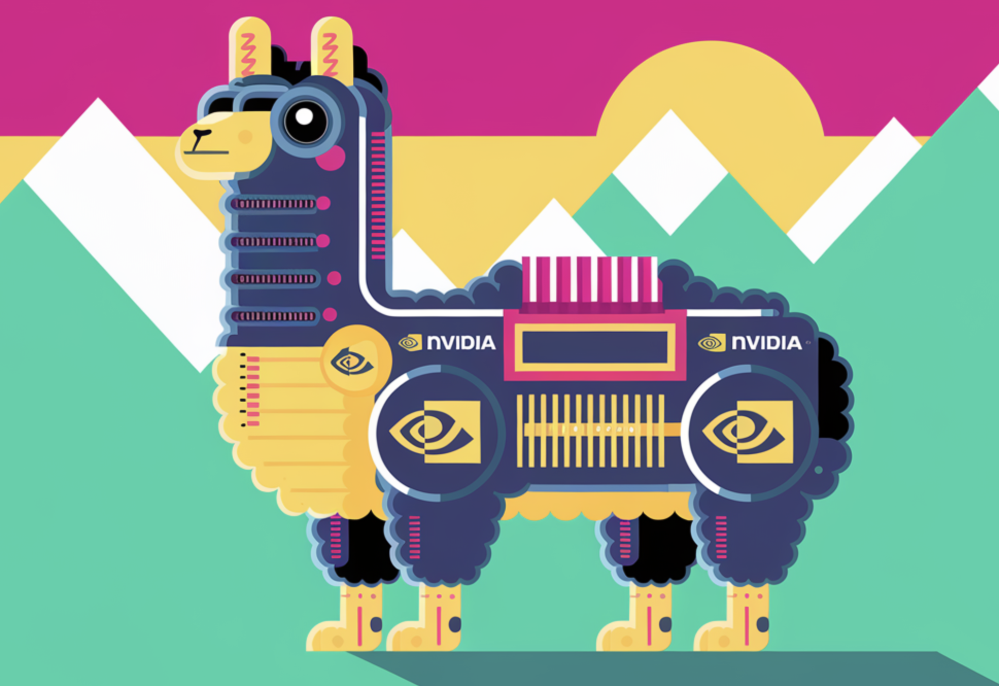

# Nvidia AI Quietly Launches Nemotron 70B: Crushing OpenAI’s GPT-4 on Various Benchmarks

> Current generative AI models face challenges related to robustness, accuracy, efficiency, cost, and handling nuanced human-like responses. There is a need for more scalable and efficient solutions that can deliver precise outputs while being practical for diverse AI applications. Nvidia introduces the Nemotron 70B Model, built to offer a new benchmark in the realm of […]

Current generative AI models face challenges related to robustness, accuracy, efficiency, cost, and handling nuanced human-like responses. There is a need for more scalable and efficient solutions that can deliver precise outputs while being practical for diverse AI applications.

Nvidia introduces the Nemotron 70B Model, built to offer a new benchmark in the realm of large language models (LLMs). Developed as part of the Llama 3.1 family, Nemotron 70B quietly emerged without the typical high-profile launch. Despite this, its impact has been significant, focusing on integrating state-of-the-art architectural improvements to outperform competitors in processing speed, training efficiency, and output accuracy. Nemotron 70B is designed to make complex AI capabilities accessible and practical for enterprises and developers, helping democratize AI adoption.

Technically, Nemotron 70B boasts a transformative 70-billion parameter structure, leveraging enhanced multi-query attention and an optimized transformer design that ensures faster computation without compromising accuracy. Compared to earlier models, the Llama 3.1 iteration features more advanced learning mechanisms, allowing Nemotron 70B to achieve improved results with fewer resources. This model has a powerful fine-tuning capability that allows users to customize it for specific industries and tasks, making it highly versatile. By utilizing Nvidia’s specialized GPU infrastructure, Nemotron 70B significantly reduces inference times, resulting in more timely and actionable insights for users. The benefits extend beyond speed and accuracy—the model also exhibits a notable reduction in energy consumption, promoting a more sustainable AI ecosystem.

The importance of Nvidia’s Nemotron 70B cannot be overstated, especially considering the evolving landscape of generative AI. With its advanced architecture, Nemotron 70B sets new performance benchmarks, including accuracy rates surpassing those of OpenAI’s GPT-4 on key natural language understanding tests. According to recent evaluations shared on platforms like Hugging Face, the model excels in contextual comprehension and multilingual capabilities, making it highly suitable for real-world applications in finance, healthcare, and customer service. Nvidia has reported that Nemotron 70B outperforms prior models by up to 15% in comprehensive language understanding tasks, reflecting its robust performance and ability to provide meaningful, context-aware responses. This performance boost makes it a crucial tool for enterprises seeking to build smarter, more intuitive AI-driven systems.

In conclusion, Nvidia’s Nemotron 70B Model is poised to redefine the landscape of large language models, addressing critical gaps in efficiency, accuracy, and energy consumption. By pushing the boundaries of what’s possible in generative AI, Nvidia has crafted a tool that not only competes with but also surpasses some of the most advanced models currently available, including GPT-4. With its low energy footprint, impressive performance, and versatile application range, Nemotron 70B is setting a new standard for how generative models can operate and contribute to a wide array of industries. Nvidia’s approach, blending technical prowess with practical usability, ensures that Nemotron 70B will be a game changer in AI innovation and adoption.

---

Check out the** [Models here](https://huggingface.co/collections/nvidia/llama-31-nemotron-70b-670e93cd366feea16abc13d8)**. All credit for this research goes to the researchers of this project. Also, don’t forget to follow us on **[Twitter](https://twitter.com/Marktechpost)** and join our **[Telegram Channel](https://pxl.to/at72b5j)** and [**LinkedIn Gr**](https://www.linkedin.com/groups/13668564/)[**oup**](https://www.linkedin.com/groups/13668564/). **If you like our work, you will love our**[** newsletter..**](https://marktechpost-newsletter.beehiiv.com/subscribe) Don’t Forget to join our **[50k+ ML SubReddit](https://www.reddit.com/r/machinelearningnews/)**.

**[[Upcoming Live Webinar- Oct 29, 2024] ](https://go.predibase.com/predibase-inference-engine-102924-lp?utm_medium=3rdparty&utm_source=marktechpost)****[The Best Platform for Serving Fine-Tuned Models: Predibase Inference Engine (Promoted)](https://go.predibase.com/predibase-inference-engine-102924-lp?utm_medium=3rdparty&utm_source=marktechpost)**
