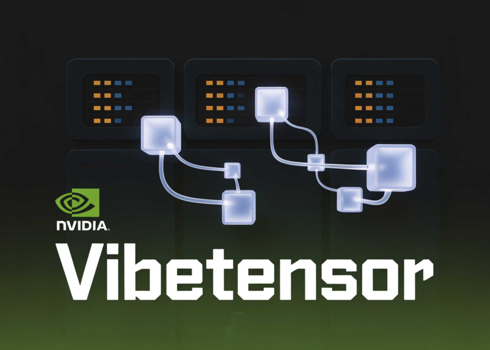

# NVIDIA AI Release VibeTensor: An AI Generated Deep Learning Runtime Built End to End by Coding Agents Programmatically

> NVIDIA has released VIBETENSOR, an open-source research system software stack for deep learning. VIBETENSOR is generated by LLM-powered coding agents under high-level human guidance. The system asks a concrete question: can coding agents generate a coherent deep learning runtime that spans Python and JavaScript APIs down to C++ runtime components and CUDA memory management and […]

NVIDIA has released VIBETENSOR, an open-source research system software stack for deep learning. VIBETENSOR is generated by LLM-powered coding agents under high-level human guidance.

The system asks a concrete question: can coding agents generate a coherent deep learning runtime that spans Python and JavaScript APIs down to C++ runtime components and CUDA memory management and validate it only through tools.

### Architecture from frontends to CUDA runtime

VIBETENSOR implements a PyTorch-style eager tensor library with a C++20 core for CPU and CUDA, a torch-like Python overlay via nanobind, and an experimental Node.js / TypeScript interface. It targets Linux x86_64 and NVIDIA GPUs via CUDA, and builds without CUDA are intentionally disabled.

*https://arxiv.org/pdf/2601.16238*

The core stack includes its own tensor and storage system, a schema-lite dispatcher, a reverse-mode autograd engine, a CUDA subsystem with streams, events, and CUDA graphs, a stream-ordered caching allocator with diagnostics, and a stable C ABI for dynamically loaded operator plugins. Frontends in Python and Node.js share a C++ dispatcher, tensor implementation, autograd engine, and CUDA runtime.

The Python overlay exposes a `vibetensor.torch` namespace with tensor factories, operator dispatch, and CUDA utilities. The Node.js frontend is built on Node-API and focuses on async execution, using worker scheduling with bounds on concurrent inflight work as described in the implementation sections.

At the runtime level, `TensorImpl` represents a view over reference-counted `Storage`, with sizes, strides, storage offsets, dtype, device metadata, and a shared version counter. This supports non-contiguous views and aliasing. A `TensorIterator` subsystem computes iteration shapes and per-operand strides for elementwise and reduction operators, and the same logic is exposed through the plugin ABI so external kernels follow the same aliasing and iteration rules.

The dispatcher is schema-lite. It maps operator names to implementations across CPU and CUDA dispatch keys and allows wrapper layers for autograd and Python overrides. Device policies enforce invariants such as “all tensor inputs on the same device,” while leaving room for specialized multi-device policies.

### Autograd, CUDA subsystem, and multi-GPU Fabric

Reverse-mode autograd uses Node and Edge graph objects and per-tensor `AutogradMeta`. During backward, the engine maintains dependency counts, per-input gradient buffers, and a ready queue. For CUDA tensors, it records and waits on CUDA events to synchronize cross-stream gradient flows. The system also contains an experimental multi-device autograd mode for research on cross-device execution.

*https://arxiv.org/pdf/2601.16238*

The CUDA subsystem provides C++ wrappers for CUDA streams and events, a caching allocator with stream-ordered semantics, and CUDA graph capture and replay. The allocator includes diagnostics such as snapshots, statistics, memory-fraction caps, and GC ladders to make memory behavior observable in tests and debugging. CUDA graphs integrate with allocator “graph pools” to manage memory lifetime across capture and replay.

The Fabric subsystem is an experimental multi-GPU layer. It exposes explicit peer-to-peer GPU access via CUDA P2P and unified virtual addressing when the topology supports it. Fabric focuses on single-process multi-GPU execution and provides observability primitives such as statistics and event snapshots rather than a full distributed training stack.

As a reference extension, VIBETENSOR ships a best-effort CUTLASS-based ring allreduce plugin for NVIDIA Blackwell-class GPUs. This plugin binds experimental ring-allreduce kernels, does not call NCCL, and is positioned as an illustrative example, not as an NCCL replacement. Multi-GPU results in the paper rely on Fabric plus this optional plugin, and they are reported only for Blackwell GPUs.

### Interoperability and extension points

VIBETENSOR supports DLPack import and export for CPU and CUDA tensors and provides a C++20 Safetensors loader and saver for serialization. Extensibility mechanisms include Python-level overrides inspired by `torch.library`, a versioned C plugin ABI, and hooks for custom GPU kernels authored in Triton and CUDA template libraries such as CUTLASS. The plugin ABI exposes DLPack-based dtype and device metadata and `TensorIterator` helpers so external kernels integrate with the same iteration and aliasing rules as built-in operators.

### AI-assisted development

VIBETENSOR was built using LLM-powered coding agents as the main code authors, guided only by high-level human specifications. Over roughly 2 months, humans defined targets and constraints, then agents proposed code diffs and executed builds and tests to validate them. The work does not introduce a new agent framework, it treats agents as black-box tools that modify the codebase under tool-based checks. Validation relies on C++ tests (CTest), Python tests via pytest, and differential checks against reference implementations such as PyTorch for selected operators. The research team also include longer training regressions and allocator and CUDA diagnostics to catch stateful bugs and performance pathologies that do not show up in unit tests.

### Key Takeaways

- **AI-generated, CUDA-first deep learning stack**: VIBETENSOR is an Apache 2.0, open-source PyTorch-style eager runtime whose implementation changes were generated by LLM coding agents, targeting Linux x86_64 with NVIDIA GPUs and CUDA as a hard requirement.

- **Full runtime architecture, not just kernels**: The system includes a C++20 tensor core (TensorImpl/Storage/TensorIterator), a schema-lite dispatcher, reverse-mode autograd, a CUDA subsystem with streams, events, graphs, a stream-ordered caching allocator, and a versioned C plugin ABI, exposed through Python (`vibetensor.torch`) and experimental Node.js frontends.

- **Tool-driven, agent-centric development workflow**: Over ~2 months, humans specified high-level goals, while agents proposed diffs and validated them via CTest, pytest, differential checks against PyTorch, allocator diagnostics, and long-horizon training regressions, without per-diff manual code review.

- **Strong microkernel speedups, slower end-to-end training**: AI-generated kernels in Triton/CuTeDSL achieve up to ~5–6× speedups over PyTorch baselines in isolated benchmarks, but complete training workloads (Transformer toy tasks, CIFAR-10 ViT, miniGPT-style LM) run 1.7× to 6.2× slower than PyTorch, emphasizing the gap between kernel and system-level performance.

---

Check out the **[Paper](https://arxiv.org/pdf/2601.16238) and [Repo here](https://github.com/NVLabs/vibetensor)**. Also, feel free to follow us on **[Twitter](https://x.com/intent/follow?screen_name=marktechpost)** and don’t forget to join our **[100k+ ML SubReddit](https://www.reddit.com/r/machinelearningnews/)** and Subscribe to **[our Newsletter](https://www.aidevsignals.com/)**. Wait! are you on telegram? **[now you can join us on telegram as well.](https://t.me/machinelearningresearchnews)**
