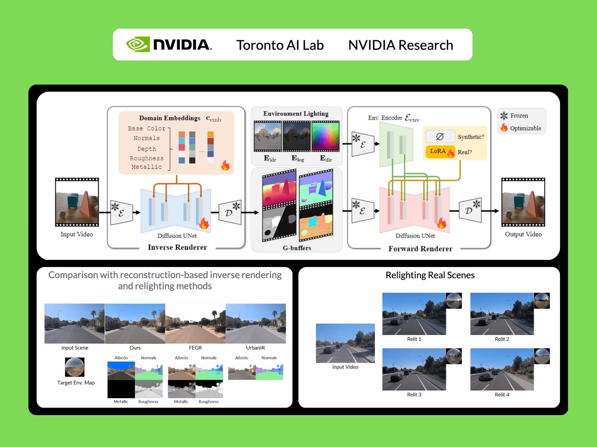

# NVIDIA AI Released DiffusionRenderer: An AI Model for Editable, Photorealistic 3D Scenes from a Single Video

> AI-powered video generation is improving at a breathtaking pace. In a short time, we’ve gone from blurry, incoherent clips to generated videos with stunning realism. Yet, for all this progress, a critical capability has been missing: control and Edits While generating a beautiful video is one thing, the ability to professionally and realistically edit it—to […]

AI-powered video generation is improving at a breathtaking pace. In a short time, we’ve gone from blurry, incoherent clips to generated videos with stunning realism. Yet, for all this progress, a critical capability has been missing: **control and Edits**

While generating a beautiful video is one thing, the ability to professionally and realistically _edit_ it—to change the lighting from day to night, swap an object’s material from wood to metal, or seamlessly insert a new element into the scene—has remained a formidable, largely unsolved problem. This gap has been the key barrier preventing AI from becoming a truly foundational tool for filmmakers, designers, and creators.

Until the introduction of **[DiffusionRenderer](https://pxl.to/wpq77e8)**!!

**[In a groundbreaking new paper, researchers at NVIDIA, University of Toronto, Vector Institute and the University of Illinois Urbana-Champaign have unveiled a framework that directly tackles this challenge](https://pxl.to/911aijj)**. DiffusionRenderer represents a revolutionary leap forward, moving beyond mere generation to offer a unified solution for understanding and manipulating 3D scenes from a single video. It effectively bridges the gap between generation and editing, unlocking the true creative potential of AI-driven content.

### The Old Way vs. The New Way: A Paradigm Shift

For decades, photorealism has been anchored in PBR, a methodology that meticulously simulates the flow of light. While it produces stunning results, it’s a fragile system. PBR is critically dependent on having a perfect digital blueprint of a scene—precise 3D geometry, detailed material textures, and accurate lighting maps. The process of capturing this blueprint from the real world, known as **inverse rendering**, is notoriously difficult and error-prone. Even small imperfections in this data can cause catastrophic failures in the final render, a key bottleneck that has limited PBR’s use outside of controlled studio environments.

Previous neural rendering techniques like NeRFs, while revolutionary for creating static views, hit a wall when it came to editing. They “bake” lighting and materials into the scene, making post-capture modifications nearly impossible.

**[DiffusionRenderer](https://pxl.to/wpq77e8)** treats the “what” (the scene’s properties) and the “how” (the rendering) in one unified framework built on the same powerful video diffusion architecture that underpins models like Stable Video Diffusion.

This method uses two neural renderers to process video:

- **Neural Inverse Renderer:** This model acts like a scene detective. It analyzes an input RGB video and intelligently estimates the intrinsic properties, generating the essential data buffers (G-buffers) that describe the scene’s geometry (normals, depth) and materials (color, roughness, metallic) at the pixel level. Each attribute is generated in a dedicated pass to enable high quality generation.

***_DiffusionRenderer Inverse rendering_**_ example above.  The method predicts finer details in thin structures and accurate metallic and roughness channels (top). The method also generalizes impressively to outdoor scenes (bottom row)._*

- **Neural Forward Renderer:** This model functions as the artist. It takes the G-buffers from the inverse renderer, combines them with any desired lighting (an environment map), and synthesizes a photorealistic video. Crucially, it has been trained to be robust, capable of producing stunning, complex light transport effects like soft shadows and inter-reflections even when the input G-buffers from the inverse renderer are imperfect or “noisy.”

***_DiffusionRenderer forward rendering _**_method generates high-quality inter-reflections (top) and shadows (bottom), producing more accurate results than the neural baselines. Path Traced GT is the ground truth._*

This self-correcting synergy is the core of the breakthrough. The system is designed for the messiness of the real world, where perfect data is a myth.

### The Secret Sauce: A Novel Data Strategy to Bridge the Reality Gap

A smart model is nothing without smart data. The researchers behind [DiffusionRenderer](https://pxl.to/911aijj) devised an ingenious two-pronged data strategy to teach their model the nuances of both perfect physics and imperfect reality.

- **A Massive Synthetic Universe:** First, they built a vast, high-quality synthetic dataset of 150,000 videos. Using thousands of 3D objects, PBR materials, and HDR light maps, they created complex scenes and rendered them with a perfect path-tracing engine. This gave the inverse rendering model a flawless “textbook” to learn from, providing it with perfect ground-truth data.

- **Auto-Labeling the Real World:** The team found that the inverse renderer, trained only on synthetic data, was surprisingly good at generalizing to real videos. They unleashed it on a massive dataset of 10,510 real-world videos (DL3DV10k). The model automatically generated G-buffer labels for this real-world footage. This created a colossal, 150,000-sample dataset of real scenes with corresponding—albeit imperfect—intrinsic property maps.

By co-training the forward renderer on both the perfect synthetic data and the auto-labeled real-world data, the model learned to bridge the critical “domain gap.” It learned the rules from the synthetic world and the look and feel of the real world. To handle the inevitable inaccuracies in the auto-labeled data, the team incorporated a LoRA (Low-Rank Adaptation) module, a clever technique that allows the model to adapt to the noisier real data without compromising the knowledge gained from the pristine synthetic set.

### State-of-the-Art Performance

The results speak for themselves. In rigorous head-to-head comparisons against both classic and neural state-of-the-art methods, [DiffusionRenderer](https://pxl.to/wpq77e8) consistently came out on top across all evaluated tasks by a wide margin:

- **Forward Rendering:** When generating images from G-buffers and lighting, [DiffusionRenderer](https://pxl.to/wpq77e8) significantly outperformed other neural methods, especially in complex multi-object scenes where realistic inter-reflections and shadows are critical. The neural rendering outperformed significantly other methods.

*_For Forward rendering, the results are amazing compared to ground truth_ _(Path Traced GT is the ground truth.)._*

- **Inverse Rendering:** The [model](https://pxl.to/wpq77e8) proved superior at estimating a scene’s intrinsic properties from a video, achieving higher accuracy on albedo, material, and normal estimation than all baselines. The use of a video model (versus a single-image model) was shown to be particularly effective, reducing errors in metallic and roughness prediction by 41% and 20% respectively, as it leverages motion to better understand view-dependent effects.

- **Relighting:** In the ultimate test of the unified pipeline, [DiffusionRenderer](https://pxl.to/911aijj) produced quantitatively and qualitatively superior relighting results compared to leading methods like DiLightNet and Neural Gaffer, generating more accurate specular reflections and high-fidelity lighting.

*_Above is a relighting evaluation against other methods_*

### What You Can Do With DiffusionRenderer: powerful editing!

This research unlocks a suite of practical and powerful editing applications that operate from a single, everyday video. The workflow is simple: the model first performs inverse rendering to understand the scene, the user edits the properties, and the model then performs forward rendering to create a new photorealistic video.

- **Dynamic Relighting:** Change the time of day, swap out studio lights for a sunset, or completely alter the mood of a scene by simply providing a new environment map. The framework realistically re-renders the video with all the corresponding shadows and reflections.

- **Intuitive Material Editing:** Want to see what that leather chair would look like in chrome? Or make a metallic statue appear to be made of rough stone? Users can directly tweak the material G-buffers—adjusting roughness, metallic, and color properties—and the model will render the changes photorealistically.

- **Seamless Object Insertion:** Place new virtual objects into a real-world scene. By adding the new object’s properties to the scene’s G-buffers, the forward renderer can synthesize a final video where the object is naturally integrated, casting realistic shadows and picking up accurate reflections from its surroundings.

### A New Foundation for Graphics

[DiffusionRenderer](https://pxl.to/wpq77e8) represents a definitive breakthrough. By holistically solving inverse and forward rendering within a single, robust, data-driven framework, it tears down the long-standing barriers of traditional PBR. It democratizes photorealistic rendering, moving it from the exclusive domain of VFX experts with powerful hardware to a more accessible tool for creators, designers, and AR/VR developers.

In a recent update, the authors further improve video de-lighting and re-lighting by leveraging [NVIDIA Cosmos](https://www.nvidia.com/en-us/ai/cosmos/) and enhanced data curation.

This demonstrates a promising scaling trend: as the underlying video diffusion model grows more powerful, the output quality improves, yielding sharper, more accurate results.

These improvements make the technology even more compelling.

The new model is released under Apache 2.0 and the NVIDIA Open Model License and is **[available here](https://pxl.to/911aijj)**

**Sources:**

- Demo Video [https://youtu.be/jvEdWKaPqkc](https://youtu.be/jvEdWKaPqkc)

- Paper : [https://arxiv.org/abs/2501.18590](https://arxiv.org/abs/2501.18590)

- Code :  [https://github.com/nv-tlabs/cosmos1-diffusion-renderer](https://github.com/nv-tlabs/cosmos1-diffusion-renderer)

- Project Page: [https://research.nvidia.com/labs/toronto-ai/DiffusionRenderer/](https://research.nvidia.com/labs/toronto-ai/DiffusionRenderer/)

---

_Thanks to the NVIDIA team for the thought leadership/ Resources for this article. NVIDIA team has supported and sponsored this content/article._
