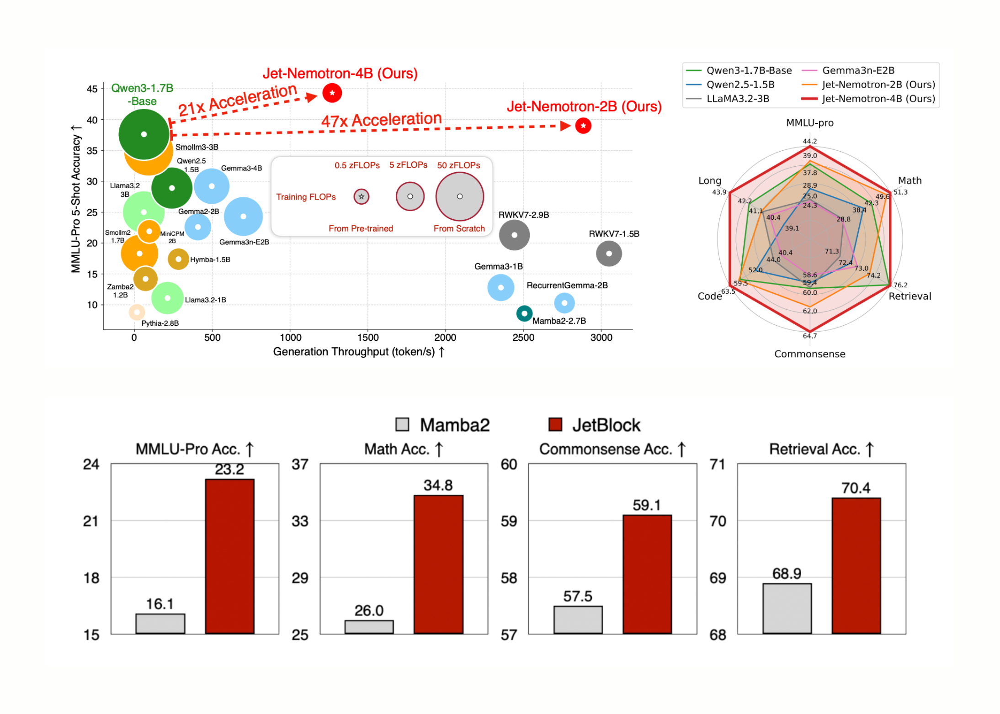

# NVIDIA AI Released Jet-Nemotron: 53x Faster Hybrid-Architecture Language Model Series that Translates to a 98% Cost Reduction for Inference at Scale

> NVIDIA researchers have shattered the longstanding efficiency hurdle in large language model (LLM) inference, releasing Jet-Nemotron—a family of models (2B and 4B) that delivers up to 53.6× higher generation throughput than leading full-attention LLMs while matching, or even surpassing, their accuracy. Most importantly, this breakthrough isn’t the result of a new pre-training run from scratch, […]

NVIDIA researchers have shattered the longstanding efficiency hurdle in large language model (LLM) inference, releasing **Jet-Nemotron**—a family of models (2B and 4B) that delivers **up to 53.6× higher generation throughput** than leading full-attention LLMs while matching, or even surpassing, their accuracy. Most importantly, this breakthrough isn’t the result of a new pre-training run from scratch, but rather a **retrofit of existing, pre-trained models** using a novel technique called **Post Neural Architecture Search (PostNAS)**. The implications are transformative for businesses, practitioners, and researchers alike.

### The Need for Speed in Modern LLMs

While today’s state-of-the-art (SOTA) LLMs, like Qwen3, Llama3.2, and Gemma3, have set new benchmarks for accuracy and flexibility, their **O(n²) self-attention** mechanism incurs exorbitant costs—both in compute and memory—especially for long-context tasks. This makes them expensive to deploy at scale and nearly impossible to run on edge or memory-constrained devices. Efforts to replace full-attention Transformers with more efficient architectures (Mamba2, GLA, RWKV, etc.) have struggled to close the accuracy gap, until now.

*https://arxiv.org/abs/2508.15884v1?*

### PostNAS: A Surgical, Capital-Efficient Overhaul

The core innovation is **PostNAS**: a neural architecture search pipeline designed specifically for **efficiently retrofitting pre-trained models**. Here’s how it works:

- **Freeze the Knowledge**: Start with a SOTA full-attention model (like Qwen2.5). Freeze its **MLP layers**—this preserves the model’s learned intelligence and greatly reduces training cost.

- **Surgical Replacement**: Replace computationally expensive full-attention (Transformers) with **JetBlock**, a new, hardware-efficient linear attention block designed for NVIDIA’s latest GPUs.

- **Hybrid, Hardware-Aware Design**: Use **super-network training and beam search** to automatically determine the **optimal placement and minimal set of full-attention layers** necessary to preserve accuracy on key tasks (retrieval, math, MMLU, coding, etc.). This step is **task-specific** and **hardware-aware**: the search maximizes throughput for target hardware, not just parameter count.

- **Scale and Deploy**: The result is a **hybrid-architecture** LLM that inherits the backbone intelligence of the original model but slashes latency and memory footprint.

**JetBlock** is particularly noteworthy: it introduces **dynamic causal convolution kernels** conditioned on input (unlike static kernels in prior linear attention blocks) and removes redundant convolutions for streamlined efficiency. With hardware-aware hyperparameter search, it not only keeps pace with prior linear attention designs in throughput, but actually **boosts accuracy**.

*https://arxiv.org/abs/2508.15884v1?*

### Jet-Nemotron: Performance by the Numbers

The key metrics from NVIDIA’s technical paper are **staggering**:

ModelMMLU-Pro Acc.Generation Throughput (tokens/s, H100)KV Cache Size (MB, 64K context)NotesQwen3-1.7B-Base37.8617,168Full-attention baselineJet-Nemotron-2B**39.0****2,885****154****47× throughput, 47× smaller cache**Jet-Nemotron-4B**44.2****1,271****258****21× throughput, still SOTA acc.**Mamba2-2.7B8.62,50780All-linear, much lower accuracyRWKV7-1.5B13.43,05024All-linear, much lower accuracyDeepSeek-V3-Small (MoE)———2.2B activated, 15B total, lower acc.

**Jet-Nemotron-2B matches or exceeds Qwen3-1.7B-Base on every major benchmark—math, commonsense, coding, retrieval, long-context—while delivering 47× higher generation throughput.**

This isn’t a small gain: **a 53.6× speedup in decoding at 256K context length** means a **98% reduction in inference cost** for the same volume of tokens. **Prefilling speedups are also dramatic**: 6.14× faster at 256K context.

**Memory footprint shrinks by 47×** (154MB cache vs. 7,168MB for Qwen3-1.7B-Base). This is a **game-changer for edge deployment**: Jet-Nemotron-2B is **8.84×** and **6.5×** faster than Qwen2.5-1.5B on Jetson Orin and RTX 3090, respectively.

*https://arxiv.org/abs/2508.15884v1?*

### Applications

#### For Business Leaders: Better ROI $$

- **Inference at scale is now affordable.** A 53× throughput gain means **dollar-for-dollar, you can serve 53× more users**—or **slash hosting costs by 98%**.

- **Operational efficiency** is transformed: **latency drops, batch sizes grow, and memory constraints vanish**. Cloud providers can **offer SOTA AI at commodity prices**.

- **The AI business model reshapes**: Tasks once too expensive (real-time document AI, long-context agents, on-device copilots) suddenly become viable.

#### For Practitioners: SOTA on the Edge

- **Forget about quantization, distillation, or pruning compromises.** Jet-Nemotron’s tiny KV cache (154MB) and 2B parameters **fit on Jetson Orin, RTX 3090, and even mobile chips**—no more offloading to the cloud.

- **No retraining, no data pipeline changes**: Just retrofitting. Your existing Qwen, Llama, or Gemma checkpoints can be upgraded **without losing accuracy**.

- **Real-world AI services** (search, copilots, summarization, coding) are now **instant and scalable**.

#### For Researchers: Lower Barrier, Higher Innovation

- **PostNAS slashes the cost of LLM architecture innovation.** Instead of months and millions on pre-training, **architecture search happens on frozen backbone models** in a fraction of the time.

- **Hardware-aware NAS is the future**: The Jet-Nemotron process considers **KV cache size** (not just parameters) as the critical factor for real-world speed. This is a **paradigm shift** in how we measure and optimize efficiency.

- **The community can iterate faster**: **PostNAS is a rapid testbed**. If a new attention block works here, it’s worth pre-training; if not, it’s filtered out before the big spend.

### Summary

The open-sourcing of **Jet-Nemotron** and **JetBlock** (code on GitHub) means the broader AI ecosystem can now retrofit their models for unprecedented efficiency. **PostNAS** is not a one-off trick: **it’s a general-purpose framework** for accelerating any Transformer, lowering the cost of future breakthroughs.

---

Check out the **[Paper](https://arxiv.org/abs/2508.15884v1?) **and **[GitHub Page](https://github.com/NVlabs/Jet-Nemotron).** Feel free to check out our **[GitHub Page for Tutorials, Codes and Notebooks](https://github.com/Marktechpost/AI-Tutorial-Codes-Included)**. Also, feel free to follow us on **[Twitter](https://x.com/intent/follow?screen_name=marktechpost)** and don’t forget to join our **[100k+ ML SubReddit](https://www.reddit.com/r/machinelearningnews/)** and Subscribe to **[our Newsletter](https://www.aidevsignals.com/)**.
