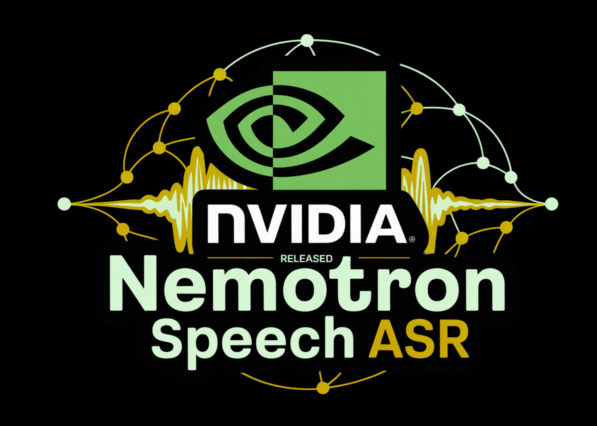

# NVIDIA AI Released Nemotron Speech ASR: A New Open Source Transcription Model Designed from the Ground Up for Low-Latency Use Cases like Voice Agents

> NVIDIA has just released its new streaming English transcription model (Nemotron Speech ASR) built specifically for low latency voice agents and live captioning. The checkpoint nvidia/nemotron-speech-streaming-en-0.6b on Hugging Face combines a cache aware FastConformer encoder with an RNNT decoder, and is tuned for both streaming and batch workloads on modern NVIDIA GPUs. Model design, architecture […]

NVIDIA has just released its new streaming English transcription model (Nemotron Speech ASR) built specifically for low latency voice agents and live captioning. The checkpoint `nvidia/nemotron-speech-streaming-en-0.6b` on Hugging Face combines a cache aware FastConformer encoder with an RNNT decoder, and is tuned for both streaming and batch workloads on modern NVIDIA GPUs.

### Model design, architecture and input assumptions

Nemotron Speech ASR (Automatic Speech Recognition) is a 600M parameter model based on a cache aware FastConformer encoder with 24 layers and an RNNT decoder. The encoder uses aggressive 8x convolutional downsampling to reduce the number of time steps, which directly lowers compute and memory costs for streaming workloads. The model consumes 16 kHz mono audio and requires at least 80 ms of input audio per chunk.

Runtime latency is controlled through configurable context sizes. The model exposes 4 standard chunk configurations, corresponding to about 80 ms, 160 ms, 560 ms and 1.12 s of audio. These modes are driven by the `att_context_size` parameter, which sets left and right attention context in multiples of 80 ms frames, and can be changed at inference time without retraining.

### Cache aware streaming, not buffered sliding windows

Traditional ‘streaming ASR’ often uses overlapping windows. Each incoming window reprocesses part of the previous audio to maintain context, which wastes compute and causes latency to drift upward as concurrency increases.

Nemotron Speech ASR instead keeps a cache of encoder states for all self attention and convolution layers. Each new chunk is processed once, with the model reusing cached activations rather than recomputing overlapping context. **This gives:**

- Non overlapping frame processing, so work scales linearly with audio length

- Predictable memory growth, because cache size grows with sequence length rather than concurrency related duplication

- Stable latency under load, which is critical for turn taking and interruption in voice agents

### Accuracy vs latency: WER under streaming constraints

Nemotron Speech ASR is evaluated on the Hugging Face OpenASR leaderboard datasets, including AMI, Earnings22, Gigaspeech and LibriSpeech. Accuracy is reported as word error rate (WER) for different chunk sizes.

**For an average across these benchmarks, the model achieves:**

- About 7.84 percent WER at 0.16 s chunk size

- About 7.22 percent WER at 0.56 s chunk size

- About 7.16 percent WER at 1.12 s chunk size

This illustrates the latency accuracy tradeoff. Larger chunks give more phonetic context and slightly lower WER, but even the 0.16 s mode keeps WER under 8 percent while remaining usable for real time agents. Developers can choose the operating point at inference time depending on application needs, for example 160 ms for aggressive voice agents, or 560 ms for transcription centric workflows.

### Throughput and concurrency on modern GPUs

The cache aware design has measurable impact on concurrency. On an NVIDIA H100 GPU, Nemotron Speech ASR supports about 560 concurrent streams at a 320 ms chunk size, roughly 3x the concurrency of a baseline streaming system at the same latency target. RTX A5000 and DGX B200 benchmarks show similar throughput gains, with more than 5x concurrency on A5000 and up to 2x on B200 across typical latency settings.

Equally important, latency remains stable as concurrency increases. In Modal’s tests with 127 concurrent WebSocket clients at 560 ms mode, the system maintained a median end to end delay around 182 ms without drift, which is essential for agents that must stay synchronized with live speech over multi minute sessions.

### Training data and ecosystem integration

Nemotron Speech ASR is trained mainly on the English portion of NVIDIA’s Granary dataset along with a large mixture of public speech corpora, for a total of about 285k hours of audio. Datasets include YouTube Commons, YODAS2, Mosel, LibriLight, Fisher, Switchboard, WSJ, VCTK, VoxPopuli and multiple Mozilla Common Voice releases. Labels combine human and ASR generated transcripts.

### Key Takeaways

- Nemotron Speech ASR is a 0.6B parameter English streaming model that uses a cache aware FastConformer encoder with an RNNT decoder and operates on 16 kHz mono audio with at least 80 ms input chunks.

- The model exposes 4 inference time chunk configurations, about 80 ms, 160 ms, 560 ms and 1.12 s, which let engineers trade latency for accuracy without retraining while keeping WER around 7.2 percent to 7.8 percent on standard ASR benchmarks.

- Cache aware streaming removes overlapping window recomputation so each audio frame is encoded once, which yields about 3 times higher concurrent streams on H100, more than 5 times on RTX A5000 and up to 2 times on DGX B200 compared to a buffered streaming baseline at similar latency.

- In an end to end voice agent with Nemotron Speech ASR, Nemotron 3 Nano 30B and Magpie TTS, measured median time to final transcription is about 24 ms and server side voice to voice latency on RTX 5090 is around 500 ms, which makes ASR a small fraction of the total latency budget.

- Nemotron Speech ASR is released as a NeMo checkpoint under the NVIDIA Permissive Open Model License with open weights and training details, so teams can self host, fine tune and profile the full stack for low latency voice agents and speech applications.

---

Check out the **[MODEL WEIGHTS here](https://huggingface.co/nvidia/nemotron-speech-streaming-en-0.6b)**. Also, feel free to follow us on **[Twitter](https://x.com/intent/follow?screen_name=marktechpost)** and don’t forget to join our **[100k+ ML SubReddit](https://www.reddit.com/r/machinelearningnews/)** and Subscribe to **[our Newsletter](https://www.aidevsignals.com/)**. Wait! are you on telegram? **[now you can join us on telegram as well.](https://t.me/machinelearningresearchnews)**

Check out our latest release of [**ai2025.dev**](https://ai2025.dev/), a 2025-focused analytics platform that turns model launches, benchmarks, and ecosystem activity into a structured dataset you can filter, compare, and export
