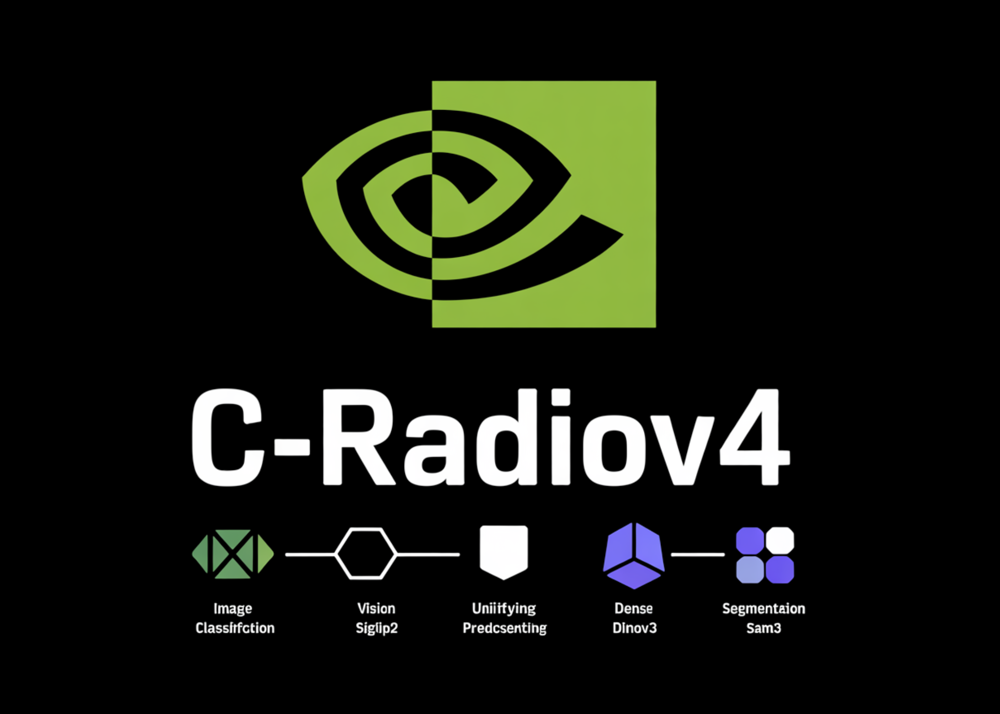

# NVIDIA AI releases C-RADIOv4 vision backbone unifying SigLIP2, DINOv3, SAM3 for classification, dense prediction, segmentation workloads at scale

> How do you combine SigLIP2, DINOv3, and SAM3 into a single vision backbone without sacrificing dense or segmentation performance? NVIDIA’s C-RADIOv4 is a new agglomerative vision backbone that distills three strong teacher models, SigLIP2-g-384, DINOv3-7B, and SAM3, into a single student encoder. It extends the AM-RADIO and RADIOv2.5 line, keeping similar computational cost while improving […]

How do you combine SigLIP2, DINOv3, and SAM3 into a single vision backbone without sacrificing dense or segmentation performance? NVIDIA’s C-RADIOv4 is a new agglomerative vision backbone that distills three strong teacher models, SigLIP2-g-384, DINOv3-7B, and SAM3, into a single student encoder. It extends the AM-RADIO and RADIOv2.5 line, keeping similar computational cost while improving dense prediction quality, resolution robustness, and drop-in compatibility with SAM3.

The key idea is simple. Instead of choosing between a vision language model, a self supervised dense model, and a segmentation model, C-RADIOv4 tries to approximate all three at once with one backbone.

*https://www.arxiv.org/pdf/2601.17237*

### Agglomerative distillation in RADIO

The RADIO family uses _agglomerative distillation_. A single ViT style student is trained to match both dense feature maps and summary tokens from several heterogeneous teachers.

Earlier RADIO models combined DFN CLIP, DINOv2, and SAM. They already supported multi resolution training but showed ‘mode switching’, where the representation changed qualitatively as input resolution changed. Later work such as PHI-S, RADIOv2.5, and FeatSharp added better multi resolution distillation and regularization, but the teacher set was still limited.

**C-RADIOv4 upgrades the teachers:**

- **SigLIP2-g-384** for stronger image text alignment

- **DINOv3-7B** for high quality self supervised dense features

- **SAM3** for segmentation oriented features and compatibility with the SAM3 decoder

The student is trained so that its dense features match DINOv3 and SAM3, while its summary tokens match SigLIP2 and DINOv3. This gives one encoder that can support classification, retrieval, dense prediction, and segmentation.

### Stochastic multi resolution training

C-RADIOv4 uses stochastic multi resolution training rather than a small fixed set of resolutions.

**Training samples input sizes from two partitions:**

- Low resolution: `{128, 192, 224, 256, 384, 432}`

- High resolution: `{512, 768, 1024, 1152}`

SigLIP2 operates natively at 384 pixels. Its features are upsampled by a factor of 3 using FeatSharp to align with 1152 pixel SAM3 features. SAM3 is trained with mosaic augmentation at 1152 × 1152.

This design smooths the performance curve over resolution and improves low resolution behavior. For example, on ADE20k linear probing, **C-RADIOv4-H** **reaches around:**

- 55.20 mIoU at 512 px

- 57.02 mIoU at 1024 px

- 57.72 mIoU at 1536 px

The scaling trend is close to DINOv3-7B while using roughly an order of magnitude fewer parameters.

### Removing teacher noise with shift equivariant losses and MESA

Distilling from large vision models tends to copy their artifacts, not just their useful structure. SigLIP2 has border noise patterns, and ViTDet style models can show window boundary artifacts. Direct feature regression can force the student to reproduce those patterns.

**C-RADIOv4 introduces two shift equivariant mechanisms to suppress such noise:**

- **Shift equivariant dense loss**: Each teacher and the student see _independently shifted_ crops of an image. Before computing the squared error, features are aligned via a shift mapping and the loss only uses overlapping spatial positions. Because the student never sees the same absolute positions as the teacher, it cannot simply memorize position fixed noise and is forced to track input dependent structure instead.

- **Shift equivariant MESA**: C-RADIOv4 also uses MESA style regularization between the online network and an EMA copy. Here again, the student and its EMA see different crops, features are aligned by a shift, and the loss is applied after layer normalization. This encourages smooth loss landscapes and robustness, while being invariant to absolute position.

In addition, training uses DAMP, which injects multiplicative noise into weights. This further improves robustness to corruptions and small distribution shifts.

### Balancing teachers with an angular dispersion aware summary loss

The summary loss in previous RADIO models used cosine distance between student and teacher embeddings. Cosine distance removes magnitude but not _directional dispersion_ on the sphere. Some teachers, such as SigLIP2, produce embeddings concentrated in a narrow cone, while DINOv3 variants produce more spread out embeddings.

If raw cosine distance is used, teachers with wider angular dispersion contribute larger losses and dominate optimization. In practice, DINOv3 tended to overshadow SigLIP2 in the summary term.

C-RADIOv4 replaces this with an _angle normalized_ loss. The squared angle between student and teacher embeddings is divided by the teacher’s angular dispersion. Measured dispersions show SigLIP2-g-384 around 0.694, while DINOv3-H+ and DINOv3-7B are around 2.12 and 2.19. Normalizing by these values equalizes their influence and preserves both vision language and dense semantics.

### Performance: classification, dense prediction, and Probe3d

On **ImageNet-1k zero shot classification**, C-RADIOv4-H reaches about **83.09 %** top-1 accuracy. It matches or improves on RADIOv2.5-H and C-RADIOv3-H across resolutions, with the best performance near 1024 px.

On **k-NN classification**, C-RADIOv4-H improves over RADIOv2.5 and C-RADIOv3, and matches or surpasses DINOv3 starting around 256 px. DINOv3 peaks near 192–256 px and then degrades, while C-RADIOv4 keeps stable or improving performance at higher resolutions.

Dense and 3D aware metrics show the intended tradeoff. On ADE20k, PASCAL VOC, NAVI, and SPair, C-RADIOv4-H and the SO400M variant outperform earlier RADIO models and are competitive with DINOv3-7B on dense benchmarks. **For C-RADIOv4-H, typical scores are:**

- ADE20k: 55.20 mIoU

- VOC: 87.24 mIoU

- NAVI: 63.44

- SPair: 60.57

*https://www.arxiv.org/pdf/2601.17237*

On **Probe3d**, which includes Depth Normals, Surface Normals, NAVI, and SPair, C-RADIOv4-H achieves the best **NAVI** and **SPair** scores in the RADIO family. Depth and Surface metrics are close to those of C-RADIOv3-H, with small differences in either direction, rather than a uniform improvement.

### Integration with SAM3 and ViTDet-mode deployment

C-RADIOv4 is designed to be a drop in replacement for the Perception Encoder backbone in SAM3. The SAM3 decoder and memory components remain unchanged. A reference implementation is provided in a SAM3 fork. Qualitative examples show that segmentation behavior is preserved for both text prompts such as “shoe”, “helmet”, “bike”, “spectator” and box prompts, and in some reported cases C-RADIOv4 based SAM3 resolves failure cases from the original encoder.

For deployment, C-RADIOv4 exposes a **ViTDet-mode** configuration. Most transformer blocks use windowed attention, while a few use global attention. Supported window sizes range from 6 × 6 to 32 × 32 tokens, subject to divisibility with patch size and image resolution. On an A100, the SO400M model with window size at most 12 is faster than the SAM3 ViT-L+ encoder across a wide range of input sizes, and the Huge model with window size 8 is close in latency.

This makes C-RADIOv4 a practical backbone for high resolution dense tasks where full global attention at all layers is too expensive.

### Key Takeaways

- **Single unified backbone:** C-RADIOv4 distills SigLIP2-g-384, DINOv3-7B, and SAM3 into one ViT-style encoder that supports classification, retrieval, dense prediction, and segmentation.

- **Any-resolution behavior:** Stochastic multi resolution training over {128…1152} px, and FeatSharp upsampling for SigLIP2, stabilizes performance across resolutions and tracks DINOv3-7B scaling with far fewer parameters.

- **Noise suppression via shift equivariance:** Shift equivariant dense loss and shift equivariant MESA prevent the student from copying teacher border and window artifacts, focusing learning on input dependent semantics.

- **Balanced multi-teacher distillation:** An angular dispersion normalized summary loss equalizes the contribution of SigLIP2 and DINOv3, preserving both text alignment and dense representation quality.

- **SAM3 and ViTDet-ready deployment:** C-RADIOv4 can directly replace the SAM3 Perception Encoder, offers ViTDet-mode windowed attention for faster high resolution inference, and is released under the NVIDIA Open Model License.

---

Check out the **[Paper](https://www.arxiv.org/pdf/2601.17237), [Repo](https://github.com/NVlabs/RADIO), [Model-1](https://huggingface.co/nvidia/C-RADIOv4-H) and [Model-2](https://huggingface.co/nvidia/C-RADIOv4-SO400M)**. Also, feel free to follow us on **[Twitter](https://x.com/intent/follow?screen_name=marktechpost)** and don’t forget to join our **[100k+ ML SubReddit](https://www.reddit.com/r/machinelearningnews/)** and Subscribe to **[our Newsletter](https://www.aidevsignals.com/)**. Wait! are you on telegram? **[now you can join us on telegram as well.](https://t.me/machinelearningresearchnews)**
