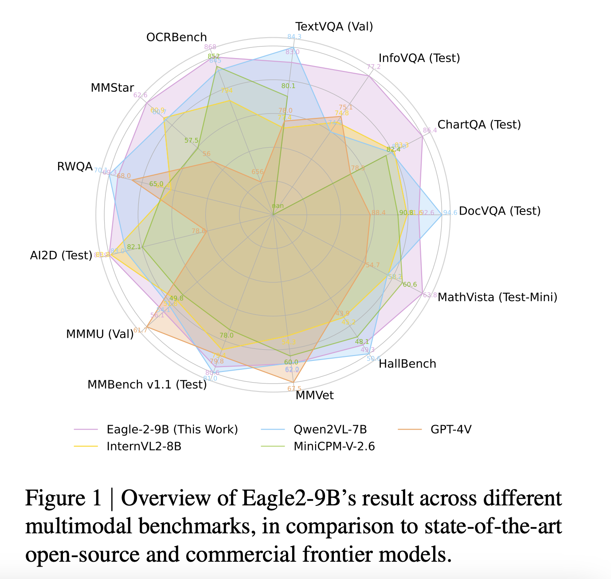

# NVIDIA AI Releases Eagle2 Series Vision-Language Model: Achieving SOTA Results Across Various Multimodal Benchmarks

> Vision-Language Models (VLMs) have significantly expanded AI’s ability to process multimodal information, yet they face persistent challenges. Proprietary models such as GPT-4V and Gemini-1.5-Pro achieve remarkable performance but lack transparency, limiting their adaptability. Open-source alternatives often struggle to match these models due to constraints in data diversity, training methodologies, and computational resources. Additionally, limited documentation […]

Vision-Language Models (VLMs) have significantly expanded AI’s ability to process multimodal information, yet they face persistent challenges. Proprietary models such as GPT-4V and Gemini-1.5-Pro achieve remarkable performance but lack transparency, limiting their adaptability. Open-source alternatives often struggle to match these models due to constraints in data diversity, training methodologies, and computational resources. Additionally, limited documentation on post-training data strategies makes replication difficult. To address these gaps, NVIDIA AI introduces **Eagle 2**, a VLM designed with a structured, transparent approach to data curation and model training.

### NVIDIA AI Introduces Eagle 2: A Transparent VLM Framework

Eagle 2 offers a fresh approach by prioritizing openness in its data strategy. Unlike most models that only provide trained weights, Eagle 2 details its data collection, filtering, augmentation, and selection processes. This initiative aims to equip the open-source community with the tools to develop competitive VLMs without relying on proprietary datasets.

Eagle2-9B, the most advanced model in the Eagle 2 series, performs on par with models several times its size, such as those with 70B parameters. By refining post-training data strategies, Eagle 2 optimizes performance without requiring excessive computational resources.

### Key Innovations in Eagle 2

The strengths of Eagle 2 stem from three main innovations: a refined data strategy, a multi-phase training approach, and a vision-centric architecture.

- **Data Strategy**

The model follows a **diversity-first, then quality** approach, curating a dataset from over **180 sources** before refining it through filtering and selection.

- A structured data refinement pipeline includes error analysis, Chain-of-Thought (CoT) explanations, rule-based QA generation, and data formatting for efficiency.

- **Three-Stage Training Framework**

**Stage 1** aligns vision and language modalities by training an MLP connector.

- **Stage 1.5** introduces diverse large-scale data, reinforcing the model’s foundation.

- **Stage 2** fine-tunes the model using high-quality instruction tuning datasets.

- **Tiled Mixture of Vision Encoders (MoVE)**

The model integrates **SigLIP and ConvNeXt** as dual vision encoders, enhancing image understanding.

- High-resolution tiling ensures fine-grained details are retained efficiently.

- A balance-aware greedy knapsack method optimizes data packing, reducing training costs while improving sample efficiency.

These elements make Eagle 2 both powerful and adaptable for various applications.

### Performance and Benchmark Insights

Eagle 2’s capabilities have been rigorously tested, demonstrating strong performance across multiple benchmarks:

- **Eagle2-9B** achieves **92.6% accuracy on DocVQA**, surpassing InternVL2-8B (91.6%) and GPT-4V (88.4%).

- In **OCRBench**, Eagle 2 scores **868**, outperforming Qwen2-VL-7B (845) and MiniCPM-V-2.6 (852), highlighting its strengths in text recognition.

- **MathVista performance** improves by over **10 points** compared to its baseline, reinforcing the effectiveness of the three-stage training approach.

- **ChartQA, OCR QA, and multimodal reasoning tasks** show notable improvements, outperforming GPT-4V in key areas.

Additionally, the training process is designed for efficiency. Advanced subset selection techniques reduced dataset size from **12.7M to 4.6M samples**, maintaining accuracy while improving data efficiency.

### Conclusion

Eagle 2 represents a step forward in making high-performance VLMs more accessible and reproducible. By emphasizing **a transparent data-centric approach**, it bridges the gap between open-source accessibility and the performance of proprietary models. The model’s innovations in **data strategy, training methods, and vision architecture** make it a compelling option for researchers and developers.

By openly sharing its methodology, NVIDIA AI fosters a **collaborative AI research environment**, allowing the community to build upon these insights without reliance on closed-source models. As AI continues to evolve, Eagle 2 exemplifies how thoughtful data curation and training strategies can lead to robust, high-performing vision-language models.

---

Check out **_the [Paper](https://arxiv.org/abs/2501.14818), [GitHub Page](https://github.com/NVlabs/EAGLE) and [Models on Hugging Face](https://huggingface.co/collections/nvidia/eagle-2-6764ba887fa1ef387f7df067)._** All credit for this research goes to the researchers of this project. Also, don’t forget to follow us on **[Twitter](https://x.com/intent/follow?screen_name=marktechpost)** and join our **[Telegram Channel](https://arxiv.org/abs/2406.09406)** and [**LinkedIn Gr**](https://www.linkedin.com/groups/13668564/)[**oup**](https://www.linkedin.com/groups/13668564/). Don’t Forget to join our **[70k+ ML SubReddit](https://www.reddit.com/r/machinelearningnews/)**.

**🚨 [Meet IntellAgent](https://pxl.to/82homag): [An Open-Source Multi-Agent Framework to Evaluate Complex Conversational AI System](https://pxl.to/82homag)** _(Promoted)_
