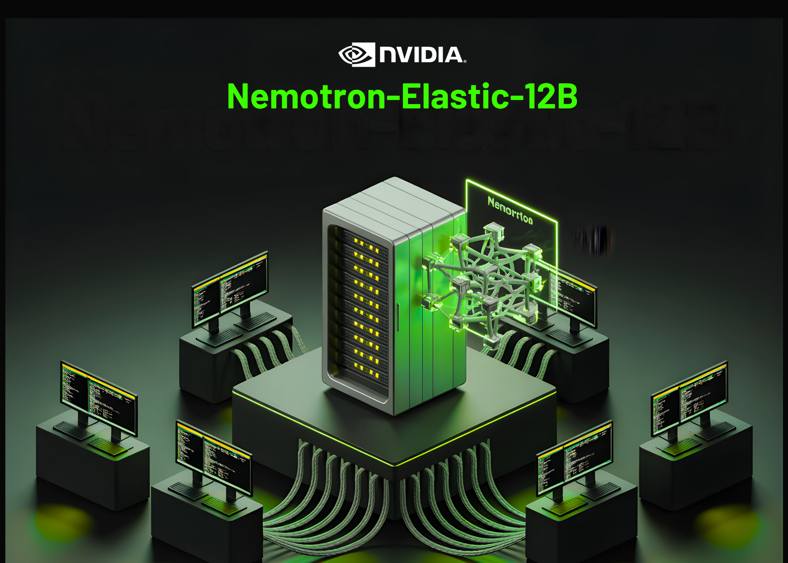

# NVIDIA AI Releases Nemotron-Elastic-12B: A Single AI Model that Gives You 6B/9B/12B Variants without Extra Training Cost

> Why are AI dev teams still training and storing multiple large language models for different deployment needs when one elastic model can generate several sizes at the same cost? NVIDIA is collapsing the usual ‘model family’ stack into a single training job. NVIDIA AI team releases Nemotron-Elastic-12B, a 12B parameter reasoning model that embeds nested […]

Why are AI dev teams still training and storing multiple large language models for different deployment needs when one elastic model can generate several sizes at the same cost? NVIDIA is collapsing the usual ‘model family’ stack into a single training job. NVIDIA AI team releases **Nemotron-Elastic-12B**, a 12B parameter reasoning model that embeds nested 9B and 6B variants in the same parameter space, so all three sizes come from one elastic checkpoint with no extra distillation runs per size.

## Many in one model family

Most production systems need several model sizes, a larger model for server side workloads, a mid size model for strong edge GPUs, and a smaller model for tight latency or power budgets. The usual pipeline trains or distills each size separately, so token cost and checkpoint storage scale with the number of variants.

Nemotron Elastic takes a different route. It starts from the Nemotron Nano V2 12B reasoning model and trains an elastic hybrid Mamba Attention network that exposes multiple nested submodels. The released Nemotron-Elastic-12B checkpoint can be sliced into 9B and 6B variants, Nemotron-Elastic-9B and Nemotron-Elastic-6B, using a provided slicing script, without any extra optimization.

All variants share weights and routing metadata, so training cost and deployment memory are tied to the largest model, not to the number of sizes in the family.

*https://arxiv.org/pdf/2511.16664v1*

## Hybrid Mamba Transformer with elastic masks

Architecturally, Nemotron Elastic is a Mamba-2 Transformer hybrid. The base network follows the Nemotron-H style design, where most layers are Mamba-2 based sequence state space blocks plus MLP, and a small set of attention layers preserve global receptive field.

**Elasticity is implemented by turning this hybrid into a dynamic model controlled by masks**:

- Width, embedding channels, Mamba heads and head channels, attention heads, and FFN intermediate size can be reduced through binary masks.

- Depth, layers can be dropped according to a learned importance ordering, with residual paths preserving signal flow.

A router module outputs discrete configuration choices per budget. These choices are converted to masks with Gumbel Softmax, then applied to embeddings, Mamba projections, attention projections, and FFN matrices. **The research team adds several details to keep the SSM structure valid:**

- Group aware SSM elastification that respects Mamba head and channel grouping.

- Heterogeneous MLP elastification where different layers can have distinct intermediate sizes.

- Normalized MSE based layer importance to decide which layers stay when depth is reduced.

Smaller variants are always prefix selections in the ranked component lists, which makes the 6B and 9B models true nested subnetworks of the 12B parent.

*https://arxiv.org/pdf/2511.16664v1*

## Two stage training for reasoning workloads

Nemotron Elastic is trained as a reasoning model with a frozen teacher. The teacher is the original Nemotron-Nano-V2-12B reasoning model. The elastic-12B student is optimized jointly for all three budgets, 6B, 9B, 12B, using knowledge distillation plus language modeling loss.

**Training runs in two stages**:

- **Stage 1:** short context, sequence length 8192, batch size 1536, around 65B tokens, with uniform sampling over the three budgets.

- **Stage 2:** extended context, sequence length 49152, batch size 512, around 45B tokens, with non uniform sampling that favors the full 12B budget.

*https://arxiv.org/pdf/2511.16664v1*

The second stage is important for reasoning tasks. The above table shows that for AIME 2025, the 6B model improves from 56.88 to 68.13, a 19.8 percent relative gain, while the 9B model gains 9.7 percent and the 12B model gains 4.0 percent after extended context training.

Budget sampling is also tuned. In Stage 2, non uniform weights of 0.5, 0.3, 0.2 for 12B, 9B, 6B avoid degradation of the largest model and keep all variants competitive on Math 500, AIME 2025, and GPQA.

## Benchmark results

Nemotron Elastic is evaluated on reasoning heavy benchmarks, MATH 500, AIME 2024, AIME 2025, GPQA, LiveCodeBench v5, and MMLU Pro. The below table summarizes pass at 1 accuracy.

*https://arxiv.org/pdf/2511.16664v1*

The 12B elastic model matches the NanoV2-12B baseline on average, 77.41 versus 77.38, while also providing 9B and 6B variants from the same run. The 9B elastic model tracks the NanoV2-9B baseline closely, 75.95 versus 75.99. The 6B elastic model reaches 70.61, slightly below Qwen3-8B at 72.68 but still strong for its parameter count given that it is not trained separately.

## Training token and memory savings

Nemotron Elastic targets the cost problem directly. The below table compares the token budgets needed to derive 6B and 9B models from a 12B parent:

- NanoV2 pretraining for 6B and 9B, 40T tokens total.

- NanoV2 Compression with Minitron SSM, 480B exploratory plus 270B final, 750B tokens.

- Nemotron Elastic, 110B tokens in a single elastic distillation run.

*https://arxiv.org/pdf/2511.16664v1*

The research team reports that this gives around 360 times reduction versus training the two extra models from scratch, and around 7 times reduction versus the compression baseline.

Deployment memory is reduced as well. The below table states that storing Nemotron Elastic 6B, 9B, and 12B together requires 24GB of BF16 weights, while storing NanoV2 9B plus 12B requires 42GB. This is a 43 percent memory reduction while also exposing an extra 6B size.

*https://arxiv.org/pdf/2511.16664v1*

## Comparison

SystemSizes (B)Avg reasoning score*Tokens for 6B + 9BBF16 memoryNemotron Elastic6, 9, 1270.61 / 75.95 / 77.41110B24GBNanoV2 Compression9, 1275.99 / 77.38750B42GBQwen3872.68n / an / a

## Key Takeaways

- Nemotron Elastic trains one 12B reasoning model that contains nested 9B and 6B variants which can be extracted zero shot without extra training.

- The elastic family uses a hybrid Mamba-2 and Transformer architecture plus a learned router that applies structured masks over width and depth to define each submodel.

- The approach needs 110B training tokens to derive 6B and 9B from the 12B parent which is about 7 times fewer tokens than the 750B token Minitron SSM compression baseline and about 360 times fewer than training extra models from scratch.

- On reasoning benchmarks such as MATH 500, AIME 2024 and 2025, GPQA, LiveCodeBench and MMLU Pro the 6B, 9B and 12B elastic models reach average scores of about 70.61, 75.95 and 77.41 which are on par with or close to the NanoV2 baselines and competitive with Qwen3-8B.

- All three sizes share one 24GB BF16 checkpoint so deployment memory stays constant for the family compared with around 42GB for separate NanoV2-9B and 12B models which gives about 43 percent memory savings while adding a 6B option.

## Editorial Comments

Nemotron-Elastic-12B is a practical step toward making reasoning model families cheaper to build and operate. One elastic checkpoint produces 6B, 9B, and 12B variants with a hybrid Mamba-2 and Transformer architecture, a learned router, and structured masks that preserve reasoning performance. The approach cuts token cost relative to separate compression or pretraining runs and keeps deployment memory at 24GB for all sizes, which simplifies fleet management for multi tier LLM deployments. Overall, Nemotron-Elastic-12B turns multi size reasoning LLMs into a single elastic systems design problem.

---

Check out the **[Paper](https://arxiv.org/pdf/2511.16664v1) and [Model weights](https://huggingface.co/nvidia/Nemotron-Elastic-12B)**. Feel free to check out our **[GitHub Page for Tutorials, Codes and Notebooks](https://github.com/Marktechpost/AI-Tutorial-Codes-Included)**. Also, feel free to follow us on **[Twitter](https://x.com/intent/follow?screen_name=marktechpost)** and don’t forget to join our **[100k+ ML SubReddit](https://www.reddit.com/r/machinelearningnews/)** and Subscribe to **[our Newsletter](https://www.aidevsignals.com/)**. Wait! are you on telegram? **[now you can join us on telegram as well.](https://t.me/machinelearningresearchnews)**
