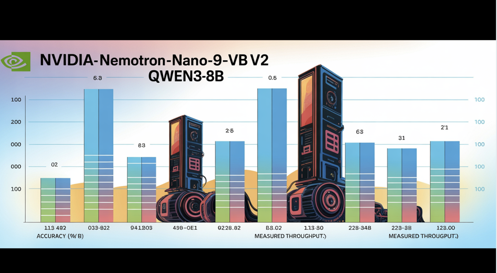

# NVIDIA AI Releases Nemotron Nano 2 AI Models: A Production-Ready Enterprise AI Model Family and 6x Faster than Similar Sized Model

> NVIDIA has unveiled the Nemotron Nano 2 family, introducing a line of hybrid Mamba-Transformer large language models (LLMs) that not only push state-of-the-art reasoning accuracy but also deliver up to 6× higher inference throughput than models of similar size. This release stands out with unprecedented transparency in data and methodology, as NVIDIA provides most of […]

NVIDIA has unveiled the Nemotron Nano 2 family, introducing a line of hybrid Mamba-Transformer large language models (LLMs) that not only push state-of-the-art reasoning accuracy but also deliver up to 6× higher inference throughput than models of similar size. This release stands out with unprecedented transparency in data and methodology, as NVIDIA provides most of the training corpus and recipes alongside model checkpoints for the community. Critically, these models maintain massive 128K-token context capability on a single midrange GPU, significantly lowering barriers for long-context reasoning and real-world deployment.

### Key Highlights

- **6× throughput vs. similarly sized models:** Nemotron Nano 2 models deliver up to 6.3× the token generation speed of models like Qwen3-8B in reasoning-heavy scenarios—without sacrificing accuracy.

- **Superior accuracy for reasoning, coding & multilingual tasks:** Benchmarks show on-par or better results vs. competitive open models, notably exceeding peers in math, code, tool use, and long-context tasks.

- **128K context length on a single GPU:** Efficient pruning and hybrid architecture make it possible to run 128,000 token inference on a single NVIDIA A10G GPU (22GiB).

- **Open data & weights:** Most of the pretraining and post-training datasets, including code, math, multilingual, synthetic SFT, and reasoning data, are released with permissive licensing on Hugging Face.

### Hybrid Architecture: Mamba Meets Transformer

Nemotron Nano 2 is built on a hybrid Mamba-Transformer backbone, inspired by the Nemotron-H Architecture. Most traditional self-attention layers are replaced by efficient Mamba-2 layers, with only about 8% of the total layers using self-attention. This architecture is carefully crafted:

- **Model Details:** The 9B-parameter model features 56 layers (out of a pre-trained 62), a hidden size of 4480, with grouped-query attention and Mamba-2 state space layers facilitating both scalability and long sequence retention.

- **Mamba-2 Innovations:** These state-space layers, recently popularized as high-throughput sequence models, are interleaved with sparse self-attention (to preserve long-range dependencies), and large feed-forward networks.

This structure enables high throughput on reasoning tasks requiring “thinking traces”—long generations based on long, in-context input—where traditional transformer-based architectures often slow down or run out of memory.

### Training Recipe: Massive Data Diversity, Open Sourcing

Nemotron Nano 2 models are trained and distilled from a 12B parameter teacher model using an extensive, high-quality corpus. NVIDIA’s unprecedented data transparency is a highlight:

- **20T tokens pretraining:** Data sources include curated and synthetic corpora for web, math, code, multilingual, academic, and STEM domains.

- **Major Datasets Released:**

**Nemotron-CC-v2:** Multilingual web crawl (15 languages), synthetic Q&A rephrasing, deduplication.

- **Nemotron-CC-Math:** 133B tokens of math content, standardized to LaTeX, over 52B “highest quality” subset.

- **Nemotron-Pretraining-Code:** Curated and quality-filtered GitHub source code; rigorous decontamination and deduplication.

- **Nemotron-Pretraining-SFT:** Synthetic, instruction-following datasets across STEM, reasoning, and general domains.

- **Post-training Data:** Includes over 80B tokens of supervised fine-tuning (SFT), RLHF, tool-calling, and multilingual datasets—most of which are open-sourced for direct reproducibility.

### Alignment, Distillation, and Compression: Unlocking Cost-Effective, Long-Context Reasoning

NVIDIA’s model compression process is built on the “Minitron” and Mamba pruning frameworks:

- **Knowledge distillation** from the 12B teacher reduces the model to 9B parameters, with careful pruning of layers, FFN dimensions, and embedding width.

- **Multi-stage SFT and RL:** Includes tool-calling optimization (BFCL v3), instruction-following (IFEval), DPO and GRPO reinforcement, and “thinking budget” control (support for controllable reasoning-token budgets at inference).

- **Memory-targeted NAS:** Through architecture search, the pruned models are specifically engineered so that the model and key-value cache both fit—and remain performant—within the A10G GPU memory at a 128k context length.

The result: inference speeds of up to 6× faster than open competitors in scenarios with large input/output tokens, without compromised task accuracy.

### Benchmarking: Superior Reasoning and Multilingual Capabilities

In head-to-head evaluations, Nemotron Nano 2 models excel:

Task/BenchNemotron-Nano-9B-v2Qwen3-8BGemma3-12BMMLU (General)**74.5**76.473.6MMLU-Pro (5-shot)**59.4**56.345.1GSM8K CoT (Math)**91.4**84.074.5MATH**80.5**55.442.4HumanEval+**58.5**57.636.7RULER-128K (Long Context)**82.2**–80.7Global-MMLU-Lite (Avg Multi)**69.9**72.871.9MGSM Multilingual Math (Avg)**84.8**64.557.1

- **Throughput (tokens/s/GPU) at 8k input/16k output:**

Nemotron-Nano-9B-v2: up to 6.3× Qwen3-8B in reasoning traces.

- Maintains up to 128k-context with batch size=1—previously impractical on midrange GPUs.

### Conclusion

NVIDIA’s Nemotron Nano 2 release is an important moment for open LLM research: it redefines what’s possible on a single cost-effective GPU—both in speed and context capacity—while raising the bar for data transparency and reproducibility. Its hybrid architecture, throughput supremacy, and high-quality open datasets are set to accelerate innovation across the AI ecosystem.

---

Check out the **[Technical Details](https://research.nvidia.com/labs/adlr/NVIDIA-Nemotron-Nano-2/), [Paper](https://research.nvidia.com/labs/adlr/files/NVIDIA-Nemotron-Nano-2-Technical-Report.pdf)** and **[Models on Hugging Face](https://huggingface.co/collections/nvidia/nvidia-nemotron-689f6d6e6ead8e77dd641615)**. Feel free to check out our **[GitHub Page for Tutorials, Codes and Notebooks](https://github.com/Marktechpost/AI-Tutorial-Codes-Included)**. Also, feel free to follow us on **[Twitter](https://x.com/intent/follow?screen_name=marktechpost)** and don’t forget to join our **[100k+ ML SubReddit](https://www.reddit.com/r/machinelearningnews/)** and Subscribe to **[our Newsletter](https://www.aidevsignals.com/)**.

[📥 Sponsorship Media Kit](https://95xaxi6d7td.typeform.com/to/jhs8ftBd)
