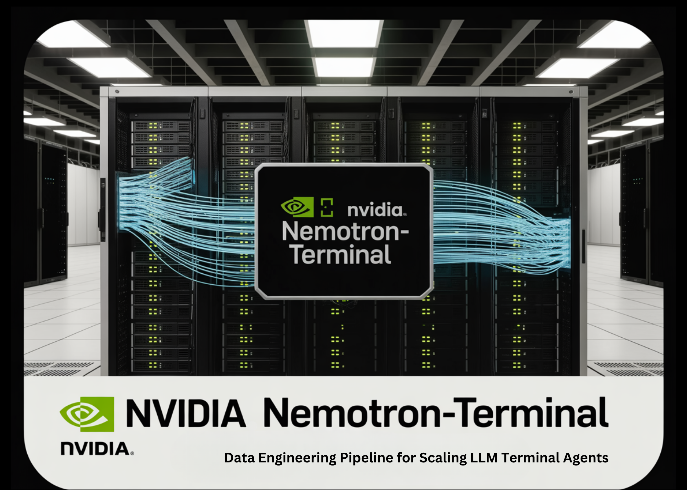

# NVIDIA AI Releases Nemotron-Terminal: A Systematic Data Engineering Pipeline for Scaling LLM Terminal Agents

> The race to build autonomous AI agents has hit a massive bottleneck: data. While frontier models like Claude Code and Codex CLI have demonstrated impressive proficiency in terminal environments, the training strategies and data mixtures behind them have remained closely guarded secrets. This lack of transparency has forced researchers and devs into a costly cycle […]

The race to build autonomous AI agents has hit a massive bottleneck: data. While frontier models like Claude Code and Codex CLI have demonstrated impressive proficiency in terminal environments, the training strategies and data mixtures behind them have remained closely guarded secrets. This lack of transparency has forced researchers and devs into a costly cycle of trial and error.

NVIDIA is now breaking that silence by unveiling a comprehensive framework for building high-performance terminal agents. By introducing **Terminal-Task-Gen** and the **Terminal-Corpus** dataset, NVIDIA is essentially giving the developer community the blueprints to build agents that don’t just ‘chat’ about code, but actually execute it with surgical precision.

*https://arxiv.org/pdf/2602.21193*

### The Data Scarcity Problem

The challenge of training an agent for the command line is two-fold. First, there is a scarcity of foundational resources—specifically, diverse task prompts and the complex dependency files needed to create realistic environments. Second, capturing ‘trajectories’ (the step-by-step terminal interactions) is logistically painful. Human interactions are slow to record, and synthetic generation via LLM agents is prohibitively expensive because it requires fresh Docker environment instantiation for every single turn.

### Terminal-Task-Gen: A Two-Pronged Strategy

NVIDIA’s solution is a ‘coarse-to-fine’ data generation pipeline called **Terminal-Task-Gen**. It utilizes two distinct strategies to scale training data without breaking the bank.

#### 1. Dataset Adaptation (The Coarse Layer)

Instead of starting from scratch, the team leverages high-quality existing Supervised Fine-Tuning (SFT) datasets from math, code, and software engineering (SWE) domains. They transform these static prompts into interactive terminal tasks.

- **Math and Code:** Using 163K math prompts and 35K code prompts, they wrap these challenges in a terminal scaffold.

- **SWE:** They pull 32K unique prompts from repositories like SWE-bench and SWE-reBench. The clever part? This process doesn’t require an LLM “in the loop” for the initial adaptation, making it incredibly efficient to scale volume.

#### 2. Synthetic Task Generation (The Fine Layer)

To bridge the gap between general reasoning and the specific rigors of terminal agency, NVIDIA team uses **Terminal-Task-Gen** to create novel, executable tasks.

- **Seed-based Generation:** The LLM uses existing scientific computing or algorithmic problems as “inspiration” to synthesize new tasks. The agent is forced to install packages, read input files, and write results—mirroring a real-world developer workflow.

- **Skill-based Generation:** This is where it gets technical. NVIDIA curated a taxonomy of “primitive terminal skills” across nine domains, including Security, Data Science, and System Administration. The LLM is then instructed to combine 3–5 of these primitives (like graph traversal + network configuration + file I/O) into a single, complex task.

### Solving the Infrastructure Overhead

One of the most significant engineering breakthroughs in this research is the move to **Pre-Built Docker Images**. Previous frameworks often generated a unique Dockerfile for every single task, leading to massive build-time overhead and frequent failures. NVIDIA team instead maintains nine shared base images pre-configured with essential libraries (like `pandas` for data science or cryptography tools for security). This ‘single-pass’ creation method allows for massive parallelization and a significantly smaller resource footprint.

### Performance: When 32B Beats 480B

The results of this data-centric approach are staggering. NVIDIA team used this pipeline to train the **Nemotron-Terminal** family of models, initialized from Qwen3.

On the **Terminal-Bench 2.0** benchmark, which tests agents on end-to-end workflows like training machine learning models or debugging system environments, **the improvements were vertical:**

- **Nemotron-Terminal-8B:** Jumped from a 2.5% success rate to 13.0%.

- **Nemotron-Terminal-32B:** Achieved a **27.4%** accuracy.

To put that in perspective, the 32B model outperformed the **480B Qwen3-Coder** (23.9%) and rivaled the performance of closed-source giants like **Grok 4** (23.1%) and **GPT-5-Mini** (24.0%). This proves that for terminal agents, high-quality, diverse trajectory data is a more powerful lever than sheer parameter scale.

### Critical Insights

**NVIDIA’s research also debunks several common myths in data engineering:**

- **Don’t Filter Out Errors:** The research team found that keeping ‘unsuccessful’ trajectories in the training data actually improved performance (12.4% vs 5.06% for success-only filtering). Exposing models to realistic error states and recovery patterns makes them more robust.

- **Skip the Curriculum:** They experimented with ‘curriculum learning’ (training on easy data before hard data) but found that simple mixed training was just as effective, if not better.

- **Context Length Limits:** While terminal trajectories can be long, most high-quality supervision fits within a standard 32,768-token window. Extending the context length slightly hurt performance, likely because long-tail trajectories tend to be noisier.

---

Check out **[Paper](https://arxiv.org/pdf/2602.21193) **and** [HF Project Page](https://huggingface.co/collections/nvidia/nemotron-terminal). **Also, feel free to follow us on **[Twitter](https://x.com/intent/follow?screen_name=marktechpost)** and don’t forget to join our **[120k+ ML SubReddit](https://www.reddit.com/r/machinelearningnews/)** and Subscribe to **[our Newsletter](https://www.aidevsignals.com/)**. Wait! are you on telegram? **[now you can join us on telegram as well.](https://t.me/machinelearningresearchnews)**
