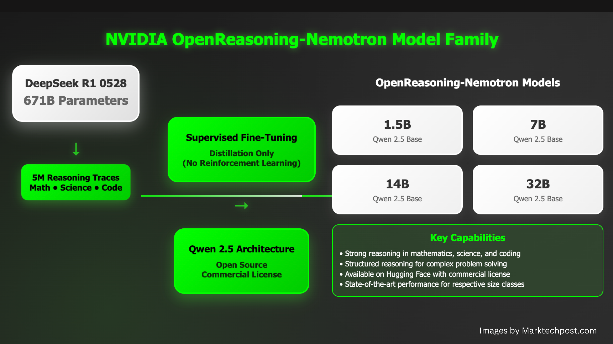

# NVIDIA AI Releases OpenReasoning-Nemotron: A Suite of Reasoning-Enhanced LLMs Distilled from DeepSeek R1 0528

> NVIDIA AI has introduced OpenReasoning-Nemotron, a family of large language models (LLMs) designed to excel in complex reasoning tasks across mathematics, science, and code. This model suite—comprising 1.5B, 7B, 14B, and 32B parameter versions—has been distilled from the 671B DeepSeek R1 0528 model, capturing its high-level reasoning capabilities in significantly smaller and more efficient models. […]

NVIDIA AI has introduced **OpenReasoning-Nemotron**, a family of large language models (LLMs) designed to excel in complex reasoning tasks across mathematics, science, and code. This model suite—comprising **1.5B, 7B, 14B, and 32B parameter versions**—has been **distilled from the 671B DeepSeek R1 0528 model**, capturing its high-level reasoning capabilities in significantly smaller and more efficient models.

The release positions NVIDIA as a leading contributor to the open-source LLM ecosystem, delivering models that push state-of-the-art (SOTA) performance while remaining commercially permissive and widely accessible via [Hugging Face](https://huggingface.co/blog/nvidia/openreasoning-nemotron?linkId=100000374186136).

### Model Overview and Architecture

#### ✅ Distillation from DeepSeek R1 0528 (671B)

At the heart of OpenReasoning-Nemotron lies a **distillation strategy** that transfers reasoning ability from DeepSeek R1—a massive 671B parameter model—into smaller architectures. The process prioritizes **reasoning generalization** over raw token prediction, enabling compact models to perform effectively on structured, high-cognition tasks.

The distillation dataset emphasizes **mathematics, science, and programming languages**, aligning model capabilities with key reasoning domains.

#### 📊 Model Variants and Specs

Model NameParametersIntended UseHugging Face PageOpenReasoning-Nemotron-1.5B1.5BEntry-level reasoning and inference[Link](https://huggingface.co/nvidia/OpenReasoning-Nemotron-1.5B)OpenReasoning-Nemotron-7B7BMid-scale reasoning, good for code/math[Link](https://huggingface.co/nvidia/OpenReasoning-Nemotron-7B)OpenReasoning-Nemotron-14B14BAdvanced reasoning capabilities[Link](https://huggingface.co/nvidia/OpenReasoning-Nemotron-14B)OpenReasoning-Nemotron-32B32BNear frontier-model performance in logic-intensive tasks[Link](https://huggingface.co/nvidia/OpenReasoning-Nemotron-32B)

All models are compatible with **transformer architectures**, support **FP16/INT8 quantization**, and are optimized for **NVIDIA GPUs and NeMo** frameworks.

### Performance Benchmarks

These models set **new state-of-the-art pass@1 scores for their size class** across multiple reasoning benchmarks:

ModelGPQAMMLU‑PROHLELiveCodeBenchSciCodeAIME24AIME25HMMT Feb 20251.5B31.647.55.528.62.255.545.631.57B61.171.98.363.316.284.778.263.514B71.677.510.167.823.587.882.071.232B73.180.011.970.228.589.284.073.8

All quoted scores are pass@1 without GenSelect.

#### 🔍 GenSelect (Heavy Mode)

Using **Generative Selection with 64 candidates** (“GenSelect”), performance further improves, especially at 32B:

- **32B achieves**: AIME24 89.2 → 93.3, AIME25 84.0 → 90.0, HMMT 73.8 → 96.7, LiveCodeBench 70.2 → 75.3.

This demonstrates strong emergent reasoning performance at scale.

### Training Data and Reasoning Specialization

The training corpus is a **distilled, high-quality subset** of the DeepSeek R1 0528 dataset. Key features include:

- **Heavily curated reasoning data** from math, science, and CS disciplines.

- **Prompt-engineered fine-tuning** designed to reinforce multi-step thought chains.

- Emphasis on **logical consistency, constraint satisfaction**, and **symbolic reasoning**.

This deliberate curation ensures strong alignment with real-world reasoning problems found in both academia and applied [ML](https://www.marktechpost.com/2025/01/14/what-is-machine-learning-ml/) domains.

### Open and Ecosystem Integration

All four OpenReasoning-Nemotron models are released under an **open and commercially permissive license**, with model cards, evaluation scripts, and inference-ready weights available on Hugging Face:

- [OpenReasoning-Nemotron-1.5B](https://huggingface.co/nvidia/OpenReasoning-Nemotron-1.5B)

- [OpenReasoning-Nemotron-7B](https://huggingface.co/nvidia/OpenReasoning-Nemotron-7B)

- [OpenReasoning-Nemotron-14B](https://huggingface.co/nvidia/OpenReasoning-Nemotron-14B)

- [OpenReasoning-Nemotron-32B](https://huggingface.co/nvidia/OpenReasoning-Nemotron-32B)

These models are designed to plug into the **NVIDIA NeMo framework**, and support **TensorRT-LLM**, **ONNX**, and **Hugging Face Transformers** toolchains, facilitating rapid deployment in production and research settings.

### Key Use Cases

- **Math tutors and theorem solvers**

- **Scientific QA agents and medical reasoning systems**

- **Code generation and debugging assistants**

- **Chain-of-thought multi-hop question answering**

- **Synthetic data generation for structured domains**

### Conclusion

NVIDIA’s OpenReasoning-Nemotron models offer a pragmatic, open-source path toward **scaling reasoning ability without frontier-scale compute costs**. By distilling from the 671B DeepSeek R1 and targeting high-leverage reasoning domains, these models deliver a powerful balance of **accuracy, efficiency, and accessibility**.

For developers, researchers, and enterprises working on logic-intensive AI applications, OpenReasoning-Nemotron provides a compelling foundation—free from the trade-offs that often accompany proprietary or overgeneralized models.

---

### 🔍 Frequently Asked Questions (FAQs)

**Q1. What benchmarks are supported?**
GPQA, MMLU-PRO, HLE, LiveCodeBench, SciCode, AIME 2024/25, HMMT Feb 2025 (pass@1).

**Q2. How much data was used?**
A distillation corpus of **5 million reasoning log examples** across domains, generated by DeepSeek‑R1‑0528.

**Q3. Is reinforcement learning used?**
No—models are trained purely via SFT, preserving efficiency while enabling future RL research.

**Q4. Can I scale reasoning with GenSelect?**
Yes. Using GenSelect significantly boosts performance—32B jumps from 73.8 to 96.7 on HMMT with 64 candidates.

---

Check out the** [Technical details](https://huggingface.co/blog/nvidia/openreasoning-nemotron?linkId=100000374186136).** All credit for this research goes to the researchers of this project.

**Sponsorship Opportunity:** Reach the most influential AI developers in US and Europe. 1M+ monthly readers, 500K+ community builders, infinite possibilities. **[[Explore Sponsorship]](https://promotion.marktechpost.com/)**
