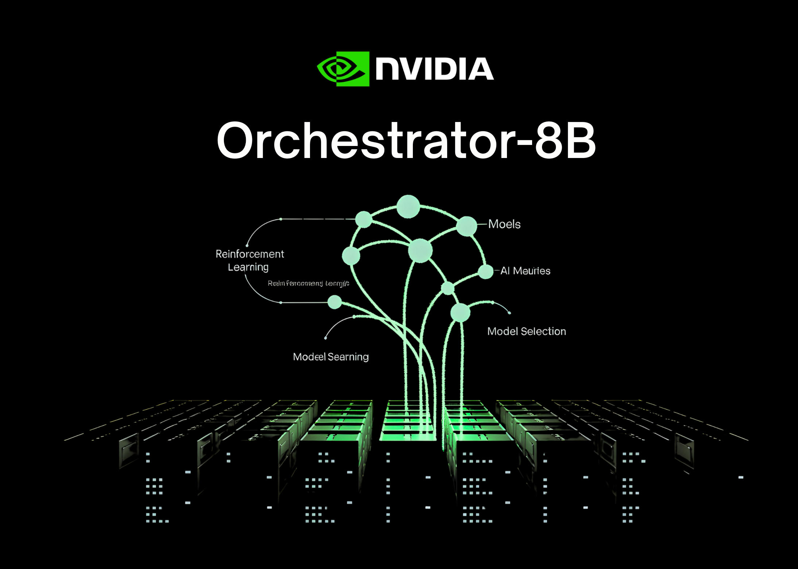

# NVIDIA AI Releases Orchestrator-8B: A Reinforcement Learning Trained Controller for Efficient Tool and Model Selection

> How can an AI system learn to pick the right model or tool for each step of a task instead of always relying on one large model for everything? NVIDIA researchers release ToolOrchestra, a novel method for training a small language model to act as the orchestrator- the ‘brain’ of a heterogeneous tool-use agent From […]

**How can an AI system learn to pick the right model or tool for each step of a task instead of always relying on one large model for everything? **NVIDIA researchers release **ToolOrchestra**, a novel method for training a small language model to act as the orchestrator- the ‘brain’ of a heterogeneous tool-use agent

*https://arxiv.org/pdf/2511.21689*

### From Single Model Agents to an Orchestration Policy

Most current agents follow a simple pattern. A single large model such as GPT-5 receives a prompt that describes available tools, then decides when to call web search or a code interpreter. All high level reasoning still stays inside the same model. ToolOrchestra changes this setup. It trains a dedicated controller model called as ‘**Orchestrator-8B**‘, that treats both classic tools and other LLMs as callable components.

A pilot study in the same research shows why naive prompting is not enough. When Qwen3-8B is prompted to route between GPT-5, GPT-5 mini, Qwen3-32B and Qwen2.5-Coder-32B, it delegates 73 percent of cases to GPT-5. When GPT-5 acts as its own orchestrator, it calls GPT-5 or GPT-5 mini in 98 percent of cases. The research team call these self enhancement and other enhancement biases. The routing policy over uses strong models and ignores cost instructions.

ToolOrchestra instead trains a small orchestrator explicitly for this routing problem, using reinforcement learning over full multi turn trajectories.

### What is Orchestrator 8B?

Orchestrator-8B is an 8B parameter decoder only Transformer. It is built by fine tuning Qwen3-8B as an orchestration model and released on Hugging Face.

At inference time, the system runs a multi turn loop that alternates reasoning and tool calls. The rollout has **three main steps**. **First**, Orchestrator 8B reads the user instruction and an optional natural language preference description, for example a request to prioritize low latency or to avoid web search. **Second**, it generates internal chain of thought style reasoning and plans an action. **Third**, it chooses a tool from the available set and emits a structured tool call in a unified JSON format. The environment executes that call, appends the result as an observation and feeds it back into the next step. The process stops when a termination signal is produced or a maximum of 50 turns is reached.

Tools cover **three main groups**. Basic tools include Tavily web search, a Python sandbox code interpreter and a local Faiss index built with Qwen3-Embedding-8B. Specialized LLMs include Qwen2.5-Math-72B, Qwen2.5-Math-7B and Qwen2.5-Coder-32B. Generalist LLM tools include GPT-5, GPT-5 mini, Llama 3.3-70B-Instruct and Qwen3-32B. All tools share the same schema with names, natural language descriptions and typed parameter specs.

### End to End Reinforcement Learning with Multi Objective Rewards

**ToolOrchestra** formulates the whole workflow as a Markov Decision Process. The state contains the conversation history, past tool calls and observations, and user preferences. Actions are the next text step, including both reasoning tokens and a tool call schema. After up to 50 steps, the environment computes a scalar reward for the full trajectory.

The reward has **three components**. Outcome reward is binary and depends on whether the trajectory solves the task. For open-ended answers, GPT-5 is used as a judge to compare the model output with the reference. Efficiency rewards penalize both monetary cost and wall clock latency. Token usage for proprietary and open source tools is mapped to monetary cost using public API and Together AI pricing. Preference reward measures how well tool usage matches a user preference vector that can increase or decrease the weight on cost, latency or specific tools. These components are combined into a single scalar using the preference vector.

The policy is optimized with **Group Relative Policy Optimization** GRPO, a variant of policy gradient reinforcement learning that normalizes rewards within groups of trajectories for the same task. The training process includes filters that drop trajectories with invalid tool call format or weak reward variance to stabilize optimization.

*https://arxiv.org/pdf/2511.21689*

To make this training possible at scale, the **research team plans to introduce ToolScale**, a synthetic dataset of multi step tool calling tasks. For each domain, an LLM generates a database schema, database entries, domain specific APIs and then diverse user tasks with ground truth sequences of function calls and required intermediate information.

### Benchmark results and cost profile

NVIDIA research team evaluates **Orchestrator-8B** on three challenging benchmarks, Humanity’s Last Exam, FRAMES and τ² Bench. These benchmarks target long horizon reasoning, factuality under retrieval and function calling in a dual control environment.

On Humanity’s Last Exam text only questions, Orchestrator-8B reaches 37.1 percent accuracy. GPT-5 with basic tools reaches 35.1 percent in the same setting. On FRAMES, Orchestrator-8B achieves 76.3 percent versus 74.0 percent for GPT-5 with tools. On τ² Bench, Orchestrator-8B scores 80.2 percent versus 77.7 percent for GPT-5 with basic tools.

*https://arxiv.org/pdf/2511.21689*

The efficiency gap is larger. In the configuration that uses basic tools plus specialized and generalist LLM tools, Orchestrator-8B has average cost 9.2 cents and latency 8.2 minutes per query, averaged over Humanity’s Last Exam and FRAMES. In the same configuration, GPT-5 costs 30.2 cents and takes 19.8 minutes on average. The model card summarizes this as about 30 percent of the monetary cost and 2.5 times faster for Orchestrator-8B compared to GPT-5.

Tool use analysis supports this picture. Claude Opus 4.1 used as an orchestrator calls GPT-5 most of the time. GPT-5 used as an orchestrator prefers GPT-5 mini. Orchestrator-8B spreads calls more evenly across strong models, cheaper models, search, local retrieval and the code interpreter, and reaches higher accuracy at lower cost for the same turn budget.

*https://arxiv.org/pdf/2511.21689*

Generalization experiments replace the training time tools with unseen models such as OpenMath Llama-2-70B, DeepSeek-Math-7B-Instruct, Codestral-22B-v0.1, Claude Sonnet-4.1 and Gemma-3-27B. Orchestrator-8B still achieves the best trade off between accuracy, cost and latency among all baselines in this setting. A separate preference aware test set shows that Orchestrator-8B also tracks user tool usage preferences more closely than GPT-5, Claude Opus-4.1 and Qwen3-235B-A22B under the same reward metric.

### Key Takeaways

- ToolOrchestra trains an 8B parameter orchestration model, Orchestrator-8B, that selects and sequences tools and LLMs to solve multi step agentic tasks using reinforcement learning with outcome, efficiency and preference aware rewards.

- Orchestrator-8B is released as an open weight model on Hugging Face. It is designed to coordinate diverse tools such as web search, code execution, retrieval and specialist LLMs through a unified schema.

- On Humanity’s Last Exam, Orchestrator-8B reaches 37.1 percent accuracy, surpassing GPT-5 at 35.1 percent, while being about 2.5 times more efficient, and on τ² Bench and FRAMES it outperforms GPT-5 while using roughly 30 percent of the cost.

- The framework shows that naive prompting of a frontier LLM as its own router leads to self enhancement bias where it overuses itself or a small set of strong models, while a trained orchestrator learns a more balanced, cost aware routing policy over multiple tools.

### Editorial Notes

NVIDIA’s ToolOrchestra is a practical step toward compound AI systems where an 8B orchestration model, Orchestrator-8B, learns an explicit routing policy over tools and LLMs instead of relying on a single frontier model. It shows clear gains on Humanity’s Last Exam, FRAMES and τ² Bench with about 30 percent of the cost and around 2.5 times better efficiency than GPT-5 based baselines, which makes it directly relevant for teams that care about accuracy, latency and budget. This launch makes orchestration policy a first class optimization target in AI systems.

---

Check out the **[Paper](https://arxiv.org/pdf/2511.21689), [Repo](https://github.com/NVlabs/ToolOrchestra/), [Project Page](https://research.nvidia.com/labs/lpr/ToolOrchestra/) **and** [Model Weights](https://huggingface.co/nvidia/Orchestrator-8B)**. Feel free to check out our **[GitHub Page for Tutorials, Codes and Notebooks](https://github.com/Marktechpost/AI-Tutorial-Codes-Included)**. Also, feel free to follow us on **[Twitter](https://x.com/intent/follow?screen_name=marktechpost)** and don’t forget to join our **[100k+ ML SubReddit](https://www.reddit.com/r/machinelearningnews/)** and Subscribe to **[our Newsletter](https://www.aidevsignals.com/)**. Wait! are you on telegram? **[now you can join us on telegram as well.](https://t.me/machinelearningresearchnews)**
