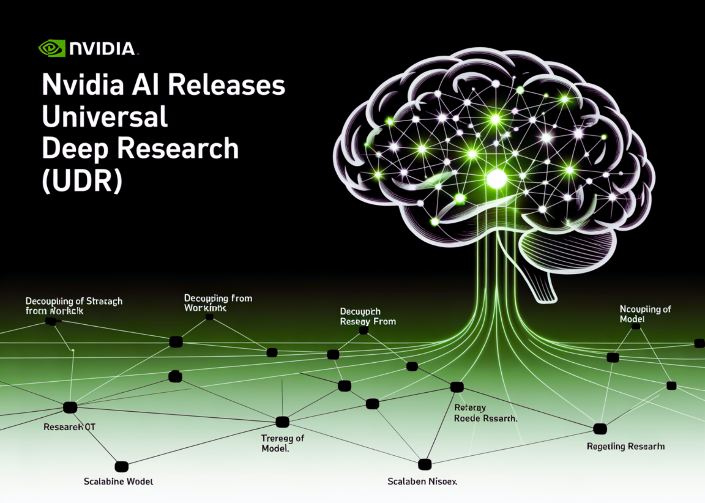

# NVIDIA AI Releases Universal Deep Research (UDR): A Prototype Framework for Scalable and Auditable Deep Research Agents

> Why do existing deep research tools fall short? Deep Research Tools (DRTs) like Gemini Deep Research, Perplexity, OpenAI’s Deep Research, and Grok DeepSearch rely on rigid workflows bound to a fixed LLM. While effective, they impose strict limitations: users cannot define custom strategies, swap models, or enforce domain-specific protocols. NVIDIA’s analysis identifies three core problems: […]

### Why do existing deep research tools fall short?

Deep Research Tools (DRTs) like Gemini Deep Research, Perplexity, OpenAI’s Deep Research, and Grok DeepSearch rely on rigid workflows bound to a fixed LLM. While effective, they impose strict limitations: users cannot define custom strategies, swap models, or enforce domain-specific protocols.

**NVIDIA’s analysis identifies three core problems:**

- Users cannot enforce preferred sources, validation rules, or cost control.

- Specialized research strategies for domains such as finance, law, or healthcare are unsupported.

- DRTs are tied to single models, preventing flexible pairing of the best LLM with the best strategy.

These issues restrict adoption in high-value enterprise and scientific applications.

*https://arxiv.org/pdf/2509.00244*

### What is Universal Deep Research (UDR)?

Universal Deep Research (UDR) is an open-source system (in preview) that decouples **strategy from model**. It allows users to design, edit, and run their own deep research workflows without retraining or fine-tuning any LLM.

**Unlike existing tools, UDR works at the system orchestration level:**

- It converts user-defined research strategies into executable code.

- It runs workflows in a sandboxed environment for safety.

- It treats the LLM as a utility for localized reasoning (summarization, ranking, extraction) instead of giving it full control.

This architecture makes UDR lightweight, flexible, and model-agnostic.

*https://arxiv.org/pdf/2509.00244*

### How does UDR process and execute research strategies?

UDR takes two inputs: the **research strategy** (step-by-step workflow) and the **research prompt** (topic and output requirements).

- **Strategy Processing**

Natural language strategies are compiled into Python code with enforced structure.

- Variables store intermediate results, avoiding context-window overflow.

- All functions are deterministic and transparent.

- **Strategy Execution**

Control logic runs on CPU; only reasoning tasks call the LLM.

- Notifications are emitted via `yield` statements, keeping users updated in real time.

- Reports are assembled from stored variable states, ensuring traceability.

This separation of **orchestration vs. reasoning** improves efficiency and reduces GPU cost.

### What example strategies are available?

**NVIDIA ships UDR with three template strategies:**

- **Minimal** – Generate a few search queries, gather results, and compile a concise report.

- **Expansive** – Explore multiple topics in parallel for broader coverage.

- **Intensive** – Iteratively refine queries using evolving subcontexts, ideal for deep dives.

These serve as starting points, but the framework allows users to encode entirely custom workflows.

*https://arxiv.org/pdf/2509.00244*

### What outputs does UDR generate?

UDR produces two key outputs:

- **Structured Notifications** – Progress updates (with type, timestamp, and description) for transparency.

- **Final Report** – A Markdown-formatted research document, complete with sections, tables, and references.

This design gives users both **auditability** and **reproducibility**, unlike opaque agentic systems.

### Where can UDR be applied?

UDR’s general-purpose design makes it adaptable across domains:

- Scientific discovery: structured literature reviews.

- Enterprise due diligence: validation against filings and datasets.

- Business intelligence: market analysis pipelines.

- Startups: custom assistants built without retraining LLMs.

By separating **model choice from research logic**, UDR supports innovation in both dimensions.

### Summary

Universal Deep Research signals a shift from **model-centric** to **system-centric** AI agents. By giving users direct control over workflows, NVIDIA enables customizable, efficient, and auditable research systems.

For startups and enterprises, UDR provides a foundation for building domain-specific assistants without the cost of model retraining—opening new opportunities for innovation across industries.

---

Check out the **[PAPER](https://arxiv.org/abs/2509.00244), [PROJECT](https://research.nvidia.com/labs/lpr/udr/)** and** [CODE](https://github.com/NVlabs/UniversalDeepResearch)_._** Feel free to check out our **[GitHub Page for Tutorials, Codes and Notebooks](https://github.com/Marktechpost/AI-Tutorial-Codes-Included)**. Also, feel free to follow us on **[Twitter](https://x.com/intent/follow?screen_name=marktechpost)** and don’t forget to join our **[100k+ ML SubReddit](https://www.reddit.com/r/machinelearningnews/)** and Subscribe to **[our Newsletter](https://www.aidevsignals.com/)**.
