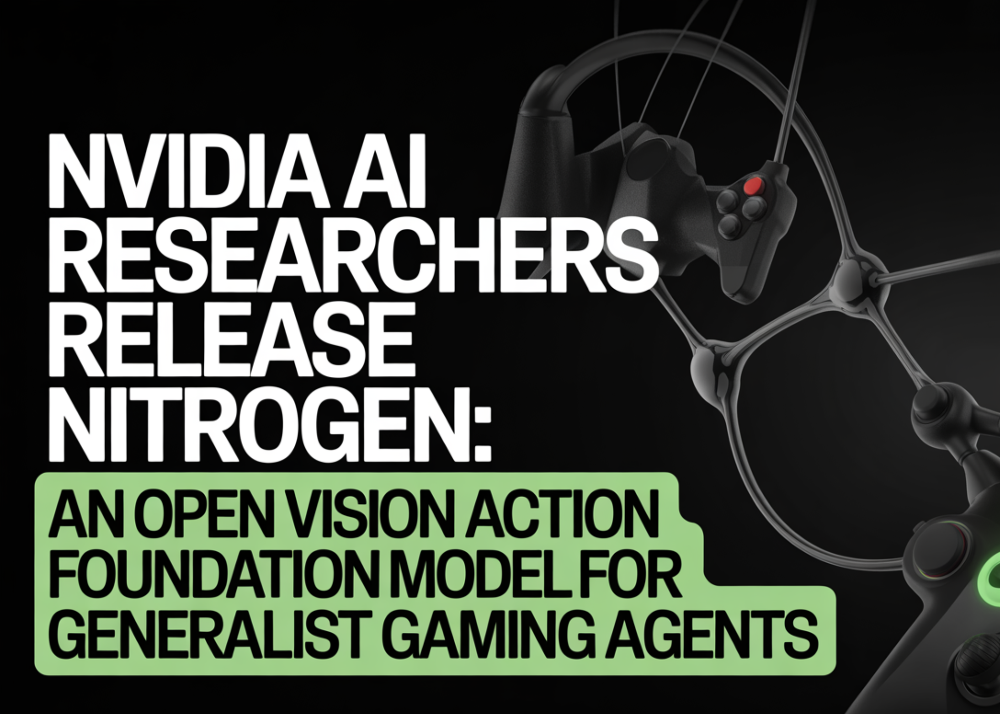

# NVIDIA AI Researchers Release NitroGen: An Open Vision Action Foundation Model For Generalist Gaming Agents

> NVIDIA AI research team released NitroGen, an open vision action foundation model for generalist gaming agents that learns to play commercial games directly from pixels and gamepad actions using internet video at scale. NitroGen is trained on 40,000 hours of gameplay across more than 1,000 games and comes with an open dataset, a universal simulator, […]

NVIDIA AI research team released NitroGen, an open vision action foundation model for generalist gaming agents that learns to play commercial games directly from pixels and gamepad actions using internet video at scale. NitroGen is trained on 40,000 hours of gameplay across more than 1,000 games and comes with an open dataset, a universal simulator, and a pre trained policy.

*https://nitrogen.minedojo.org/assets/documents/nitrogen.pdf*

### Internet scale video action dataset

The NitroGen pipeline starts from publicly available gameplay videos that include input overlays, for example gamepad visualizations that streamers place in a corner of the screen. The research team collects 71,000 hours of raw video with such overlays, then applies quality filtering based on action density, which leaves 55% of the data, about 40,000 hours, spanning more than 1,000 games.

The curated dataset contains 38,739 videos from 818 creators. The distribution covers a wide range of titles. There are 846 games with more than 1 hour of data, 91 games with more than 100 hours, and 15 games with more than 1,000 hours each. Action RPGs account for 34.9 percent of the hours, platformers for 18.4 percent, and action adventure titles for 9.2 percent, with the rest spread across sports, roguelike, racing and other genres.

### Action extraction from controller overlays

To recover frame level actions from raw streams, NitroGen uses a three stage action extraction pipeline. First, a template matching module localizes the controller overlay using about 300 controller templates. For each video, the system samples 25 frames and matches SIFT and XFeat features between frames and templates, then estimates an affine transform when at least 20 inliers support a match. This yields a crop of the controller region for all frames.

Second, a SegFormer based hybrid classification segmentation model parses the controller crops. The model takes two consecutive frames concatenated spatially and outputs joystick locations on an 11 by 11 grid plus binary button states. It is trained on 8 million synthetic images rendered with different controller templates, opacities, sizes and compression settings, using AdamW with learning rate 0.0001, weight decay 0.1, and batch size 256.

Third, the pipeline refines joystick positions and filters low activity segments. Joystick coordinates are normalized to the range from −1.0 to 1.0 using the 99th percentile of absolute x and y values to reduce outliers. Chunks where fewer than 50 percent of timesteps have non zero actions are removed, which avoids over predicting the null action during policy training.

A separate benchmark with ground truth controller logs shows that joystick predictions reach an average R² of 0.84 and button frame accuracy reaches 0.96 across major controller families such as Xbox and PlayStation. This validates that automatic annotations are accurate enough for large scale behavior cloning.

### Universal simulator and multi game benchmark

NitroGen includes a universal simulator that wraps commercial Windows games in a Gymnasium compatible interface. The wrapper intercepts the game engine system clock to control simulation time and supports frame by frame interaction without modifying game code, for any title that uses the system clock for physics and interactions.

Observations in this benchmark are single RGB frames. Actions are defined as a unified controller space with a 16 dimensional binary vector for gamepad buttons, four d pad buttons, four face buttons, two shoulders, two triggers, two joystick thumb buttons, start and back, plus a 4 dimensional continuous vector for joystick positions, left and right x,y. This unified layout allows direct transfer of one policy across many games.

The evaluation suite covers 10 commercial games and 30 tasks. There are 5 two dimensional games, three side scrollers and two top down roguelikes, and 5 three dimensional games, two open world games, two combat focused action RPGs and one sports title. Tasks fall into 11 combat tasks, 10 navigation tasks, and 9 game specific tasks with custom objectives.

### NitroGen model architecture

The NitroGen foundation policy follows the GR00T N1 architecture pattern for embodied agents. It discards the language and state encoders, and keeps a vision encoder plus a single action head. Input is one RGB frame at 256 by 256 resolution. A SigLIP 2 vision transformer encodes this frame into 256 image tokens.

A diffusion transformer, DiT, generates 16 step chunks of future actions. During training, noisy action chunks are embedded by a multilayer perceptron into action tokens, processed by a stack of DiT blocks with self attention and cross attention to visual tokens, then decoded back into continuous action vectors. The training objective is conditional flow matching with 16 denoising steps over each 16 action chunk.

The released checkpoint has 4.93 × 10^8 parameters. The model card describes the output as a 21 by 16 tensor, where 17 dimensions correspond to binary button states and 4 dimensions store two two dimensional joystick vectors, over 16 future timesteps. This representation is consistent with the unified action space, up to reshaping of the joystick components.

### Training outcomes and transfer gains

NitroGen is trained purely with large scale behavior cloning on the internet video dataset. There is no reinforcement learning and no reward design in the base model. Image augmentations include random brightness, contrast, saturation, hue, small rotations, and random crops. Training uses AdamW with weight decay 0.001, a warmup stable decay learning rate schedule with constant phase at 0.0001, and an exponential moving average of weights with decay 0.9999.

After pre training on the full dataset, NitroGen 500M already achieves non trivial task completion rates in zero shot evaluation across all games in the benchmark. Average completion rates stay in the range from about 45 percent to 60 percent across combat, navigation and game specific tasks, and across two dimensional and three dimensional games, despite the noise in internet supervision.

For transfer to unseen games, the research team hold out a title, pre train on the remaining data, and then fine tune on the held out game under a fixed data and compute budget. On an isometric roguelike, fine tuning from NitroGen gives an average relative improvement of about 10 percent compared with training from scratch. On a three dimensional action RPG, the average gain is about 25 percent, and for some combat tasks in the low data regime, 30 hours, the relative improvement reaches 52 percent.

### Key Takeaways

- **NitroGen is a generalist vision action foundation model for games**: It maps 256×256 RGB frames directly to standardized gamepad actions and is trained with pure behavior cloning on internet gameplay, without any reinforcement learning.

- **The dataset is large scale and automatically labeled from controller overlays**: NitroGen uses 40,000 hours of filtered gameplay from 38,739 videos across more than 1,000 games, where frame level actions are extracted from visual controller overlays using a SegFormer based parsing pipeline.

- **Unified controller action space enables cross game transfer**: Actions are represented in a shared space of about 20 dimensions per timestep, including binary gamepad buttons and continuous joystick vectors, which allows a single policy to be deployed across many commercial Windows games using a universal Gymnasium style simulator.

- **Diffusion transformer policy with conditional flow matching**: The 4.93 × 10^8 parameter model uses a SigLIP 2 vision encoder plus a DiT based action head trained with conditional flow matching on 16 step action chunks, achieving robust control from noisy web scale data.

- **Pretraining on NitroGen improves downstream game performance**: When fine tuned on held out titles under the same data and compute budget, NitroGen based initialization yields consistent relative gains, around 10 percent to 25 percent on average and up to 52 percent in low data combat tasks, compared to training from scratch.

---

Check out the **[Paper](https://nitrogen.minedojo.org/assets/documents/nitrogen.pdf)** and **[Model here](https://huggingface.co/nvidia/NitroGen)**. Also, feel free to follow us on **[Twitter](https://x.com/intent/follow?screen_name=marktechpost)** and don’t forget to join our **[100k+ ML SubReddit](https://www.reddit.com/r/machinelearningnews/)** and Subscribe to **[our Newsletter](https://www.aidevsignals.com/)**. Wait! are you on telegram? **[now you can join us on telegram as well.](https://t.me/machinelearningresearchnews)**
