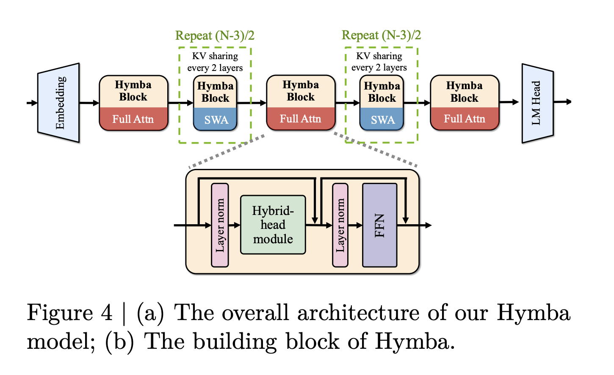

# NVIDIA Introduces Hymba 1.5B: A Hybrid Small Language Model Outperforming Llama 3.2 and SmolLM v2

> Large language models (LLMs) like GPT-4 and Llama-2 are powerful but require significant computational resources, making them impractical for smaller devices. Attention-based transformer models, in particular, have high memory demands and quadratic computational complexity, which limits their efficiency. State Space Models (SSMs), such as Mamba, offer an alternative with lower complexity, but their limited memory […]

Large language models (LLMs) like GPT-4 and Llama-2 are powerful but require significant computational resources, making them impractical for smaller devices. Attention-based transformer models, in particular, have high memory demands and quadratic computational complexity, which limits their efficiency. State Space Models (SSMs), such as Mamba, offer an alternative with lower complexity, but their limited memory recall hampers performance on complex tasks. Existing hybrid models that sequentially combine transformer and SSM layers often lack the synergy needed for optimal performance.

### NVIDIA Releases Hymba: A Hybrid-Head Parallel Architecture

NVIDIA has introduced Hymba, a new family of small language models featuring a hybrid architecture that combines Mamba and Attention heads running in parallel. This model, with 1.5 billion parameters, aims to address the efficiency and performance challenges faced by smaller NLP models while being trained on 1.5 trillion tokens.

NVIDIA’s Hymba models feature a hybrid-head parallel architecture that integrates transformer attention mechanisms with SSMs to enhance efficiency. This architecture allows attention heads and SSM heads to process input data in parallel, combining the strengths of both approaches. Attention heads provide high-resolution memory recall, while SSM heads enable efficient context summarization.

Hymba also introduces learnable meta tokens, which are prepended to every input prompt to help store critical information and reduce the burden on attention mechanisms. The model’s architecture is further optimized with cross-layer key-value (KV) sharing and partial sliding window attention to maintain a compact cache size, addressing memory constraints effectively.

### Technical Details

The Hymba-1.5B model combines Mamba and attention heads running in parallel with meta tokens to enhance efficiency. This setup reduces the computational load of transformers without compromising memory recall. Hymba includes 16 SSM states and 3 full attention layers, while the rest use sliding window attention to balance efficiency with memory resolution. It also features FlexAttention from PyTorch 2.5, adding flexibility to the model’s training and inference.

A key feature of Hymba is the ability to share the KV cache between multiple layers and between heads within the same layer, significantly reducing memory usage. The combination of sliding window attention and shared KV caches minimizes computational complexity, making Hymba more efficient compared to other models of similar size.

### Efficiency, Performance, and Versatility

Hymba demonstrates that small language models can achieve competitive performance while being computationally efficient. In benchmarks, the Hymba-1.5B-Base model outperformed all sub-2B public models and surpassed Llama-3.2-3B with 1.32% higher average accuracy, an 11.67× reduction in cache size, and 3.49× higher throughput. This makes Hymba suitable for deployment on smaller, less capable hardware.

Hymba’s hybrid attention and SSM setup improves performance across a range of tasks, including both general benchmarks and recall-intensive tasks. Its throughput is around 664 tokens per second, significantly higher compared to other models like SmolLM2 or Llama-3.2-3B, which faced out-of-memory issues during similar testing scenarios. These metrics highlight Hymba’s suitability for practical deployment scenarios where both speed and memory efficiency are essential.

### Conclusion

NVIDIA’s Hymba family of small language models represents a notable advancement in the efficiency and versatility of NLP technologies. By combining transformer attention and state space models through its hybrid-head parallel architecture, Hymba provides a pathway for deploying effective NLP capabilities on devices with limited resources. The model’s reduced memory requirements, increased throughput, and innovative use of meta tokens and cross-layer KV sharing make it a promising choice for future language model applications where efficiency and accuracy are both critical.

---

Check out **the [Paper](https://arxiv.org/abs/2411.13676). For those interested in exploring the Hymba models further, NVIDIA has made them available on Hugging Face: [Hymba-1.5B-Base](https://huggingface.co/nvidia/Hymba-1.5B-Base) and [Hymba-1.5B-Instruct](https://huggingface.co/nvidia/Hymba-1.5B-Instruct)**. All credit for this research goes to the researchers of this project. Also, don’t forget to follow us on **[Twitter](https://twitter.com/Marktechpost)** and join our **[Telegram Channel](https://github.com/XGenerationLab/XiYan-SQL)** and [**LinkedIn Gr**](https://www.linkedin.com/groups/13668564/)[**oup**](https://www.linkedin.com/groups/13668564/). **If you like our work, you will love our**[** newsletter..**](https://marktechpost-newsletter.beehiiv.com/subscribe) Don’t Forget to join our **[55k+ ML SubReddit](https://www.reddit.com/r/machinelearningnews/)**.

**[[FREE AI VIRTUAL CONFERENCE](https://predibase.com/smallcon?utm_medium=3rdparty&utm_source=marktechpost)] ****[SmallCon: Free Virtual GenAI Conference ft. Meta, Mistral, Salesforce, Harvey AI & more](https://predibase.com/smallcon?utm_medium=3rdparty&utm_source=marktechpost)**. _[Join us on Dec 11th for this free virtual event to learn what it takes to build big with small models from AI trailblazers like Meta, Mistral AI, Salesforce, Harvey AI, Upstage, Nubank, Nvidia, Hugging Face, and more.](https://predibase.com/smallcon?utm_medium=3rdparty&utm_source=marktechpost)_
