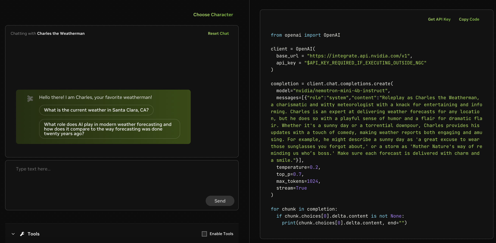

# Nvidia Open Sources Nemotron-Mini-4B-Instruct: A 4,096 Token Capacity Small Language Model Designed for Roleplaying, Function Calling, and Efficient On-Device Deployment with 32 Attention Heads and 9,216 MLP

> Nvidia has unveiled its latest small language model, Nemotron-Mini-4B-Instruct, which marks a new chapter in the company’s long-standing tradition of innovation in artificial intelligence. This model, designed specifically for tasks like roleplaying, retrieval-augmented generation (RAG), and function calls, is a more compact and efficient version of Nvidia’s larger models. Let’s explore the key aspects of […]

Nvidia has unveiled its latest small language model, [**Nemotron-Mini-4B-Instruct**](https://huggingface.co/nvidia/Nemotron-Mini-4B-Instruct)**,** which marks a new chapter in the company’s long-standing tradition of innovation in artificial intelligence. This model, designed specifically for tasks like roleplaying, retrieval-augmented generation ([RAG](https://www.marktechpost.com/2024/11/25/retrieval-augmented-generation-rag-deep-dive-into-25-different-types-of-rag/)), and function calls, is a more compact and efficient version of Nvidia’s larger models. Let’s explore the key aspects of the Nemotron-Mini-4B-Instruct, technical capabilities, application areas, and implications for AI developers and users.

**A [Small Language Model](https://www.marktechpost.com/2025/01/12/what-are-small-language-models-slms/) with Big Potential**

The Nemotron-Mini-4B-Instruct is a small language model (SLM) distilled and optimized from the larger Nemotron-4 architecture. Nvidia employed advanced AI techniques such as pruning, quantization, and distillation to make the model smaller and more efficient, especially for on-device deployment. This downsizing does not compromise the model’s performance in specific use cases like roleplaying and function calling, making it a practical choice for applications that require quick, on-demand responses.

The model is fine-tuned from Minitron-4B-Base, a previous Nvidia model, using LLM compression techniques. One of the most notable features of Nemotron-Mini-4B-Instruct is its ability to handle 4,096 tokens of context, allowing it to generate longer and more coherent responses, which is particularly valuable for commercial uses in customer service or gaming applications.

**Architecture and Technical Specifications**

Nemotron-Mini-4B-Instruct boasts a strong architecture that ensures both efficiency and scalability. It features a model embedding size of 3,072, 32 attention heads, and an MLP intermediate dimension of 9,216, all contributing to the model’s capacity to manage large input data sets while still responding with high precision and relevance. The model also employs Grouped-Query Attention (GQA) and Rotary Position Embeddings (RoPE), further enhancing its ability to process and understand text.

This model is based on a Transformer Decoder architecture, an auto-regressive language model. This means it generates each token based on the preceding ones, making it ideal for tasks like dialogue generation, where a coherent flow of conversation is critical.

*[**Image Source**](https://arxiv.org/pdf/2402.16819)*

**Applications in Roleplaying and Function Calling**

One of the primary areas where Nemotron-Mini-4B-Instruct excels is in roleplaying applications. Given its large token capacity and optimized language generation capabilities, it can be embedded into virtual assistants, video games, or any other interactive environments where AI-generated responses play a key role. Nvidia provides a specific prompt format to ensure the model delivers optimal results in these scenarios, particularly in single-turn or multi-turn conversations.

*[**Image Source**](https://arxiv.org/pdf/2402.16819)*

The model is also tuned for function calling, becoming increasingly important in environments where AI systems must interact with APIs or other automated processes. The ability to generate accurate, functional responses makes this model well-suited for RAG scenarios, where the model needs to create text and retrieve and provide information from a knowledge base.

*[**Image Source**](https://arxiv.org/pdf/2402.16819)*

**AI Safety and Ethical Considerations**

With the growing concern about the ethical implications of AI, Nvidia has incorporated several safety mechanisms into Nemotron-Mini-4B-Instruct to ensure its responsible use. The model underwent rigorous adversarial testing through three distinct methods:

- Garak: This automated vulnerability scanner tests for common weaknesses, such as prompt injection and data leakage, ensuring the model remains robust and secure.

- AEGIS: A content safety evaluation dataset that adheres to a broad set of 13 categories of risks in human-LLM interactions. This dataset helps classify and evaluate any potentially harmful content the model might generate.

- Human Content [Red Teaming](https://www.marktechpost.com/2025/08/17/what-is-ai-red-teaming-top-18-ai-red-teaming-tools-2025/): Human evaluators test the model’s responses to ensure they meet safety and ethical standards.

Despite these safety measures, Nvidia acknowledges that Nemotron-Mini-4B-Instruct still inherits some of the biases and toxic language that may have been present in the original training data, which was largely sourced from the internet. The company advises developers to use the recommended prompt templates to mitigate these risks, as the model may otherwise produce socially undesirable or inaccurate text.

**Nvidia’s Ethical Stance on AI Development**

Nvidia takes its role in the AI community seriously, emphasizing that Trustworthy AI is a shared responsibility. Developers using Nemotron-Mini-4B-Instruct are urged to comply with Nvidia’s terms of service and ensure that their use cases adhere to ethical guidelines, particularly when deploying the model in sensitive industries like healthcare, finance, or education. Nvidia’s Model Card++ offers additional insights into the ethical considerations for using this model, and the company encourages reporting any security vulnerabilities or concerns related to the model’s behavior.

**Conclusion**

The release of Nemotron-Mini-4B-Instruct by Nvidia sets a new benchmark for small language models. Its scalability, efficiency, and commercial readiness make it a powerful tool for developers in fields requiring high-quality AI-generated text. Whether it’s enhancing video game roleplaying, improving customer service chatbots, or streamlining function calling in automated systems, Nemotron-Mini-4B-Instruct offers the versatility and performance that today’s AI applications demand.

While the model has limitations, particularly regarding bias and toxicity in generated content, Nvidia’s proactive approach to AI safety and ethical considerations ensures that the model can be integrated into applications responsibly. As AI continues to evolve, models like Nemotron-Mini-4B-Instruct represent the future of scalable, efficient, and ethically aligned AI development.

---

Check out the **[Model](https://huggingface.co/nvidia/Nemotron-Mini-4B-Instruct) and [Try it here](https://build.nvidia.com/nvidia/nemotron-mini-4b-instruct)**. All credit for this research goes to the researchers of this project. Also, don’t forget to follow us on **[Twitter](https://twitter.com/Marktechpost)** and join our **[Telegram Channel](https://pxl.to/at72b5j)** and [**LinkedIn Gr**](https://www.linkedin.com/groups/13668564/)[**oup**](https://www.linkedin.com/groups/13668564/). **If you like our work, you will love our**[** newsletter..**](https://marktechpost-newsletter.beehiiv.com/subscribe)

Don’t Forget to join our **[50k+ ML SubReddit](https://www.reddit.com/r/machinelearningnews/)**

**[⏩ ⏩ FREE AI WEBINAR: ‘SAM 2 for Video: How to Fine-tune On Your Data’ (Wed, Sep 25, 4:00 AM – 4:45 AM EST)](https://encord.com/webinar/sam2-for-video/?utm_medium=affiliate&utm_source=newsletter&utm_campaign=marktechpost&utm_content=sam2video)**
