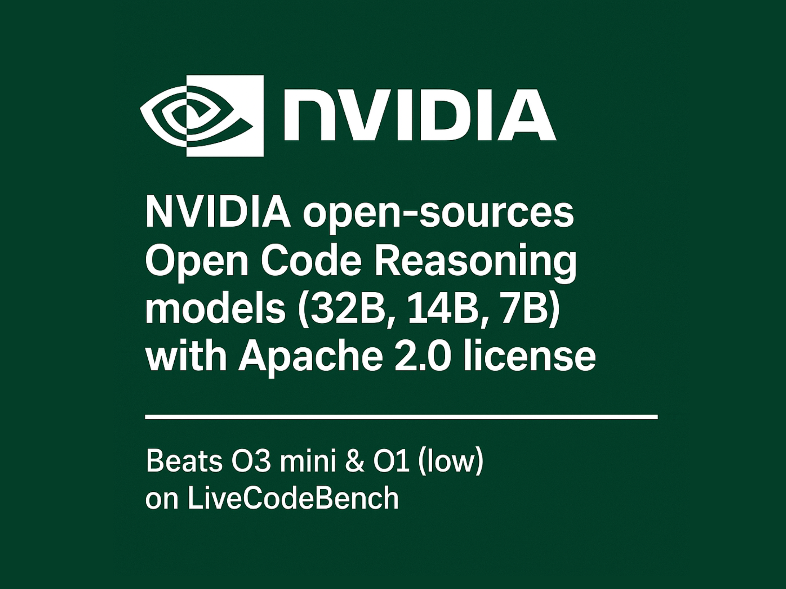

# NVIDIA Open-Sources Open Code Reasoning Models (32B, 14B, 7B)

> NVIDIA continues to push the boundaries of open AI development by open-sourcing its Open Code Reasoning (OCR) model suite — a trio of high-performance large language models purpose-built for code reasoning and problem-solving. The 32B, 14B, and 7B variants, all released under the Apache 2.0 license. Benchmarked to Beat the Best The Open Code Reasoning […]

NVIDIA continues to push the boundaries of open AI development by open-sourcing its **Open Code Reasoning (OCR) model suite** — a trio of high-performance large language models purpose-built for code reasoning and problem-solving. The 32B, 14B, and 7B variants, all released under the **Apache 2.0 license**.

### Benchmarked to Beat the Best

The **Open Code Reasoning** (OCR) models come with **notable benchmark achievements**, outperforming **OpenAI’s o3-Mini and o1 (low)** models on the **LiveCodeBench** benchmark. LiveCodeBench is a comprehensive evaluation suite for code reasoning tasks such as debugging, code generation, and logic completion in real-world developer environments. In direct comparison, NVIDIA’s 32B OCR model tops the leaderboard in reasoning capability for open models.

This leap in performance is attributed not only to model architecture, but to NVIDIA’s **custom “OCR dataset”** — a high-quality, code-centric training corpus designed to emphasize instruction-following, reasoning, and multi-step code problem solving. According to NVIDIA, this results in a **30% improvement in token efficiency**, allowing the models to produce accurate code and logical outputs with fewer tokens.

### A Model Lineup for Every Use Case

The Open Code Reasoning suite comes in **three parameter scales**:

- **OpenCodeReasoning-Nemotron-32B**

- **OpenCodeReasoning-Nemotron-14B**

- **OpenCodeReasoning-Nemotron-7B**

Each model balances scale with performance. The 32B variant delivers state-of-the-art results for high-performance inference and research; the 14B model provides strong reasoning capabilities with reduced compute requirements, and the 7B variant is ideal for resource-constrained environments while retaining competitive performance on benchmarks.

All models are trained using the **Nemotron architecture**, NVIDIA’s transformer-based backbone optimized for multilingual, multi-task learning. The model weights and configurations are available on Hugging Face:

- [32B Model](https://huggingface.co/nvidia/OpenCodeReasoning-Nemotron-32B)

- [14B Model](https://huggingface.co/nvidia/OpenCodeReasoning-Nemotron-14B)

- [7B Model](https://huggingface.co/nvidia/OpenCodeReasoning-Nemotron-7B)

- [32B Instruction-Tuned Variant](https://huggingface.co/nvidia/OpenCodeReasoning-Nemotron-32B-IOI)

### Compatible with Open Inference Ecosystems

A key feature of these models is **out-of-the-box compatibility** with popular inference frameworks:

- `llama.cpp` for lightweight CPU/GPU inference

- `vLLM` for optimized GPU serving and speculative decoding

- `Transformers` by Hugging Face for training and evaluation pipelines

- `TGI` (Text Generation Inference) for scalable API deployment

This flexibility allows developers, researchers, and enterprises to plug these models into existing code AI infrastructure with minimal overhead.

### A Step Forward for Open Code Intelligence

With this release, NVIDIA contributes significantly to the growing ecosystem of open code models. By targeting **code reasoning** — a domain historically dominated by proprietary models — and releasing under a fully open and permissive license, NVIDIA empowers the broader AI and developer community to build, fine-tune, and deploy advanced reasoning models in production.

The Open Code Reasoning suite adds to NVIDIA’s growing portfolio of open LLMs and strengthens its stance on accessible, transparent AI development. Whether you’re building developer copilots, automated code review agents, or code generation services, these models offer a high-performing, cost-effective, and community-friendly alternative to closed solutions.

---

Check out the [32B Model](https://huggingface.co/nvidia/OpenCodeReasoning-Nemotron-32B), [14B Model](https://huggingface.co/nvidia/OpenCodeReasoning-Nemotron-14B), [7B Model](https://huggingface.co/nvidia/OpenCodeReasoning-Nemotron-7B) and [32B Instruction-Tuned Variant](https://huggingface.co/nvidia/OpenCodeReasoning-Nemotron-32B-IOI). Also, don’t forget to follow us on **[Twitter](https://x.com/intent/follow?screen_name=marktechpost)**.

**Here’s a brief overview of what we’re building at Marktechpost:**

- **Newsletter– [airesearchinsights.com/](https://minicon.marktechpost.com/)(30k+ subscribers)**

- **miniCON AI Events – [minicon.marktechpost.com](https://minicon.marktechpost.com/)**

- **AI Reports & Magazines – [magazine.marktechpost.com](https://magazine.marktechpost.com/)**

- **AI Dev & Research News – [marktechpost.com](https://marktechpost.com/) (1M+ monthly readers)**

- **ML News Community –[ r/machinelearningnews](https://www.reddit.com/r/machinelearningnews/) (92k+ members)**
