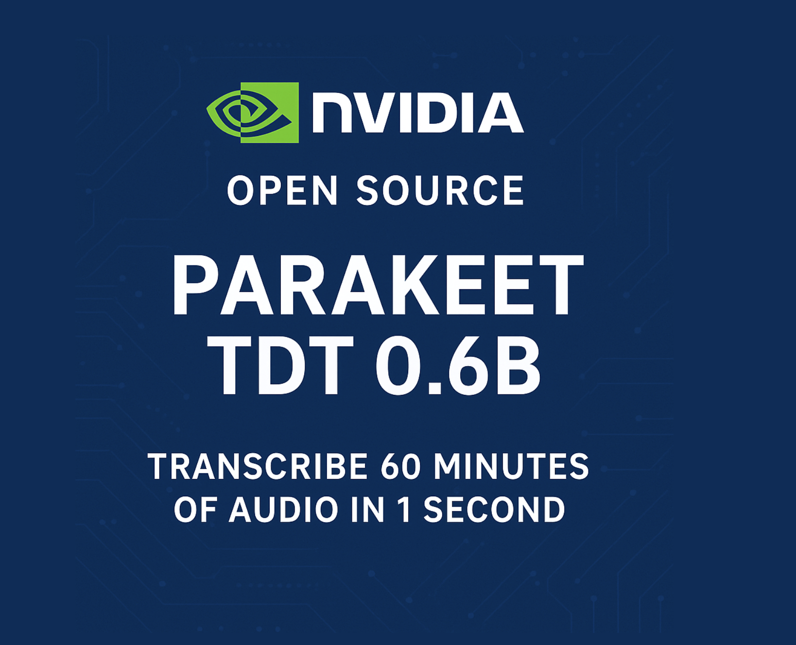

# NVIDIA Open Sources Parakeet TDT 0.6B: Achieving a New Standard for Automatic Speech Recognition ASR and Transcribes an Hour of Audio in One Second

> NVIDIA has unveiled Parakeet TDT 0.6B, a state-of-the-art automatic speech recognition (ASR) model that is now fully open-sourced on Hugging Face. With 600 million parameters, a commercially permissive CC-BY-4.0 license, and a staggering real-time factor (RTF) of 3386, this model sets a new benchmark for performance and accessibility in speech AI. Blazing Speed and Accuracy […]

NVIDIA has unveiled **Parakeet TDT 0.6B**, a state-of-the-art automatic speech recognition (ASR) model that is now fully open-sourced on [Hugging Face](https://huggingface.co/nvidia/parakeet-tdt-0.6b-v2). With **600 million parameters**, a **commercially permissive CC-BY-4.0 license**, and a staggering **real-time factor (RTF) of 3386**, this model sets a new benchmark for performance and accessibility in speech AI.

## Blazing Speed and Accuracy

At the heart of Parakeet TDT 0.6B’s appeal is its **unmatched speed and transcription quality**. The model can transcribe **60 minutes of audio in just one second**, a performance that’s **over 50x faster** than many existing open ASR models. On Hugging Face’s **Open ASR Leaderboard**, Parakeet V2 achieves a **6.05% word error rate (WER)**—the **best-in-class** among open models.

This performance represents a significant leap forward for enterprise-grade speech applications, including real-time transcription, voice-based analytics, call center intelligence, and audio content indexing.

## Technical Overview

Parakeet TDT 0.6B builds on a transformer-based architecture fine-tuned with high-quality transcription data and optimized for inference on NVIDIA hardware. Here are the key highlights:

- **600M parameter encoder-decoder model**

- **Quantized and fused kernels** for maximum inference efficiency

- Optimized for **TDT (Transducer Decoder Transformer)** architecture

- Supports **accurate timestamp formatting**, **numerical formatting**, and **punctuation restoration**

- Pioneers **song-to-lyrics transcription**, a rare capability in ASR models

The model’s high-speed inference is powered by NVIDIA’s **TensorRT** and **FP8 quantization**, enabling it to reach a real-time factor of **RTF = 3386**, meaning it processes audio **3386 times faster than real-time**.

## Benchmark Leadership

On the[ Hugging Face Open ASR Leaderboard](https://huggingface.co/spaces/hf-audio/open_asr_leaderboard)—a standardized benchmark for evaluating speech models across public datasets—Parakeet TDT 0.6B leads with the **lowest WER recorded among open-source models**. This positions it well above comparable models like Whisper from OpenAI and other community-driven efforts.

*Data based on May 5 2025*

This performance makes Parakeet V2 not only a leader in quality but also in **deployment readiness** for latency-sensitive applications.

## Beyond Conventional Transcription

Parakeet is not just about speed and word error rate. NVIDIA has embedded unique capabilities into the model:

- **Song-to-lyrics transcription**: Unlocks transcription for sung content, expanding use cases into music indexing and media platforms.

- **Numerical and timestamp formatting**: Improves readability and usability in structured contexts like meeting notes, legal transcripts, and health records.

- **Punctuation restoration**: Enhances natural readability for downstream NLP applications.

These features elevate the quality of transcripts and reduce the burden on post-processing or human editing, especially in enterprise-grade deployments.

## Strategic Implications

The release of Parakeet TDT 0.6B represents another step in NVIDIA’s strategic investment in **AI infrastructure** and **open ecosystem leadership**. With strong momentum in foundational models (e.g., Nemotron for language and BioNeMo for protein design), NVIDIA is positioning itself as a full-stack AI company—from GPUs to state-of-the-art models.

For the AI developer community, this open release could become the new foundation for building speech interfaces in everything from smart devices and virtual assistants to multimodal AI agents.

## Getting Started

Parakeet TDT 0.6B is available now on [Hugging Face](https://huggingface.co/nvidia/parakeet-tdt-0.6b-v2), complete with model weights, tokenizer, and inference scripts. It runs optimally on NVIDIA GPUs with TensorRT, but support is also available for CPU environments with reduced throughput.

Whether you’re building transcription services, annotating massive audio datasets, or integrating voice into your product, Parakeet TDT 0.6B offers a compelling open-source alternative to commercial APIs.

---

Check out the **[Model on Hugging Face](https://huggingface.co/nvidia/parakeet-tdt-0.6b-v2)**. Also, don’t forget to follow us on **[Twitter](https://x.com/intent/follow?screen_name=marktechpost)**.

**Here’s a brief overview of what we’re building at Marktechpost:**

- **Newsletter– [airesearchinsights.com/](https://minicon.marktechpost.com/)(30k+ subscribers)**

- **miniCON AI Events – [minicon.marktechpost.com](https://minicon.marktechpost.com/)**

- **AI Reports & Magazines – [magazine.marktechpost.com](https://magazine.marktechpost.com/)**

- **AI Dev & Research News – [marktechpost.com](https://marktechpost.com/) (1M+ monthly readers)**

- **ML News Community –[ r/machinelearningnews](https://www.reddit.com/r/machinelearningnews/) (92k+ members)**
