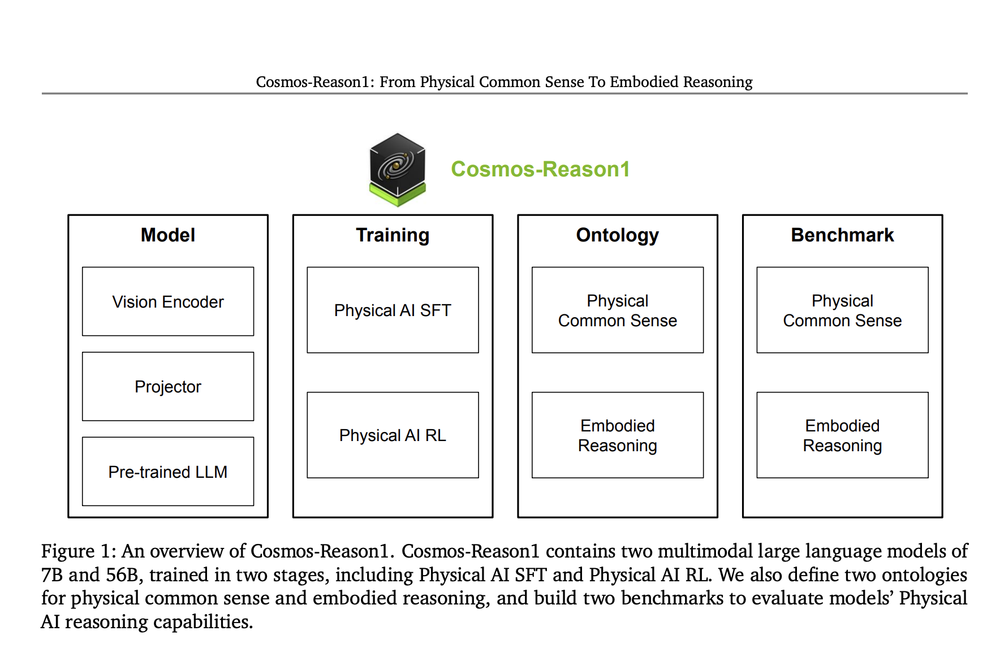

# NVIDIA Releases Cosmos-Reason1: A Suite of AI Models Advancing Physical Common Sense and Embodied Reasoning in Real-World Environments

> AI has advanced in language processing, mathematics, and code generation, but extending these capabilities to physical environments remains challenging. Physical AI seeks to close this gap by developing systems that perceive, understand, and act in dynamic, real-world settings. Unlike conventional AI that processes text or symbols, Physical AI engages with sensory inputs, especially video, and […]

AI has advanced in language processing, mathematics, and code generation, but extending these capabilities to physical environments remains challenging. Physical AI seeks to close this gap by developing systems that perceive, understand, and act in dynamic, real-world settings. Unlike conventional AI that processes text or symbols, Physical AI engages with sensory inputs, especially video, and generates responses grounded in real-world physics. These systems are designed for navigation, manipulation, and interaction, relying on common-sense reasoning and an embodied understanding of space, time, and physical laws. Applications span robotics, autonomous vehicles, and human-machine collaboration, where adaptability to real-time perception is crucial.

The current AI models’ weak connection to real-world physics is a major limitation. While they perform well on abstract tasks, they often fail to predict physical consequences or respond appropriately to sensory data. Concepts like gravity or spatial relationships are not intuitively understood, making them unreliable for embodied tasks. Training directly in the physical world is costly and risky, which hampers development and iteration. This lack of physical grounding and embodied understanding is a significant barrier to deploying AI effectively in real-world applications.

Previously, tools for physical reasoning in AI were fragmented. Vision-language models linked visual and textual data but lacked depth in reasoning. Rule-based systems were rigid and failed in novel scenarios. Simulations and synthetic data often miss the nuances of real-world physics. Critically, there was no standardized framework to define or evaluate physical common sense or embodied reasoning. Inconsistent methodologies and benchmarks made progress difficult to quantify. Reinforcement learning approaches lacked task-specific reward structures, leading to models that struggled with cause-and-effect reasoning and physical feasibility.

Researchers from NVIDIA introduced [**Cosmos-Reason1**](https://github.com/nvidia-cosmos/cosmos-reason1), a suite of multimodal large language models. These models, [**Cosmos-Reason1-7B**](https://huggingface.co/nvidia/Cosmos-Reason1-7B) and** Cosmos-Reason1-56B**, were designed specifically for physical reasoning tasks. _Each model is trained in two major phases: Physical AI Supervised Fine-Tuning (SFT) and Physical AI Reinforcement Learning (RL)_. What differentiates this approach is the introduction of a dual-ontology system. One hierarchical ontology organizes physical common sense into three main categories, Space, Time, and Fundamental Physics, divided further into 16 subcategories. The second ontology is two-dimensional and maps reasoning capabilities across five embodied agents, including humans, robot arms, humanoid robots, and autonomous vehicles. These ontologies are training guides and evaluation tools for benchmarking AI’s physical reasoning.

The architecture of Cosmos-Reason1 uses a decoder-only LLM augmented with a vision encoder. Videos are processed to extract visual features, which are then projected into a shared space with language tokens. This integration enables the model to reason over textual and visual data simultaneously. The researchers curated a massive dataset comprising around 4 million annotated video-text pairs for training. These include action descriptions, multiple choice questions, and long chain-of-thought reasoning traces. The reinforcement learning stage is driven by rule-based, verifiable rewards derived from human-labeled multiple-choice questions and self-supervised video tasks. These tasks include predicting the temporal direction of videos and solving puzzles with spatiotemporal patches, making the training deeply tied to real-world physical logic.

The team constructed three benchmarks for physical common sense, Space, Time, and Fundamental Physics, containing 604 questions from 426 videos. Six benchmarks were built for embodied reasoning with 610 questions from 600 videos, covering a wide range of tasks. The Cosmos-Reason1 models outperformed previous baselines, especially after the RL phase. Notably, they improved in task completion verification, predicting next plausible actions, and assessing the physical feasibility of actions. These gains were observed in both model sizes, with Cosmos-Reason1-56B showing stronger performance across most metrics. This performance improvement underscores the effectiveness of using structured ontologies and multimodal data to enhance physical reasoning in AI.

**Several Key Takeaways from the Research on Cosmos-Reason1:**

- Two models introduced: Cosmos-Reason1-7B and Cosmos-Reason1-56B, trained specifically for physical reasoning tasks.

- The models were trained in two phases: Physical AI Supervised Fine-Tuning (SFT) and Physical AI Reinforcement Learning (RL).

- The training dataset includes approximately 4 million annotated video-text pairs curated for physical reasoning.

- Reinforcement learning uses rule-based and verifiable rewards, derived from human annotations and video-based tasks.

- The team relied on two ontologies: a hierarchical one with three categories and 16 subcategories, and a two-dimensional one mapping agent capabilities.

- Benchmarks: 604 questions from 426 videos for physical common sense, and 610 from 600 videos for embodied reasoning.

- Performance gains were observed across all benchmarks after RL training, particularly in predicting next actions and verifying task completion.

- Real-world applicability for robots, vehicles, and other embodied agents across diverse environments.

In conclusion, the Cosmos-Reason1 initiative demonstrates how AI can be better equipped for the physical world. It addresses key limitations in perception, reasoning, and decision-making that have hindered progress in deploying AI in embodied scenarios. The structured training pipeline, grounded in real-world data and ontological frameworks, ensures that the models are accurate and adaptable. These advancements signal a major step forward in bridging the gap between abstract AI reasoning and the needs of systems that must operate in unpredictable, real-world environments.

---

**Check out the [Paper](https://arxiv.org/abs/2503.15558), [Project Page](https://research.nvidia.com/labs/dir/cosmos-reason1/), [Models on Hugging Face](https://huggingface.co/nvidia/Cosmos-Reason1-7B) and [GitHub Page](https://github.com/nvidia-cosmos/cosmos-reason1)_._** All credit for this research goes to the researchers of this project. Also, feel free to follow us on **[Twitter](https://x.com/intent/follow?screen_name=marktechpost)** and don’t forget to join our **[95k+ ML SubReddit](https://www.reddit.com/r/machinelearningnews/)** and Subscribe to **[our Newsletter](https://www.airesearchinsights.com/subscribe)**.
