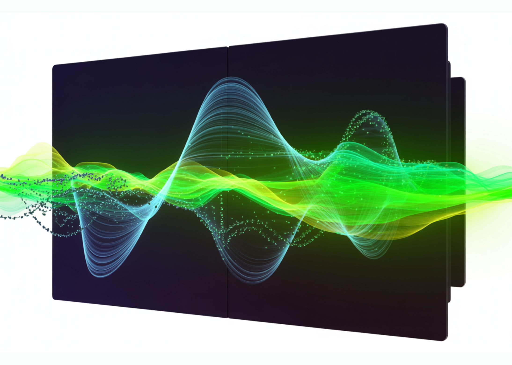

# NVIDIA Releases DreamDojo: An Open-Source Robot World Model Trained on 44,711 Hours of Real-World Human Video Data

> Building simulators for robots has been a long term challenge. Traditional engines require manual coding of physics and perfect 3D models. NVIDIA is changing this with DreamDojo, a fully open-source, generalizable robot world model. Instead of using a physics engine, DreamDojo ‘dreams’ the results of robot actions directly in pixels. Scaling Robotics with 44k+ Hours […]

Building simulators for robots has been a long term challenge. Traditional engines require manual coding of physics and perfect 3D models. NVIDIA is changing this with **DreamDojo**, a fully open-source, generalizable robot world model. Instead of using a physics engine, DreamDojo ‘dreams’ the results of robot actions directly in pixels.

*https://arxiv.org/pdf/2602.06949*

### Scaling Robotics with 44k+ Hours of Human Experience

The biggest hurdle for AI in robotics is data. Collecting robot-specific data is expensive and slow. DreamDojo solves this by learning from **44k+ hours** of egocentric human videos. This dataset, called **DreamDojo-HV**, is the largest of its kind for world model pretraining.

- It features 6,015 unique tasks across 1M+ trajectories.

- The data covers 9,869 unique scenes and 43,237 unique objects.

- Pretraining used **100,000 NVIDIA H100 GPU hours** to build 2B and 14B model variants.

Humans have already mastered complex physics, such as pouring liquids or folding clothes. DreamDojo uses this human data to give robots a ‘common sense’ understanding of how the world works.

*https://arxiv.org/pdf/2602.06949*

### Bridging the Gap with Latent Actions

Human videos do not have robot motor commands. To make these videos ‘robot-readable,’ NVIDIA’s research team introduced **continuous latent actions**. This system uses a spatiotemporal Transformer VAE to extract actions directly from pixels.

- The VAE encoder takes 2 consecutive frames and outputs a 32-dimensional latent vector.

- This vector represents the most critical motion between frames.

- The design creates an information bottleneck that disentangles action from visual context.

- This allows the model to learn physics from humans and apply them to different robot bodies.

*https://arxiv.org/pdf/2602.06949*

### Better Physics through Architecture

DreamDojo is based on the **Cosmos-Predict2.5** latent video diffusion model. It uses the **WAN2.2 tokenizer**, which has a temporal compression ratio of 4. **The team improved the architecture with 3 key features:**

- **Relative Actions:** The model uses joint deltas instead of absolute poses. This makes it easier for the model to generalize across different trajectories.

- **Chunked Action Injection:** It injects 4 consecutive actions into each latent frame. This aligns the actions with the tokenizer’s compression ratio and fixes causality confusion.

- **Temporal Consistency Loss:** A new loss function matches predicted frame velocities to ground-truth transitions. This reduces visual artifacts and keeps objects physically consistent.

### Distillation for 10.81 FPS Real-Time Interaction

A simulator is only useful if it is fast. Standard diffusion models require too many denoising steps for real-time use. NVIDIA team used a **Self Forcing** distillation pipeline to solve this.

- The distillation training was conducted on **64 NVIDIA H100 GPUs**.

- The ‘student’ model reduces denoising from 35 steps down to 4 steps.

- The final model achieves a real-time speed of **10.81 FPS**.

- It is stable for continuous rollouts of 60 seconds (600 frames).

### Unlocking Downstream Applications

DreamDojo’s speed and accuracy enable several advanced applications for AI engineers.

#### 1. Reliable Policy Evaluation

Testing robots in the real world is risky. DreamDojo acts as a high-fidelity simulator for benchmarking.

- Its simulated success rates show a Pearson correlation of (Pearson 𝑟=0.995) with real-world results.

- The Mean Maximum Rank Violation (MMRV) is only **0.003**.

#### 2. Model-Based Planning

Robots can use DreamDojo to ‘look ahead.’ A robot can simulate multiple action sequences and pick the best one.

- In a fruit-packing task, this improved real-world success rates by **17%**.

- Compared to random sampling, it provided a 2x increase in success.

#### 3. Live Teleoperation

Developers can teleoperate virtual robots in real time. NVIDIA team demonstrated this using a **PICO VR controller** and a local desktop with an **NVIDIA RTX 5090**. This allows for safe and rapid data collection.

### Summary of Model Performance

**Metric****DREAMDOJO-2B****DREAMDOJO-14B****Physics Correctness**62.50%73.50%**Action Following**63.45%72.55%**FPS (Distilled)**10.81N/A

NVIDIA has released all weights, training code, and evaluation benchmarks. This open-source release allows you to post-train DreamDojo on your own robot data today.

### Key Takeaways

- **Massive Scale and Diversity**: DreamDojo is pretrained on **DreamDojo-HV**, the largest egocentric human video dataset to date, featuring **44,711 hours** of footage across **6,015 unique tasks** and **9,869 scenes**.

- **Unified Latent Action Proxy**: To overcome the lack of action labels in human videos, the model uses **continuous latent actions** extracted via a spatiotemporal Transformer VAE, which serves as a hardware-agnostic control interface.

- **Optimized Training and Architecture**: The model achieves high-fidelity physics and precise controllability by utilizing **relative action transformations**, **chunked action injection**, and a specialized **temporal consistency loss**.

- **Real-Time Performance via Distillation**: Through a **Self Forcing** distillation pipeline, the model is accelerated to **10.81 FPS**, enabling interactive applications like live teleoperation and stable, long-horizon simulations for over **1 minute**.

- **Reliable for Downstream Tasks**: DreamDojo functions as an accurate simulator for **policy evaluation**, showing a **0.995 Pearson correlation** with real-world success rates, and can improve real-world performance by **17%** when used for **model-based planning**.

---

Check out the **[Paper](https://arxiv.org/pdf/2602.06949) **and **[Codes](https://github.com/NVIDIA/DreamDojo). **Also, feel free to follow us on **[Twitter](https://x.com/intent/follow?screen_name=marktechpost)** and don’t forget to join our **[100k+ ML SubReddit](https://www.reddit.com/r/machinelearningnews/)** and Subscribe to **[our Newsletter](https://www.aidevsignals.com/)**. Wait! are you on telegram? **[now you can join us on telegram as well.](https://t.me/machinelearningresearchnews)**
