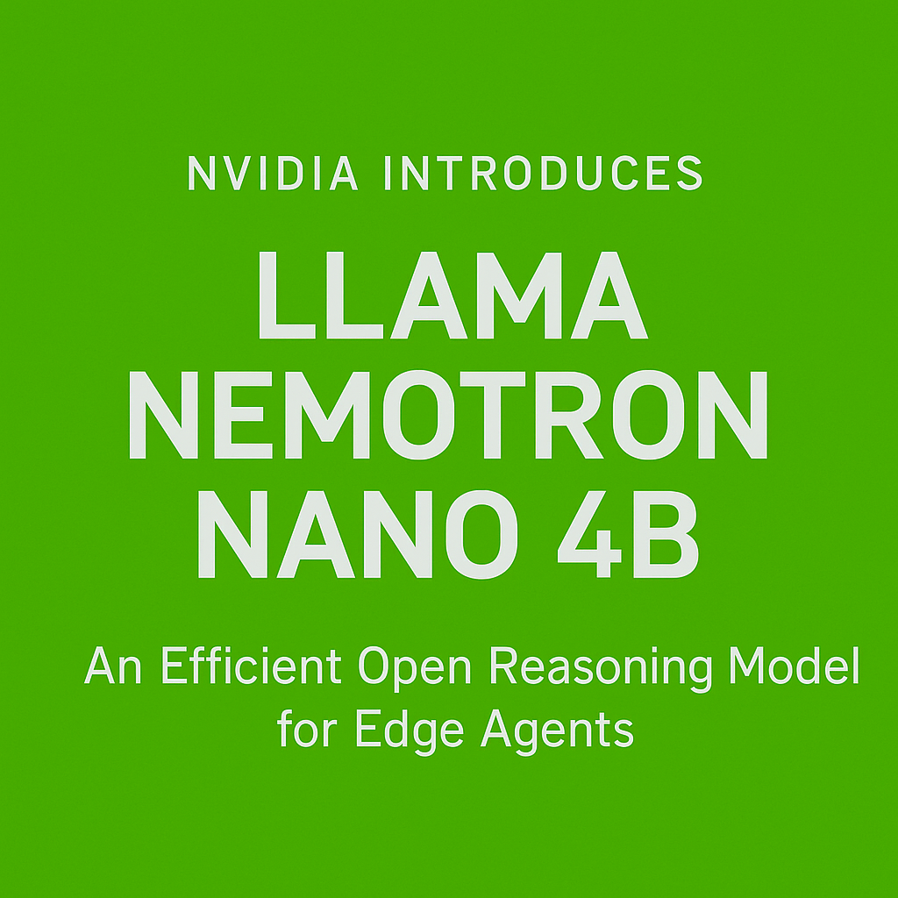

# NVIDIA Releases Llama Nemotron Nano 4B: An Efficient Open Reasoning Model Optimized for Edge AI and Scientific Tasks

> NVIDIA has released Llama Nemotron Nano 4B, an open-source reasoning model designed to deliver strong performance and efficiency across scientific tasks, programming, symbolic math, function calling, and instruction following—while being compact enough for edge deployment. With just 4 billion parameters, it achieves higher accuracy and up to 50% greater throughput than comparable open models with […]

NVIDIA has released Llama Nemotron Nano 4B, an open-source reasoning model designed to deliver strong performance and efficiency across scientific tasks, programming, symbolic math, function calling, and instruction following—while being compact enough for edge deployment. With just 4 billion parameters, it achieves higher accuracy and up to 50% greater throughput than comparable open models with up to 8 billion parameters, according to internal benchmarks.

The model is positioned as a practical foundation for deploying language-based AI agents in resource-constrained environments. By focusing on inference efficiency, Llama Nemotron Nano 4B addresses a growing demand for compact models capable of supporting hybrid reasoning and instruction-following tasks outside traditional cloud settings.

### Model Architecture and Training Stack

Nemotron Nano 4B builds upon the Llama 3.1 architecture and shares lineage with NVIDIA’s earlier “Minitron” family. The architecture follows a dense, decoder-only transformer design. The model has been optimized for performance in reasoning-intensive workloads while maintaining a lightweight parameter count.

The post-training stack for the model includes multi-stage supervised fine-tuning on curated datasets for mathematics, coding, reasoning tasks, and function calling. In addition to traditional supervised learning, Nemotron Nano 4B has undergone reinforcement learning optimization using Reward-aware Preference Optimization (RPO), a method intended to enhance the model’s utility in chat-based and instruction-following environments.

This combination of instruction tuning and reward modeling helps align the model’s outputs more closely with user intent, particularly in multi-turn reasoning scenarios. The training approach reflects NVIDIA’s emphasis on aligning smaller models to practical usage tasks that traditionally require significantly larger parameter sizes.

### Performance Benchmarks

Despite its compact footprint, Nemotron Nano 4B exhibits robust performance in both single-turn and multi-turn reasoning tasks. According to NVIDIA, it provides 50% higher inference throughput compared to similar open-weight models within the 8B parameter range. The model supports a context window of up to 128,000 tokens, which is particularly useful for tasks involving long documents, nested function calls, or multi-hop reasoning chains.

While NVIDIA has not disclosed full benchmark tables in the Hugging Face documentation, the model reportedly outperforms other open alternatives in benchmarks across math, code generation, and function calling precision. Its throughput advantage suggests it can serve as a viable default for developers targeting efficient inference pipelines with moderately complex workloads.

### Edge-Ready Deployment

One of the core differentiators of Nemotron Nano 4B is its focus on edge deployment. The model has been explicitly tested and optimized to run efficiently on NVIDIA Jetson platforms and NVIDIA RTX GPUs. This enables real-time reasoning capabilities on low-power embedded devices, including robotics systems, autonomous edge agents, or local developer workstations.

For enterprises and research teams concerned with privacy and deployment control, the ability to run advanced reasoning models locally—without relying on cloud inference APIs—can provide both cost savings and greater flexibility.

### Licensing and Access

The model is released under the NVIDIA Open Model License, which permits commercial usage. It is available through Hugging Face at [huggingface.co/nvidia/Llama-3.1-Nemotron-Nano-4B-v1.1](https://huggingface.co/nvidia/Llama-3.1-Nemotron-Nano-4B-v1.1), with all relevant model weights, configuration files, and tokenizer artifacts openly accessible. The license structure aligns with NVIDIA’s broader strategy of supporting developer ecosystems around its open models.

### Conclusion

Nemotron Nano 4B represents NVIDIA’s continued investment in bringing scalable, practical AI models to a broader development audience—especially those targeting edge or cost-sensitive deployment scenarios. While the field continues to see rapid progress in ultra-large models, compact and efficient models like Nemotron Nano 4B provide a counterbalance, enabling deployment flexibility without compromising too heavily on performance.

---

**Check out the [Model on Hugging Face](https://huggingface.co/nvidia/Llama-3.1-Nemotron-Nano-4B-v1.1)_._** All credit for this research goes to the researchers of this project. Also, feel free to follow us on **[Twitter](https://x.com/intent/follow?screen_name=marktechpost)** and don’t forget to join our **[95k+ ML SubReddit](https://www.reddit.com/r/machinelearningnews/)** and Subscribe to **[our Newsletter](https://www.airesearchinsights.com/subscribe)**.
