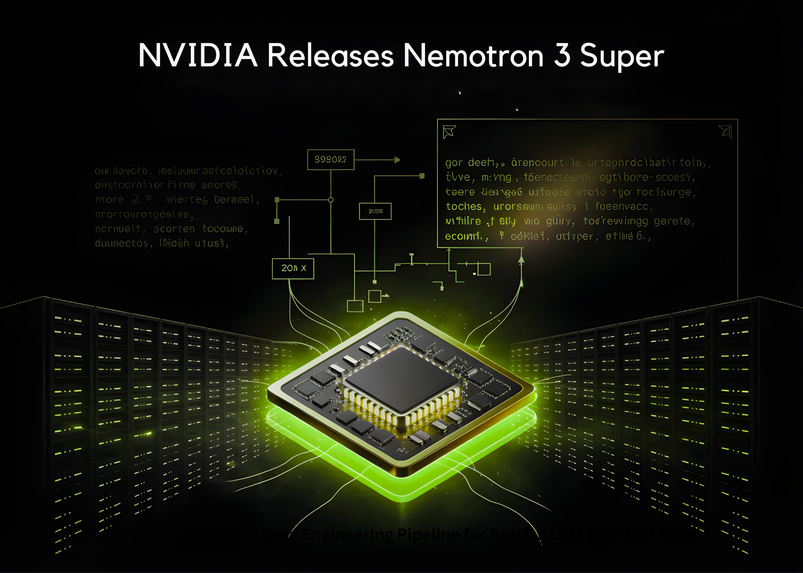

# NVIDIA Releases Nemotron 3 Super: A 120B Parameter Open-Source Hybrid Mamba-Attention MoE Model Delivering 5x Higher Throughput for Agentic AI

> The gap between proprietary frontier models and highly transparent open-source models is closing faster than ever. NVIDIA has officially pulled the curtain back on Nemotron 3 Super, a staggering 120 billion parameter reasoning model engineered specifically for complex multi-agent applications. Released today, Nemotron 3 Super sits perfectly between the lightweight 30 billion parameter Nemotron 3 […]

The gap between proprietary frontier models and highly transparent open-source models is closing faster than ever. NVIDIA has officially pulled the curtain back on [**Nemotron 3 Super**](https://pxllnk.co/ctqnna8), a staggering 120 billion parameter reasoning model engineered specifically for complex multi-agent applications.

Released today, [**Nemotron 3 Super**](https://pxllnk.co/ctqnna8) sits perfectly between the lightweight 30 billion parameter Nemotron 3 Nano and the highly anticipated 500 billion parameter Nemotron 3 Ultra coming later in 2026. [Delivering up to 7x higher throughput ](https://pxllnk.co/ml2920c)and double the accuracy of its previous generation, this model is a massive leap forward for developers who refuse to compromise between intelligence and inference efficiency.

### The ‘Five Miracles’ of Nemotron 3 Super

**Nemotron 3 Super’s unprecedented performance is driven by five major technological breakthroughs:**

- **Hybrid MoE Architecture:** The model intelligently combines memory-efficient Mamba layers with high-accuracy Transformer layers. By only activating a fraction of parameters to generate each token,[ it achieves a 4x increase in KV ](https://pxllnk.co/ml2920c)and SSM cache usage efficiency.

- **Multi-Token Prediction (MTP):** The model can predict multiple future tokens simultaneously, leading to 3x faster inference times on complex reasoning tasks.

- **1-Million Context Window:** Boasting a context length 7x larger than the previous generation, developers can drop massive technical reports or entire codebases directly into the model’s memory, eliminating the need for re-reasoning in multi-step workflows.

- **Latent MoE:** This allows the model to compress information and [activate four experts for the same compute cost as on](https://pxllnk.co/lbmkemm)e. Without this innovation, the model would need to be 35 times larger to hit the same accuracy levels.

- **NeMo RL Gym Integration:** Through interactive reinforcement learning pipelines, the model learns from dynamic feedback loops rather than just static text, effectively doubling its intelligence index.

**All these breakthroughs, lead to incredible efficiency in terms of output tokens per GPU**

### Why Nemotron 3 Super is the Ultimate Engine for Multi-Agent AI?

[Nemotron 3 Super](https://pxllnk.co/ctqnna8) isn’t just a standard large language model; it is specifically positioned as a reasoning engine designed to plan, verify, and execute complex tasks within a broader system of specialized models. Here is exactly why its architecture makes it a game-changer for multi-agent workflows:

- **High Throughput for Deeper Reasoning:** The [model’s 7x higher throughput physically expands its search space](https://pxllnk.co/ml2920c). Because it can process and generate tokens faster, it can explore significantly more trajectories and evaluate better responses. This allows developers to run deeper reasoning on the same compute budget, which is essential for building sophisticated, autonomous agents.

- **Zero “Re-Reasoning” in Long Workflows:** In multi-agent systems, agents constantly pass context back and forth. The 1-million token context window allows the model to retain massive amounts of state, like entire codebases or long, multi-step agent conversation histories, directly in its memory. This eliminates the latency and cost of forcing the model to re-process context at every single step.

- **Agent-Specific Training Environments:** Instead of relying solely on static text datasets, the model’s pipeline was extended with over 15 interactive reinforcement learning environments. By training in dynamic simulation loops (such as dedicated environments for software engineering agents and tool-augmented search), Nemotron 3 Super learned the optimal trajectories for autonomous task completion.

- **Advanced Tool Calling Capabilities:** In real-world multi-agent applications, models need to act, not just textually respond. Out of the box, [Nemotron 3 Super has proven highly proficient at tool calling](https://pxllnk.co/lbmkemm), successfully navigating massive pools of available functions—such as dynamically selecting from over 100 different tools in complex cybersecurity workflows.

### Open Sourced and Training Scale

NVIDIA isn’t just releasing the [weights; they are completely open-sourcing the model’s entire stack,](https://pxllnk.co/ctqnna8) which includes the training datasets, libraries, and the reinforcement learning environments.

Because of this level of transparency, Artificial Analysis places Nemotron 3 Super squarely in the ‘most attractive quadrant,’ noting that it achieves the highest openness score while maintaining leading accuracy alongside proprietary models. The foundation of this intelligence comes from a completely redesigned pipeline trained on 10 trillion curated tokens, supplemented by an extra 9 to 10 billion tokens strictly focused on advanced coding and reasoning tasks.

### Developer Control: Introducing ‘Reasoning Budgets‘

While raw parameter counts and benchmark scores are impressive, NVIDIA team understands that real-world enterprise developers need precise control over latency, user experience, and compute costs. To solve the classic intelligence-versus-speed dilemma, Nemotron 3 Super introduces highly flexible **Reasoning Modes** directly via its API, putting an unprecedented level of granular control in the hands of the developer.

Instead of forcing a one-size-fits-all output, developers can dynamically adjust exactly **[how hard the model ‘thinks’ based on the specific task at hand](https://pxllnk.co/ml2920c):**

- **Full Reasoning (Default):** The model is unleashed to leverage its maximum capabilities, exploring deep search spaces and multi-step trajectories to solve the most complex, agentic problems.

- **The ‘Reasoning Budget’:** This is a total game-changer for latency-sensitive applications. Developers can explicitly cap the model’s thinking time or compute allowance. By setting a strict reasoning budget, the model intelligently optimizes its internal search space to deliver the absolute best possible answer _within that exact constraint_.

- **‘Low Effort Mode’:** Not every prompt requires a deep, multi-agent analysis. When a user just needs a simple, concise answer (like standard summarization or basic Q&A) without the overhead of deep reasoning, this toggle transforms Nemotron 3 Super into a lightning-fast responder, saving massive amounts of compute and time.

#### The ‘Golden’ Configuration

Tuning reasoning models can often be a frustrating process of trial and error, but NVIDIA team has completely demystified it for this release. To extract the absolute best performance across _all_ of these dynamic modes, [**NVIDIA recommends a global configuration of Temperature 1.0 and Top P 0.95**.](https://pxllnk.co/ml2920c)

According to NVIDIA team, locking in these exact hyperparameter settings ensures the model maintains the perfect mathematical balance of creative exploration and logical precision, whether it is running on a constrained low-effort mode or an uncapped reasoning deep-dive.

### Real-World Applications and Availability

**[Nemotron 3 Super](https://pxllnk.co/ctqnna8) is already proving its mettle across demanding enterprise applications:**

- **Software Development:** It handles junior-level pull requests and outperforms leading proprietary models in issue localization, successfully finding the exact line of code causing a bug.

- **Cybersecurity:** The model excels at navigating complex security ISV workflows with its advanced tool-calling logic.

- **Sovereign AI:** Organizations globally in regions like India, Vietnam, South Korea, and Europe are using the Nemotron architecture to build specialized, localized models tailored for specific regions and regulatory frameworks.

Nemotron 3 Super is r[eleased in BF16, FP8, and NVFP4 quantizations, with NVFP4](https://pxllnk.co/ctqnna8) required for running the model on a DGX Spark.

Check out the Models on** [Hugging Face](https://pxllnk.co/ctqnna8). **You can find details on **[Research Paper](https://pxllnk.co/ml2920c)** and **[Technical/Developer Blog](https://pxllnk.co/lbmkemm)**.

---

_Thanks to the NVIDIA AI team for the thought leadership/ Resources for this article. NVIDIA AI team has supported and sponsored this content/article._
